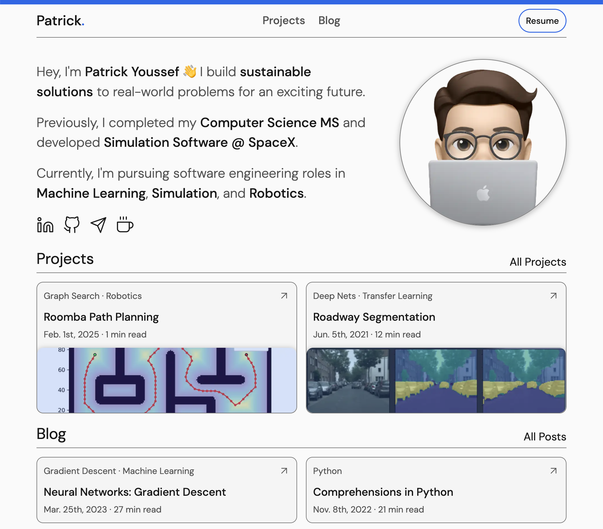

# Personal Website V1

  

## Purpose for the Site

I had a few goals/purposes when creating this site:
- Portfolio
  - Curate my projects, resume, and general message in one place
  - Share these materials in an easily accessible way
- Teaching:
  - I've always enjoyed teaching and mentoring and my blog posts are an extension of that
- Web Development:
  - This website served as exposore and practice for many modern web dev tools

## Questions

Feel free to reach out if you have any questions, always looking to improve aspects or the site or get inspiration for future posts.

## Build Status

  

