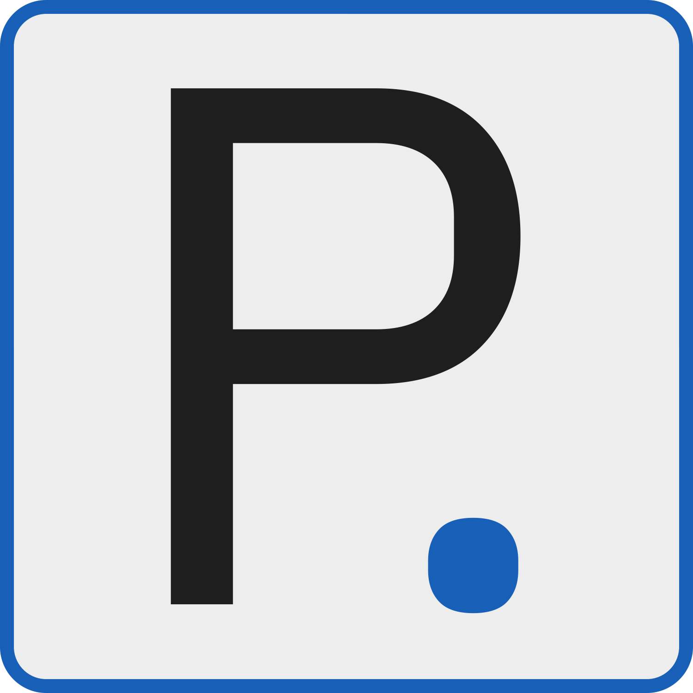

# Personal Website V1

  

## Build Status

  

## Motivation For Site

## Site Framework

### Requirements

I decided on a few requirements:

1. Fast Loading and Light
   - My needs for my site were not crazy but I wanted the page to be light to load quickly for mobile devices.
2. Low Post Overhead
   - I knew that if it took a lot of work to write a new post I would never post so I wanted to build a framework that was a minimal barrier between ideas and deployment.
3. Programmatic
   - I am not a web developer by trade so traditional web development has been less than ideal.
   - If possible, I wanted a framework that worked in similar ways that I am used to (iterating over lists, logical decisions, etc.) to help me accomplish my goals.

### Gatsby Satisfied All My Needs

After much research, the static site generator Gatsby seemed like a perfect fit. I'll go over my prior requirements and how Gatsby resolved them.

1. Fast Loading and Light
   - Gatsby by nature is a static site generator which means the served file are server generated and so little to no processing is needed on the client end.
   - This makes it perfect for mobile with bandwidth and processing limits applied.
2. Low Post Overhead
   - As Gatsby server generates, there are some plugins that take advantage of this to have a Markdown parser.
   - On page generation, Gatsby will load in all the markdown files that can be passed into a blog post template, therefore all I need to do is write markdown files!
3. Programmatic
   - Gatsby is built on ReactJS which is by nature exactly what I wanted for this!

## Questions

Feel free to reach out if you have any questions! I hope you liked the site!