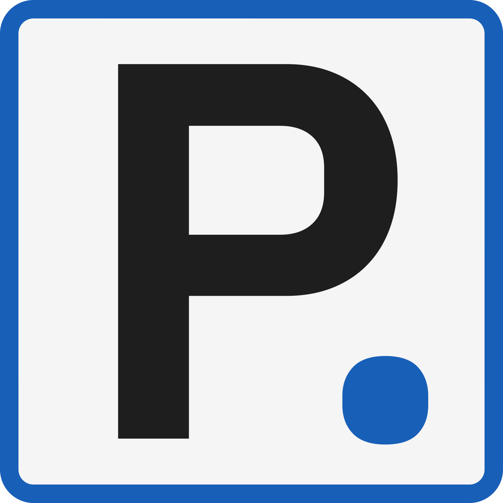
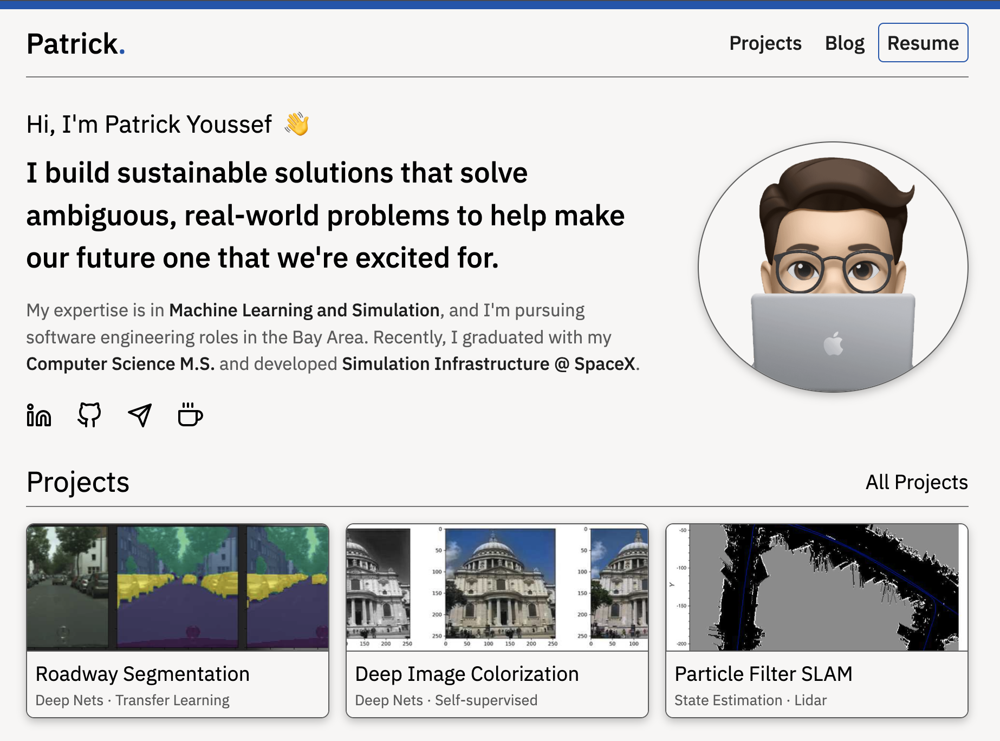

# Personal Website V1

  

## Motivation For Site

My motivations for the site are as follows:

- I enjoy teaching and sharing information so I recently decided I wanted to increase the audience I could reach.
- As I progress through my career I find that I am building a mix of materials that represent me, a website serves to host all of these materials in a cohesive nature.

## Questions

Feel free to reach out if you have any questions, always looking to improve aspects or the site or get inspiration for future posts.

## Build Status

Current status of the site can be found below.

  

