# What is a Numerical Integration?

Numerical integration is the process of utilizing numerical methods to estimate the value of a definite integral and more generally numerical solutions to differential equations. In many cases an equation may have an explicit solution that can be solved for, in which case you should just use that, but for many other equations there may not be and numerical integration can help solve them.

As mentioned before these integrators can see a lot of utility in scientific computation and simulation but I will be focusing on their usage for dynamic simulation today.

# Math Behind Integrators

The math behind the three integrators I will be going over today is not that bad, in fact the three methods extend well on each other.

## Euler

The Euler integrator is the simplest one that we will consider today. The basic principle is to repeat the following steps.

1. Evaluate the derivatives at your current state
2. Starting at your current state, follow the derivative over a determined step

Which looks something like this:

$$
x_{i+1} = x_i + h \, \dot{x}(x_i) = x_i + k_1
$$

Where $h$ is the amount to take a step with on each iteration (something you determine and often called dt). To be a bit more rigorous let's manually compute a few steps of the Euler integration for a function using $h=1$.

$$
\dot{x}=2x \text{,} \,\, x(0)=1
$$

### First Step

$$
x(h) = x(0) + h \times \dot{x}(x(0)) = 1 + 1 \times (2 \times 1) = 3
$$

### Second Step

$$
x(2h) = x(h) + h \times \dot{x}(x(h)) = 3 + 1 \times (2 \times 3) = 9
$$

This differential equation is one we can integrate explicitly so let's compare and see how we did.

$$
x(t) = e^{2t}
$$

Let's compare the values from the known solution to the results from Euler.

| $t$ | $x(t) = e^{2t}$     | Euler |
| --- | ------------------- | ----- |
| $0$ | $1$                 | $1$   |
| $1$ | $e^2 \approx 7.38$  | $3$   |
| $2$ | $e^4 \approx 54.59$ | $9$   |

As we can see the results are not very impressive, we'll discuss more about the limitations of euler integration.

## Heun

The Heun integrator extends on Euler by adding a second derivative estimate and taking the average of them. The general method is repeating the following steps:

1. Evaluate the derivatives at your current state
2. Compute the change based on following the derivative over the step ($k_1$)
3. Evaluate the derivative at the new state estimate from $k_1$ over a step ($k_2$)
4. Take the average of the two derivatives and take a step from the current state

This looks like:

$$
k_1 = h \, \dot{x}(x_i)
$$

$$
k_2 = h \, \dot{x}(x_i + k_1)
$$

$$
x_{i+1} = x_i + 0.5 (k_1 + k_2)
$$

Following the same function as prior let's manually compute two steps.

### First Step

$$
k_1 = h \, \dot{x}(x(0)) = 1 \times (2\times1) = 2
$$

$$
k_2 = h \, \dot{x}(x(0) + k_1) =  1\times(2\times(1+2)) = 6
$$

$$
x(h) = x(0) + 0.5 (k_1 + k_2) = 1 + 0.5(2+6) = 5
$$

### Second Step

Let's go ahead and see how the Heun integrator stacks up against the Euler and true results.

| $t$ | $x(t) = e^{2t}$     | Euler | Heun |
| --- | ------------------- | ----- | ---- |
| $0$ | $1$                 | $1$   | $1$  |
| $1$ | $e^2 \approx 7.38$  | $3$   | $5$  |
| $2$ | $e^4 \approx 54.59$ | $9$   | $25$ |

As we can see it's still not doing great but it's closer than Euler.

## 4th Order Runge-Kutta (RK4)

The RK4 integrator extends on both Euler and Heun by computing 4 estimates of the required changes and taking a weighted average of them based on the [butcher tableau](https://www.wikidata.org/wiki/Property:P8558).

1. Evaluate the derivatives at your current state over time step (k1)
2. Evaluate the derivatives at the current state advanced by half of k1 (k2)
3. Evaluate the derivatives at the current state advanced by half of k2 (k3)
4. Evaluate the derivatives at the current state advanced by a full step of k3 (k4)

This looks like:

$$
k_1 = h \, \dot{x}(x_i)
$$

$$
k_2 = h \, \dot{x}(x_i + 0.5 \times k_1)
$$

$$
k_3 = h \, \dot{x}(x_i + 0.5 \times k_2)
$$

$$
k_4 = h \, \dot{x}(x_i + k_3)
$$

$$
x_{i+1} = x_i + \frac{1}{6} (k_1 + 2k_2 + 2k_3 + k4)
$$

Following the same function as prior let's manually compute two steps.

### First Step

$$
k_1 = h \, \dot{x}(x(0)) = 1 \times (2\times1) = 2
$$

$$
k_2 = h \, \dot{x}(x(0) + 0.5 \times k_1)
$$

$$
= 1 \times (2 \times (1+0.5 \times 2)) = 4
$$

$$
k_3 = h \, \dot{x}(x(0) + 0.5 \times k_2)
$$

$$
= 1 \times (2 \times (1+0.5 \times 4)) = 6
$$

$$
k_4 = h \, \dot{x}(x(0) + k_3)
$$

$$
= 1 \times (2 \times (1+6)) = 14
$$

$$
x(h) = x(0) + \frac{1}{6} (k_1 + 2k_2 + 2k_3 + k4)
$$

$$
= \frac{1}{6} (2+2\times8+2\times4+6) = 7
$$

### Second Step

$$
k_1 = h \, \dot{x}(x(h)) = 1 \times (2\times7) = 14
$$

$$
k_2 = h \, \dot{x}(x(h) + 0.5 \times k_1)
$$

$$
= 1 \times (2 \times (7+0.5 \times 14)) = 28
$$

$$
k_3 = h \, \dot{x}(x(h) + 0.5 \times k_2)
$$

$$
= 1 \times (2 \times (7+0.5 \times 28)) = 42
$$

$$
k_4 = h \, \dot{x}(x(h) + k_3)
$$

$$
= 1 \times (2 \times (7+42)) = 98
$$

$$
x(2h) = x(h) + \frac{1}{6} (k_1 + 2k_2 + 2k_3 + k4)
$$

$$
= \frac{1}{6} (14+2\times28+2\times42+98) = 49
$$

Let's go ahead and see how the RK4 integrator stacks up against the Euler, Heun, and true results.

| $t$ | $x(t) = e^{2t}$     | Euler | Heun | RK4  |
| --- | ------------------- | ----- | ---- | ---- |
| $0$ | $1$                 | $1$   | $1$  | $1$  |
| $1$ | $e^2 \approx 7.38$  | $3$   | $5$  | $7$  |
| $2$ | $e^4 \approx 54.59$ | $9$   | $25$ | $49$ |

As we can see the RK4 did a much better job estimating the true value! The steps that we took were quite course for this particular equation but we'll see later on that the trend of the RK4 clearly beating the other two integrators continues into the implementation.

# Example Implementation

Let's apply three common numerical integrators to an undamped and unforced spring mass system. Let's first detail the differential equation for this system, it is as follows:

$$
m \ddot{x}+kx=0 \rightarrow m \ddot{x}=-kx
$$

Where $m$ is the mass of the object, $k$ is the spring rate, $x$ is the term we desire to track the position of the mass, and $\ddot{x}$ is the acceleration of the mass. Let's start by defining this differential equation as a Python function that returns a $[1 \times 2]$ matrix that contains the velocity $\dot{x}$ and the acceleration $\ddot{x}$.

```python
def eval_derivs(X):
    # Constants
    m = 1
    k = 1

    # New state derivative vector [xdot and xdoubledot]
    xdd = -(k/m) * X[0]
    Xdot = np.array([X[1], xdd])
    return Xdot
```

> With this structure we can do both integrations in one step! As we are starting with $\ddot{x}$ and we are trying to integrate up two power to just $x$ we need to integrate the acceleration $\ddot{x}$ to get velocity $\dot{x}$ and integrate once more to get $x$. With this matrix setup the matrix addition will update both terms at once!

## Euler Integration

Next we can implement the function that applies an Euler integration step to solve for the velocity and position of the mass. As a reminder this is the first of the integrators mentioned prior and only relies on the rate at that instant.

```python
def euler(X, dt, evaluate):
    """
    Euler Integration Step
    Inputs:
        X: State vector at the current point
        dt: Integration step (often called h)
        evaluate: Function to evaluate for derivative terms
    Returns:
        X_new: Updated state vector
    """
    # Calculate Terms
    k1 = dt * evaluate(X)

    # Update X
    X_new = X + k1
    return X_new
```

Which takes in a series of arguments and computes the estimated state one step ahead, notably the evaluate argument is where we can pass in the function, `eval_derivs`, for our equation derivative. This function only computes one step when called so we need to wrap it with an iterator to advance us through multiple steps. This can be done as follows:

```python
# Initial conditions
X = np.array([1,0])
# Time step
dt = 0.25
# End time
t = 10
iters = int(t/dt)

# Data structure for results
D = np.zeros((iters+1, 2))
D[0] = X
T = np.linspace(0,t, iters+1)

# Iterate over number of steps
for i in range(iters):
    # Compute an integration step and save
    D[i+1] = euler(D[i], dt, eval_derivs)
```

This chunk of code sets up our initial conditions for our system ($x=1$ and $\dot{x}=0$), the step to advance over, the total time, and a matrix of size $[(\text{\# Steps}+1) \times 2]$ to store $x$ and $\dot{x}$ over time. Although I mentioned that numerical integrators can be used to integrate functions with unknown explicit solutions this is not one of them so we can use the true solution to see how well our integrator works!

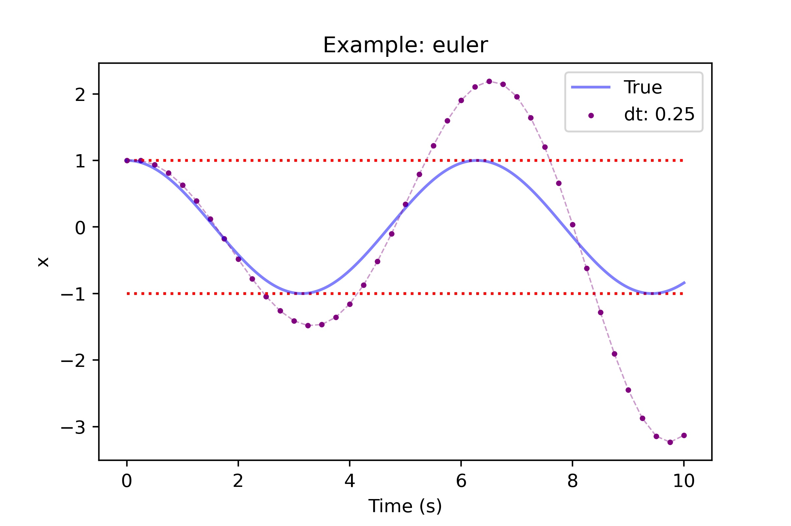

The result is not the best but we can lower the step to improve the accuracy.

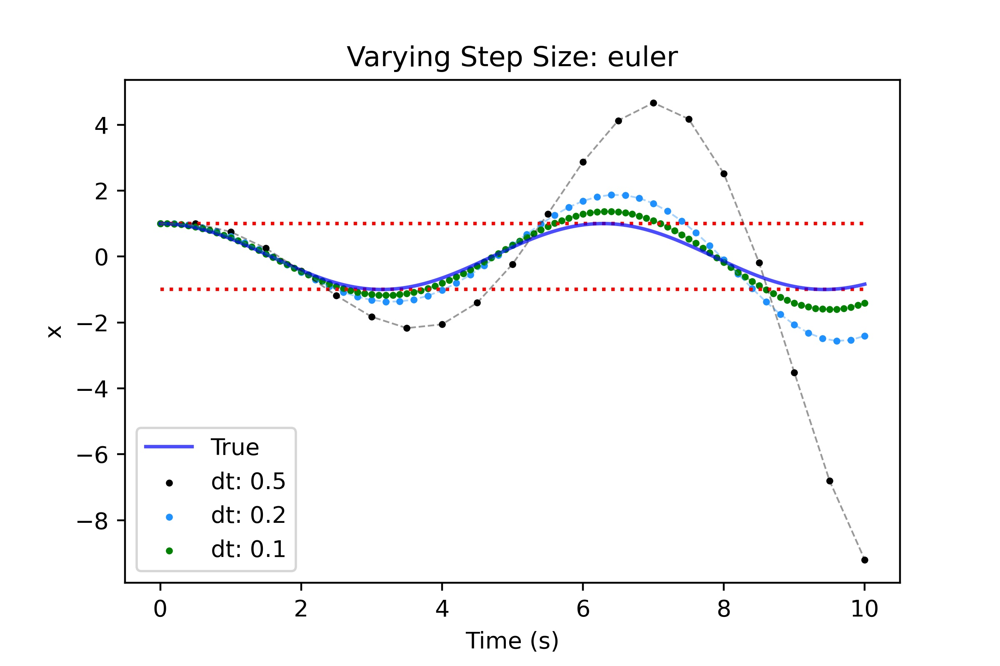

Although reducing the time step helps the result is still pretty bad, but why is this the case? As it turns out the simplicity of Euler integration, while convenient, leaves a lot to be desired in terms of accuracy. The single estimate of the rates to predict further steps does not allow the integrator to handle concave/convex sections without inducing error. To better understand this let's take a look at 2 coarse integration steps using Euler on this function.

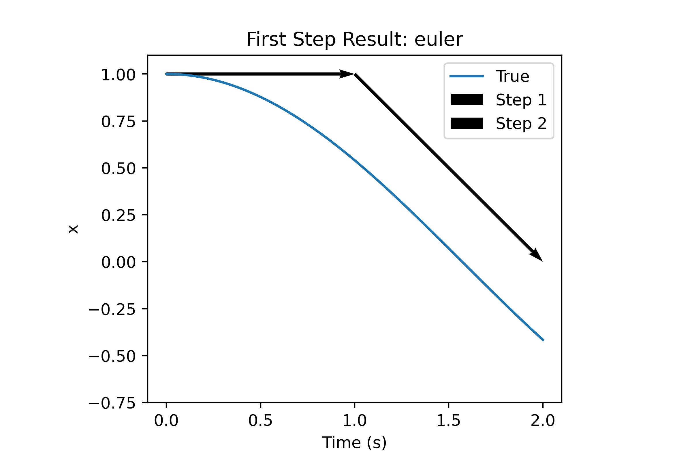

Consider the first arrow, at $t=0$ the value of $\dot{x}=0$ and so integrating that with Euler we get the following:

$$
x \times {2} = x \times {1} + \dot{x} \times \text{h} = 1 + 0 \times \text{h} = 1
$$

So no matter what h is the very first step of this integration will never change the values of $x$. This is a problem because we can see that the mass does start moving and $\dot{x}$ no longer becomes zero right after $t=0$. This is where the multiple terms of the Heun and RK4 integrator can help a lot!

## Heun Integration

We can follow the same steps we took for Euler and all we need to do now is implement `heun` in the code and pass that in as the integrator in our iterator, that looks like this:

```python
def heun(X, dt, evaluate):
    """
    Heun's Method Integration Step
    Inputs:
        X: State vector at the current point
        dt: Integration step (often called h)
        evaluate: Function to evaluate for derivative terms
    Returns:
        X_new: Updated state vector
    """
    # Calculate Terms
    k1 = dt * evaluate(X)
    k2 = dt * evaluate(X + k1)

    # Update X
    X_new = X + (1/2.)*(k1 + k2)
    return X_new
```

And for the integrator all we need to change is what integrator function call is used.

```python{high={4}}
# Iterate over number of steps
for i in range(iters):
    # Compute an integration step and save
    D[i+1] = heun(D[i], dt, eval_derivs)
```

The first term k1 is identical to Euler but we introduce k2 to get an estimate of the rates from `evaluate` at the result of the Euler step. We then take an average to estimate what the average rate from the start to end should be. This yields the following results:

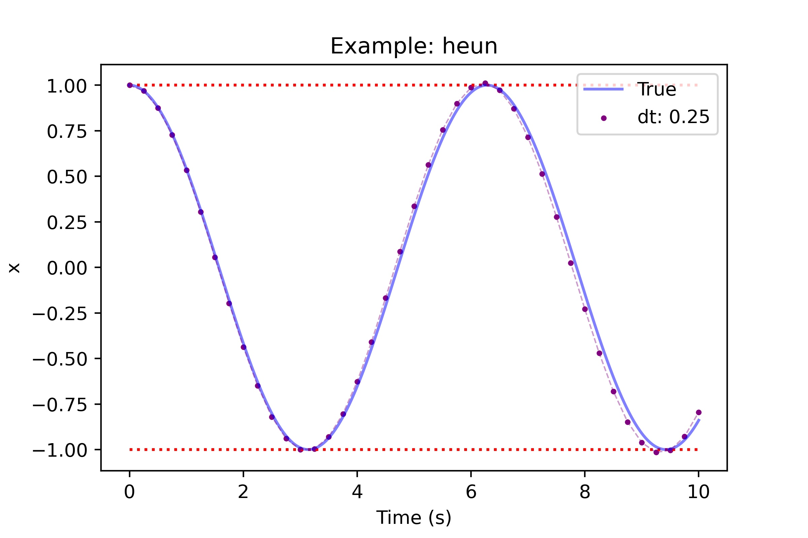

This looks great compared to Euler! We still can see some error produced near the end but it's much better. Let's see what we can achieve with coarser and finer steps.

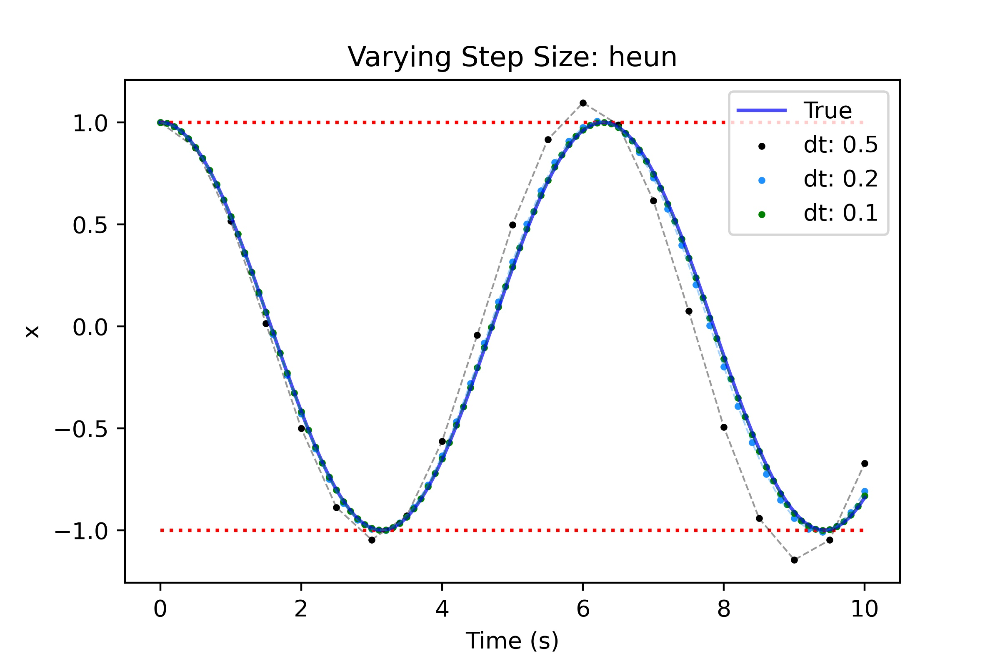

While the results are appreciably better than Euler we still see that we need to make the step quite small to get reasonable results. Going back to the lack of handling concave/convex regions lets look at the closeup.

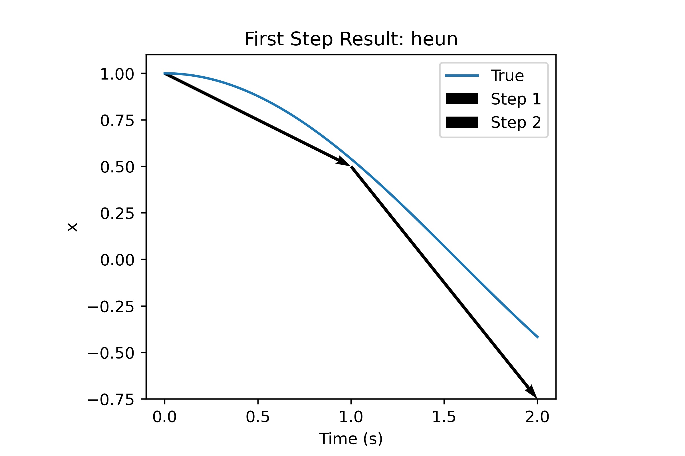

The first step is nearly perfect but we can see that the second step overestimates the rates and so we over correct, let's see what the additional two terms of RK4 can do.

## RK4

Similarly to Heun, all we need to do is implement `rk4` and change the integrator in the iterator.

```python
def rk4(X, dt, evaluate):
    """
    Runge-Kutta 4th Order Integration Step
    Inputs:
        X: State vector at the current point
        dt: Integration step (often called h)
        evaluate: Function to evaluate for derivative terms
    Returns:
        X_new: Updated state vector
    """
    # Calculate Terms
    k1 = dt * evaluate(X)
    k2 = dt * evaluate(X + 0.5*k1)
    k3 = dt * evaluate(X + 0.5*k2)
    k4 = dt * evaluate(X + k3)

    # Update X
    X_new = X + (1/6.)*(k1 + 2*k2 + 2*k3 + k4)
    return X_new
```

We start with k1 identical to Euler but then it gets interesting, as a reminder the terms can be interpreted as:

- **k1**: the rates when the derivatives are evaluated at the current state
- **k2**: the rates when the derivatives are evaluated at half the step using the initial rate estimate
- **k3**: the rates when the derivatives are evaluated at half the step using k2
- **k4**: the rates when the derivatives are evaluated at a full the step using k3

The rates are combined using a weighted average based on the [butcher tableau](https://www.wikidata.org/wiki/Property:P8558). All we do now is update the integrator call in our iterator.

```python{high={4}}
# Iterate over number of steps
for i in range(iters):
    # Compute an integration step and save
    D[i+1] = rk4(D[i], dt, eval_derivs)
```

Let's see how well this performs!

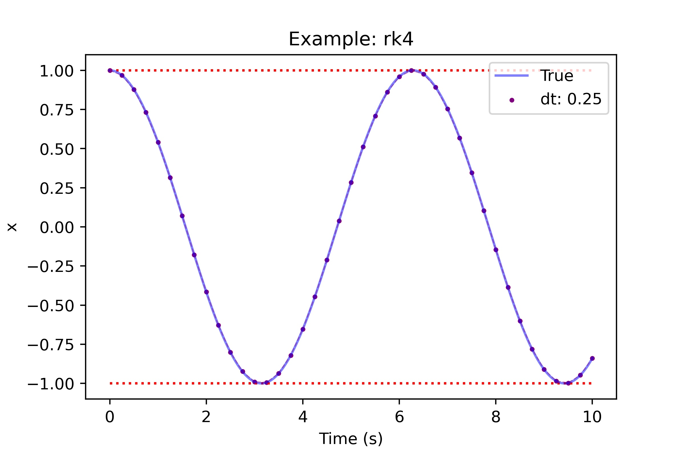

Wow! The rk4 performs extremely well for the same time step as used prior, let's see what this looks like for other time steps.

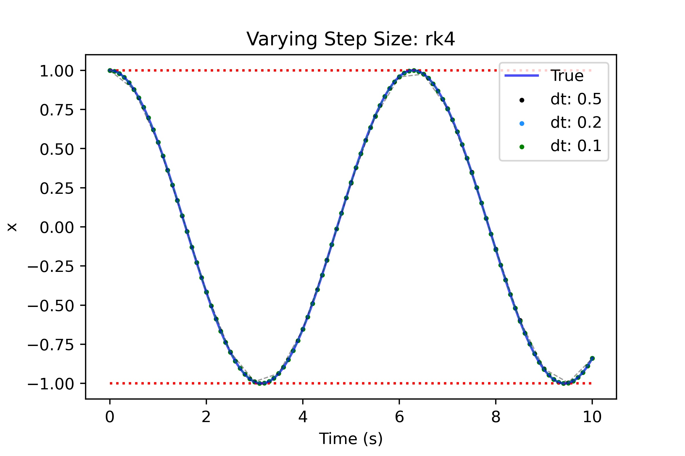

Even at the coarsest time step we get a very usable result! This is great because for a coarser timestep we can save on compute (even if each step has more compute involved when compared to Euler/Heun).

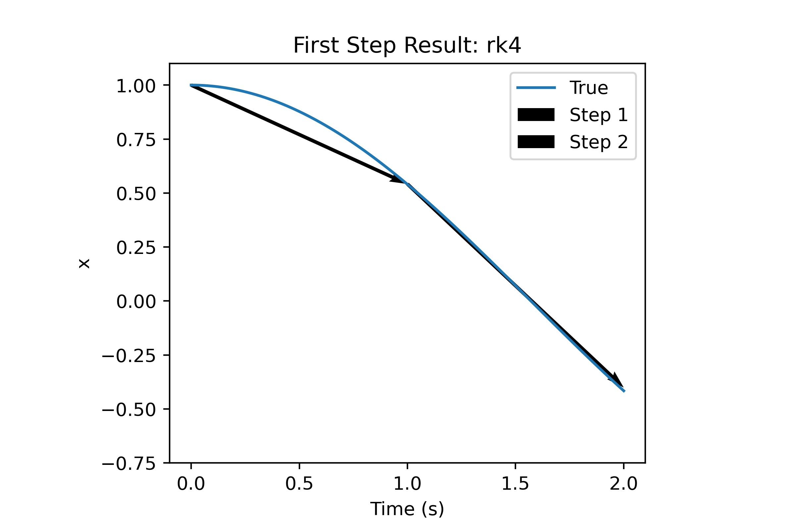

This is no surprise given the prior plots but the close up shows the steps landing almost exactly on the true function.

# Damped Spring Mass Oscillator & Error Analysis

With this example we will introduce a damping term and show how we would write each step but also dive a bit more into the error analysis of these methods. We will now be integrating the following:

$$
m \ddot{x}+kx+c\dot{x}=0 \rightarrow m \ddot{x}=-kx-c \dot{x}
$$

First we need to redefine our `eval_derivs` function for this new differential equation.

```python
def eval_derivs(X):
    # Constants
    m = 2
    k = 10
    c = 2

    # New state derivative vector [xdot and xdoubledot]
    xdd = -(k/m) * X[0] - (c/m) * X[1]
    Xdot = np.array([X[1], xdd])
    return Xdot
```

Now we just need to call the integrators within the iterator as prior, we'll also be using the same initial condition. To refresh here is what this looks like again.

```python
# Initial conditions
X = np.array([1,0])
# Time step
dt = 0.25
# End time
t = 10
iters = int(t/dt)

# Data structure for results
D = np.zeros((iters+1, 2))
D[0] = X
T = np.linspace(0,t, iters+1)

# Iterate over number of steps
for i in range(iters):
    # Compute an integration step and save
    D[i+1] = euler(D[i], dt, eval_derivs)
```

No changes need to be made to our integrators as they will operate the same as before.

## Euler

Below are the results for Euler integration on this damped oscillator.

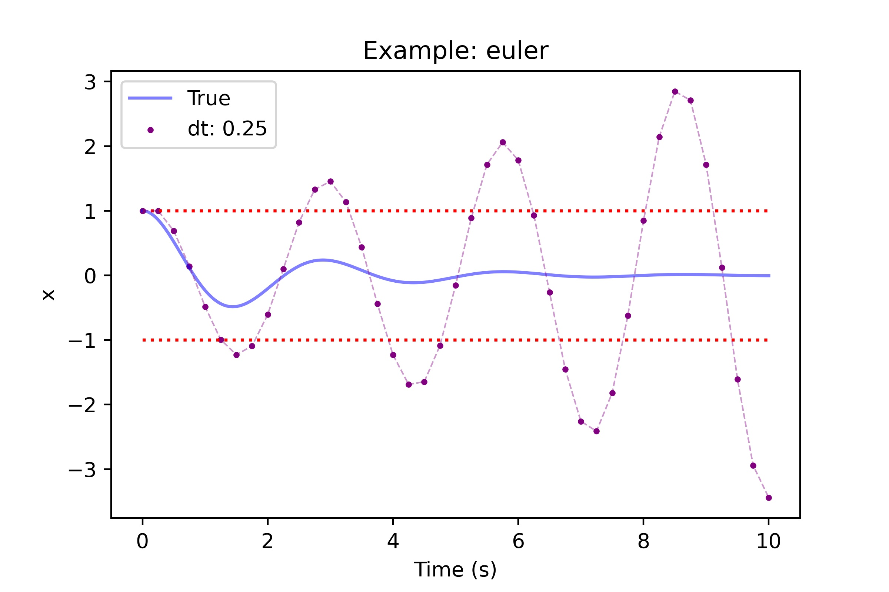
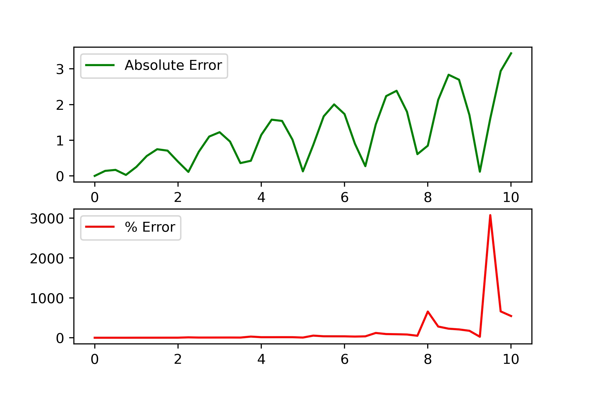

This is hardly a result and so this integrator is worthless at this timestep. The error analysis obviously agrees as visually it's apparent already.

## Heun

Below are the results for Heun integration on this damped oscillator.

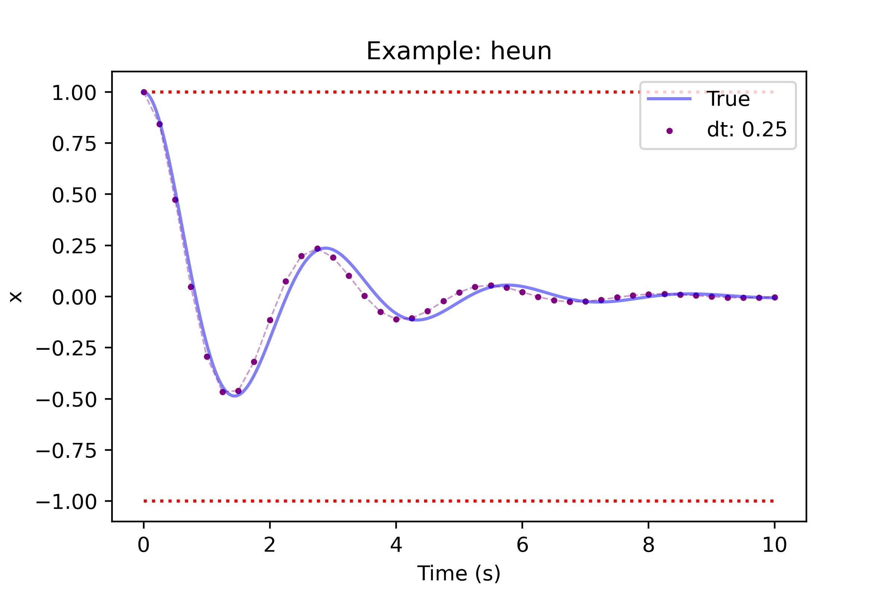
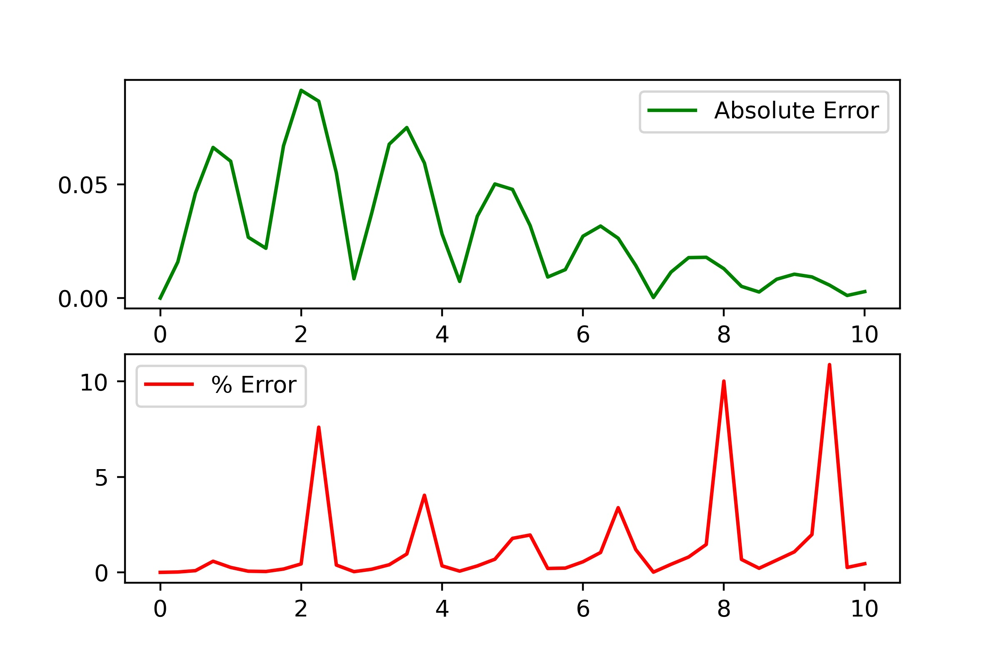

Heun does much better than Euler but seems to produce a bit of a phase shift or lag in the results. The error analysis shows this did much better but there is much more to be desired still (especially for percent error).

## RK4

Below are the results for RK4 integration on this damped oscillator.

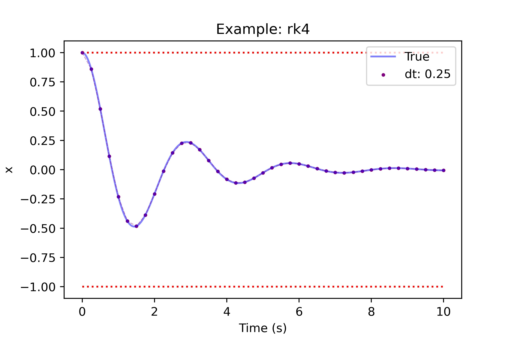
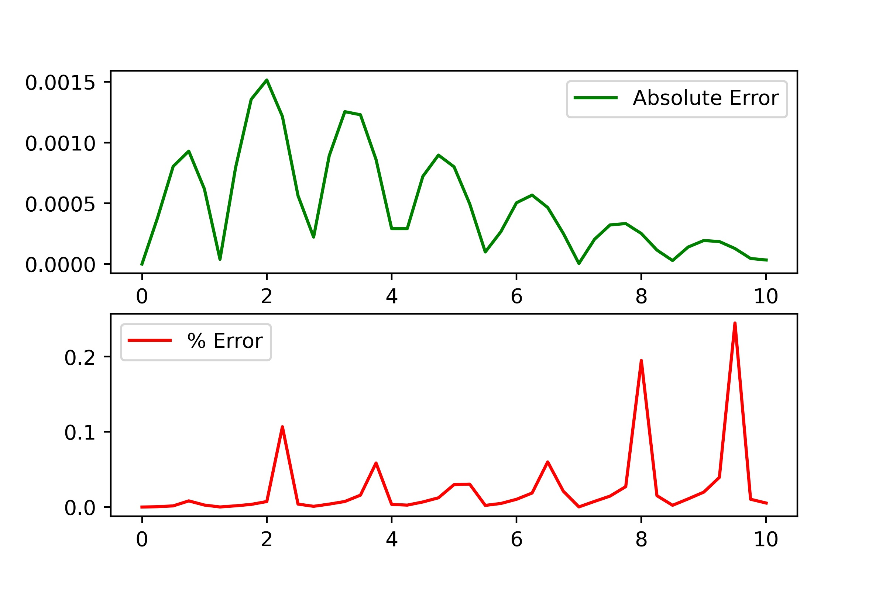

RK4 does wonderful here, we can not appreciate much error when looking at the points of the steps. The error analysis shows very small absolute and percent errors. Although this is the case I would still like to point out something interesting about the percent error.

## Error Advice

It's easy to try to chase down the values for both percent and absolute error but I want to offer some advice on how to perceive errors and determine what is "real". Let's imagine we were tracking the position of a car in a grid using an integrator. Far from the origin (0,0) a small tracking error of 1 meter for example could be a very small error whereas the same tracking error near the origin could be huge!

### Far Case

Let's say the true x position of the car is 400m from the origin with a tracking error of 1m, let's compute the errors. Obviously the absolute error is 1m so let's just compute the percent error.

$$
\text{\% Error} = \frac{\text{Error}}{\text{True Value}} \times 100 = \frac{1}{400} \times 100 = 0.25\%
$$

### Origin Case

Let's consider the same tracking error but the x position is now 5m. The absolute error is the same in both cases but as we'll see the percent error is very different.

$$
\text{\% Error} = \frac{\text{Error}}{\text{True Value}} \times 100 = \frac{1}{5} \times 100 = 20\%
$$

### Summary

To close the error conversation, it helps to think about what type of error measurement is important. In something like a car where you're concerned about staying in a lane the absolute error is all that matters whereas the percent error could give you a grossly over or unexaggerated idea of how well you're doing. There are other cases where percent error can be more useful such as when the values do not approach a sensitivity point near 0 or when relative comparisons are to be made.

# Further Analysis

This is merely an introduction to using these methods but if there is interest we can extend this material to cover more points such as:

1. Estimating error reduction with time step changes and generally more theory on numerical error for the methods
2. Trying other types of ODEs such as ones that are a function of time and not just of prior solutions
3. A higher order example (ex: simulating the flight of a ball in 3d space).

# Conclusion

Numerical integrators can be fast and flexible solutions to solving difficult ODEs in a programming environment. Although they seem simple in principle much of the difficulty can be in validating the performance of the integrators as we've seen simple integrators struggle with functions with continuously changing derivatives.

I hope you enjoyed and learned something new! Let me know if you have any questions or suggestions for improvements.
