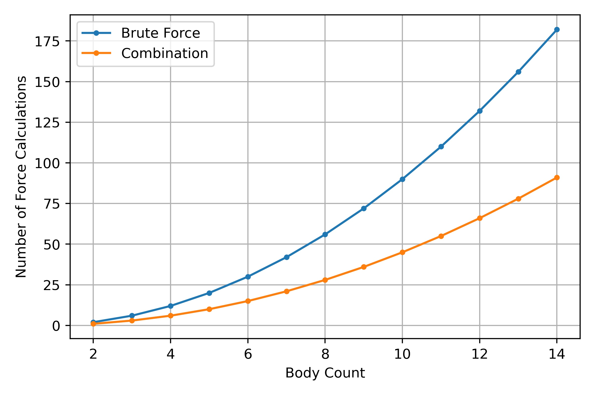
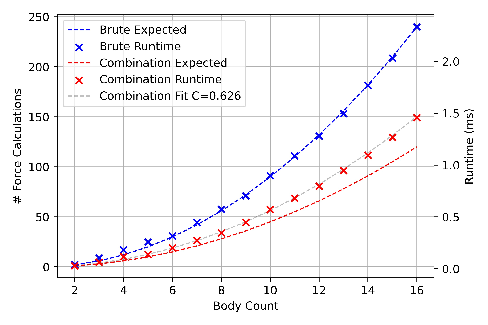
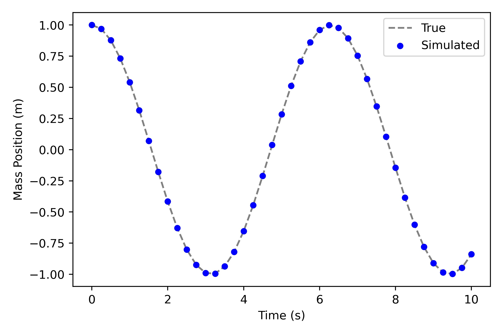
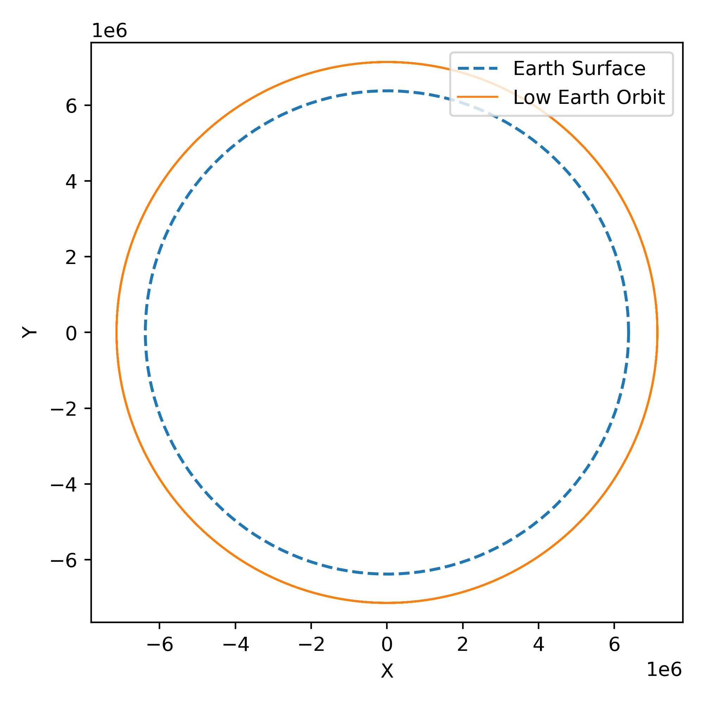
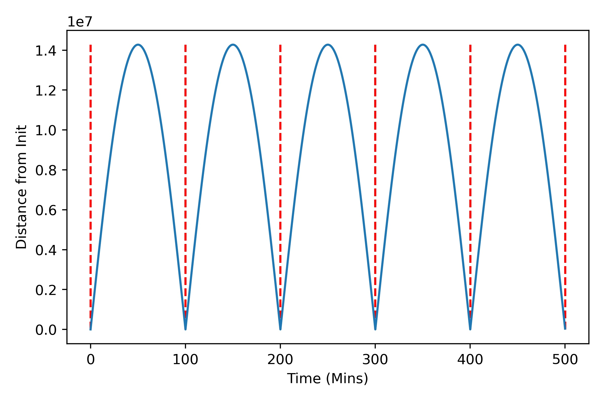
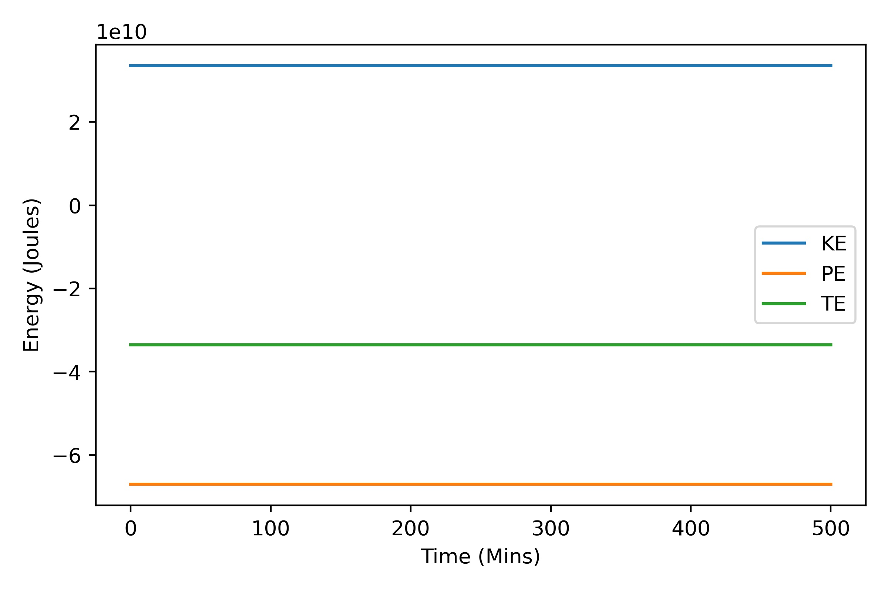
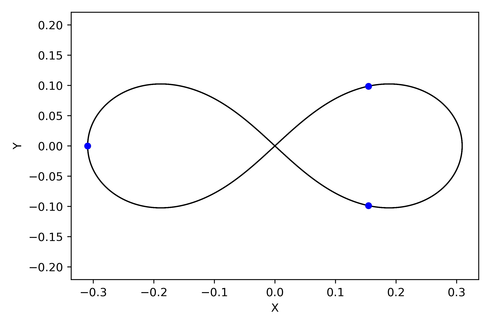
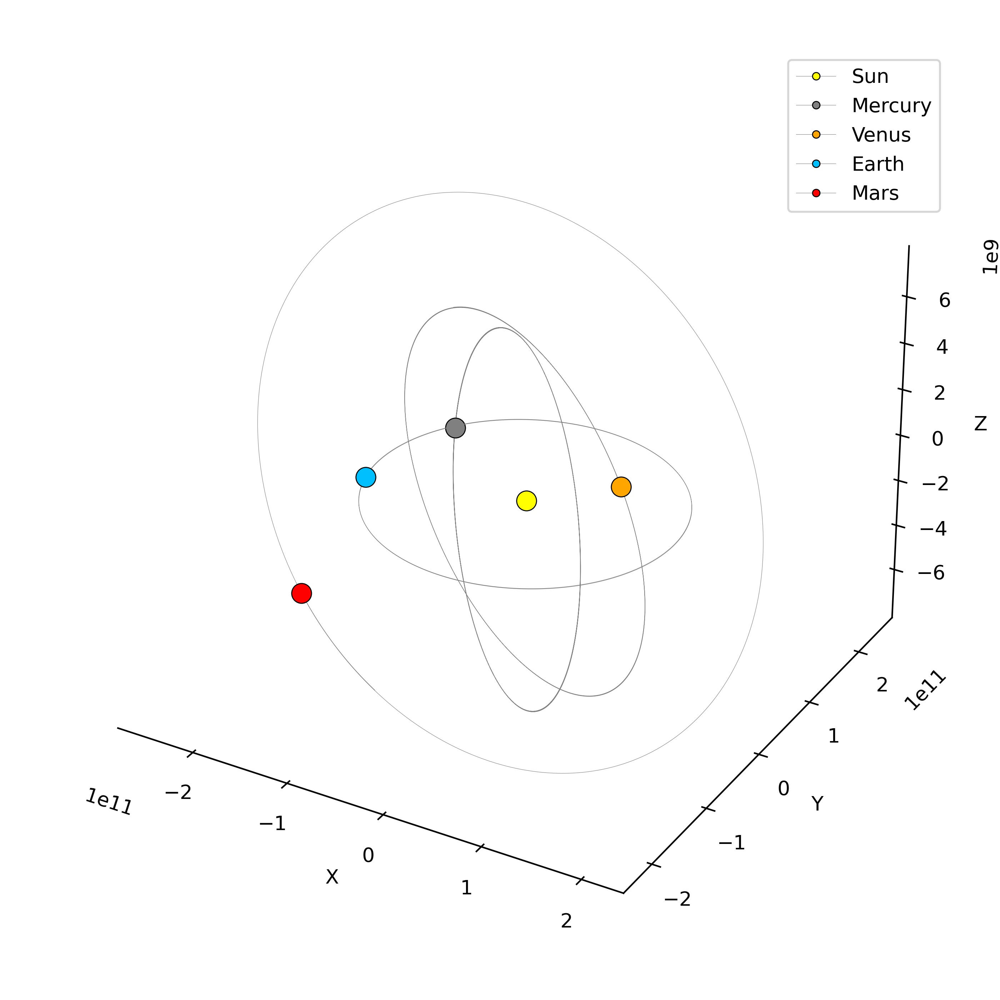
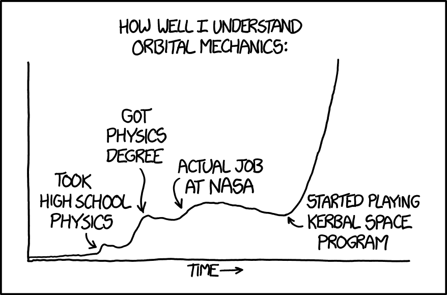

import solar_anim from "./videos/solar_anim.mp4";
import figure8 from "./videos/figure8_anim.mp4";

# Introduction

This post will introduce the principles behind predicting the motion of gravitationally interacting objects. Using Python with some popular modules, we'll implement the principles from scratch.

<PostVideo video={solar_anim} _autoplay={true}/>

# Prior Knowledge

There are a few concepts that you should know before coming into this post, in general I try to explain everything clearly but it helps if you have prior exposure to these concepts.

- **NumPy Matrices:** We will use NumPy as the primary data storage and computation backbone. If you're not familiar with NumPy matrices take a look at [this resource](https://numpy.org/doc/stable/user/absolute_beginners.html).
- **Numerical Integration for ODEs:** We use numerical integrators to solve this problem but we're building off prior knowledge of simpler cases from [my blog post from before](/blog/integrator-intro/).
- **Gravitational Laws:** To be precise, we will be using Newton's law of universal gravitation that you may have seen in a physics course or you can [review it here](https://en.wikipedia.org/wiki/Newton%27s_law_of_universal_gravitation).

# N-Body Problem

The n-body problem is to predict the individual motions of a group of objects interacting gravitationally. More precisely, given the initial conditions of a set of objects the goal is to predict the state of these objects over time when influenced by the gravity of all neighboring objects. Fields such as astronomy, space flight, and others that rely on the understanding of the positions and trajectories of celestial bodies utilize solutions to this problem. What makes this difficult is that for systems of more than two bodies, the math cannot be solved explicitly and therefore must be simulated.

The next few sections will focus on concretely defining the core operations, principles, and theories that we will use moving into the implementation.

# General Goals

As with many problems, there are different methodologies behind how you may solve it. When developing this solution I focused on a few core principles.

- **Readable**: Many operations can be written to run marginally faster at the expense of readability. As this post is meant to educate I focus on making code that is as self-explanatory as possible.
- **Adaptive**: Depending on what you are simulating it may not make sense to generalize the integrator to only work in 3D. I wanted to produce a solution that adapts depending on the inputs and only computes the number of dimensions given.

# Notation

I'll summarize the notation used for vectors, variable assignments, and some other structures that might seem foreign but will be explained through reading the post.

| Notation              | Description         | Definition                                            |
|-----------------------|---------------------|-------------------------------------------------------|
| $\vec{v}$             | Vector              | $\langle v_1, ..., v_n \rangle$                       |
| $\vec{v_{12}}$        | Vector from 1 to 2  | $\vec{v_2} - \vec{v_1}$                               |
| $\lVert\vec{v}\rVert$ | Vector Magnitude    | $\sqrt{v_1^2 + ... + v_n^2}$                          |
| $\hat{v}$             | Unit Vector         | $\frac{\vec{v}}{\lVert\vec{v}\rVert}$                 |
| $\vec{r}$             | Position Vector     | $\langle x, y, z \rangle$ in 3D                      |
| $\vec{v}$             | Velocity Vector     | $\langle \dot{x}, \dot{y}, \dot{z} \rangle$ in 3D    |
| $\vec{a}$             | Acceleration Vector | $\langle \ddot{x}, \ddot{y}, \ddot{z} \rangle$ in 3D |
| $\dot{\vec{v}}$       | Vector Derivative   | $\frac{d\vec{v}}{dt}$                                 |
| $X$                   | Object State        | $\begin{bmatrix}\vec{r} & \vec{v}\end{bmatrix}$  |
| $X$                   | System State        | $\begin{bmatrix}X_1 \\ X_2\end{bmatrix} = \begin{bmatrix}\vec{r_1} & \vec{v_1} \\ \vec{r_2} & \vec{v_2}\end{bmatrix}$  |
| $\dot{X}$             | State Derivative    | $\begin{bmatrix}\dot{X_1} \\ \dot{X_2}\end{bmatrix} = \begin{bmatrix}\vec{v_1} & \vec{a_1} \\ \vec{v_2} & \vec{a_2}\end{bmatrix}$  |


# Gravity Laws

In this section, I will give a brief overview of Newton'zs law of universal gravitation and extend the concept of gravitation between two bodies to all of our $n$ bodies.

## Law of Universal Gravitation

Newton's law of gravitation states that any two bodies in space will be attracted to each other, where $m_1$ and $m_2$ are the masses of the two bodies, $r$ is the distance separating them, and $G$ is the gravitational constant. I've given the equation below in the scalar and vector form.

$$
F = \frac{G m_1 m_2}{r^2} = \frac{G m_1 m_2}{\lVert \vec{r_2} - \vec{r_1} \rVert^2}
$$

This equation only gives us the magnitude of the force, but it would be helpful to have the force as vector. If we multiply the prior with the unit vector pointing from body 1 to body 2 we can get the force acting on body 1 due to object 2 as a vector.

$$
\vec{F_{12}} = F_{12} \hat{r_{12}}
$$
$$
=\frac{G m_1 m_2}{\lVert \vec{r_2} - \vec{r_1} \rVert^2} \frac{\vec{r_2} - \vec{r_1}}{\lVert \vec{r_2} - \vec{r_1} \rVert}
=\frac{G m_1 m_2 (\vec{r_2} - \vec{r_1})}{\lVert \vec{r_2} - \vec{r_1} \rVert^3}
$$

The force of attraction between these two bodies is always on the line between the two bodies and we know that the magnitude of the force acting on each body is the same. Given this we can get the force vector for the force acting on body 2 due to body 1 as the negated version of the force on body 1.

$$
\vec{F_{12}} = -\vec{F_{21}}
$$

## Force on One Body

Now that we know how to determine the gravitational force on a body due to a particular neighboring body, we can extend this to more than 2 bodies. Consider a set of $n$ objects with masses $m_i$ where $i$ ranges from 1 to n. The total gravitational force on a body $i$ is the sum of the gravitational forces due to all other bodies.

$$
\vec{F_i} = \sum_{\substack{j=1 \\ j \neq i}}^n \vec{F_{ij}} = 
\sum_{\substack{j=1 \\ j \neq i}}^n \frac{G m_i m_j (\vec{r_j} - \vec{r_i})}{\lVert \vec{r_j} - \vec{r_i} \rVert^3}
$$

In plain english, the net force on a particular body is the sum of the force equation evaluated between the body of interest and all *other* bodies. In the equation, the $j \neq i$ is what maintains that we do not calculate the attraction of a body onto itself as a body cannot attract itself and we would be dividing by 0 when calculating the force.

## Acceleration on One Body

From the net force it's pretty simple to determine the net acceleration. Using Newton's second law we can add an additional equality to our prior expression. With this we can move around some terms and determine the net acceleration.


$$
\vec{F_i} = m_i \vec{a_i} =
\sum_{\substack{i=1 \\ j \neq i}}^n \frac{G m_i m_j (\vec{r_j} - \vec{r_i})}{\lVert \vec{r_j} - \vec{r_i} \rVert^3}
$$

$$
\vec{a_i} = \frac{\vec{F_i}}{m_i}
$$

We can actually use this to summarize the n-body problem as a system of equations and provide the differential equation that we intend to integrate in a later section.

$$
m_i \vec{a_i} = m_i \frac{d^2 \vec{r_i}}{dt^2} =
\sum_{\substack{i=1 \\ j \neq i}}^n \frac{G m_i m_j (\vec{r_j} - \vec{r_i})}{\lVert \vec{r_j} - \vec{r_i} \rVert^3}
$$

Recall from the prior numerical integrator post that we integrated a similar differential equation for a mass-spring system but only in 1 dimension! Something that I find beautiful is that our code extends super well into the higher dimensionality cases. 

## Acceleration for All Bodies

Clearly, we need to evaluate the net acceleration for all the bodies in our system to know how each of them are going to move. The simple way to do this would be evaluate the prior expression for each of the bodies but in practice this is quite inefficient as there's repeated work being done. Let's see why this is the case and how we can improve it.

### Brute Force Method

Let's consider computing the attraction force between two bodies as a basic operation. We want to minimize the number of times we have to do this to improve the speed of our code. In this simple case, let's call it the brute force method, we compute the net force for each body as in independent operation. To do so, we need to compute $n-1$ forces for each of the $n$ bodies. Overall the number of force calculations ($K$) scales with the number of bodies quadratically.

$$
K= n(n-1)
$$

Python pseudocode for this would look something like the following where we can see that compute force would get called $n(n-1)$ times. Don't focus too much on the details of the actual functions or variables but think more about how many times we get to the line where we compute force.

```python
for i in range(N): # N being number of bodies
    for j in range(N): # Neighboring bodies
        if i == j: # If it's the same body move on
            continue
        force[i] += compute_force(i,j) # This is arbitrary
```

### Combination Method

In this method, we will try to leverage the property that each force we compute can be negated to provide a second force that we can use. In that case, we can resolve two forces in our sets of forces that we need to calculate and reduce our force calculations by half.

$$
K = \frac{n(n-1)}{2}
$$

In practice, all this entails is computing the forces for all combinations of bodies! Looking at the equation for number of combinations we can see that this reduces to the prior assertion for operation count. To be precise, we'll be looking at all combinations of size 2 ($r=2$) from the set of all our bodies. I will refer to the set of combinations the pairs of bodies ($P$) throughout the rest of the post.

$$
C(n,r) = \frac{n!}{r!(n-r)!}
$$

$$
C(n,2) = \frac{n!}{2(n-2)!} = \frac{n(n-1)}{2}
$$

Python pseudocode for this would look something like the following where we reduce the number of calls to `compute_force`. The biggest takeaway here is that by looking at the combinations of bodies we can avoid repeat force calculations.

```python
# pairs is the set of combinations of the n bodies
# `pairs` looks like [(0,1), (0,2), (1, 2)] in a 3 body case
for i, j in pairs: # Pairs will be n(n-1)/2 in length
    F_ij = compute_force(i,j) # Force from i => j
    forces[i] += F_ij # Add force to the net force for body i

    F_ji = -F_ij # Force from j => i
    forces[j] += F_ji # Add force to the net force for body j
```

### Operation Count Comparison

When comparing the different operation counts as the number of bodies $n$ increases we can see that there is a formidable gain in using the combination method over the brute force method. 



Those are familiar with big-$O$ notation may have noticed the both the implementations are still quadratic $O(n^2)$ in nature and are therefore the same time complexity. However, if you were to measure the actual runtime we would see a gain. This is an example where trying to compare time complexity to runtime can get messy.

### Runtime Comparison

Like I mentioned before, the time complexity can be a good indicator of how we would expect the runtime to scale but there are some factors in play that can make them different. 

- In big-$O$ we drop constants and lower order terms
    - Ex: $O(4n^2 + n - 2)$ = $O(n^2)$
    - Constants can be play a large role in runtime (consider $n$ vs $1000n$)
- We may adjust an algorithm where each "iteration" takes longer to run
    - We reduced iteration count in our case by 50% but each iteration has more work

Plotting the runtimes of our two different variants we get the following graph.



We can see that when we normalize the time and theoretical iteration count on the brute force method the times line up for the brute force (blue) meaning that the trend $O(n^2)$ is correct. When we look at the combination method what we see is that the runtimes do not follow the expected trend, why is this? In our case, our algo has more work to do per iteration than the brute force method so even though we expect the runtime to be 50% of the brute force we see that it's actually around ~63%.

All of our analysis is still correct but it's important to understand the limitations of big-$O$ in terms of comparing such similar algorithms. If we managed to develop an algorithm that ran in $O(n)$ time complexity we would not be nearly as concerned about what the true value of the constants are.

# System Energies

Clearly the system starts with a set amount of energy based on the positions, masses, and velocities that manifest as kinetic energy and potential energy. We don't need to compute these to execute a simulation but as we expect the system to maintain energy this can be a good check to see how we're doing.

## Kinetic Energy

Kinetic is really easy! We just need to sum up the result of a classic physics equation.

$$
\text{KE} = \sum_{i=1}^n\frac{1}{2}m_i v_i^2 = \sum_{i=1}^n\frac{1}{2}m_i \lVert \vec{v_i} \rVert^2
$$

## Potential Energy

The [gravitational potential energy](http://hyperphysics.phy-astr.gsu.edu/hbase/gpot.html) $U$ between two objects is something that is really familiar! Just as we're only looking at the combinations of bodies to determine our forces we will do the same here where $i$ and $j$ will be the indices for our bodies out of our set of combinations ($P$).

$$
U(r) = \frac{-Gm_1m_2}{r}
$$

$$
\text{PE} = 
\sum_{i,j \in P} \frac{-Gm_im_j}{r_{ij}} = 
\sum_{i,j \in P} \frac{-Gm_im_j}{\lVert \vec{r_j} - \vec{r_i} \rVert}
$$

# System State

I have been throwing around the word state a bit loosely, let's try to refine our understanding of what this means and why it's useful for us. The 30 second answer is that a state is a matrix that maintains all of the important values that describe the aspects of our system such as the positions and velocities of all of our objects.

> States are a joint representation of everything going on in our system. They help us simplify our integration operations and keep track of our variables.

## Structure

As I mentioned, a state is merely a matrix but the structure of how its constructed and what it contains is the important part. For our physical modeling cases, the state will contain the position and velocities of all the objects where each row is the state of one object and each column is a variable of importance (think a certain position/velocity).


$$
X = 
\begin{bmatrix}
X_1\\
X_2\\
\end{bmatrix} = 
\begin{bmatrix}
\vec{r_1} & \vec{v_1} \\
\vec{r_2} & \vec{v_2} 
\end{bmatrix} = 
\begin{bmatrix}
{x_1} & {y_1} & \dot{x_1} & \dot{y_1}\\
{x_2} & {y_2} & \dot{x_2} & \dot{y_2}\\
\end{bmatrix}
$$

The prior would be the state for a 2D case with two objects. Don't confuse $X$ with $x$, the capital $X$ is the state and has nothing to do with the position variable $x$.

## State Derivative

Along with the state, there is a accompanying state derivative $\dot{X}$, it might sound scary but it isn't. Throughout the integration process we make incremental changes to the state, but doing so for each value independently would be annoying and inefficient. The state derivative is a way to encode the corresponding derivative for each of the values in the state so that when we need to do update steps we can proceed with them as matrix sums. For our purposes, the structure would look like the below for the same case as before.

$$
\dot{X} = 
\begin{bmatrix}
\dot{X_1}\\
\dot{X_2}\\
\end{bmatrix} = 
\begin{bmatrix}
\dot{\vec{r_1}} & \dot{\vec{v_1}} \\
\dot{\vec{r_2}} & \dot{\vec{v_2}}
\end{bmatrix} = 
\begin{bmatrix}
\dot{x_1} & \dot{y_1} & \ddot{x_1} & \ddot{y_1}\\
\dot{x_2} & \dot{y_2} & \ddot{x_2} & \ddot{y_2}\\
\end{bmatrix}
$$

## Advantages

For simple systems, it might be easier to just build out a numerical integrator for each of the variables of interest, but for large n-body systems this would get messy quickly. Consider an example in 3D with 50 bodies, this would mean that we have 300 variables of interest and therefore 300 integrators! When we represent this system in the state matrix form, there are still the 300 values being updated but it's reduced to a series of sums between the entire matrices which is much cleaner (and can be [vectorized](https://www.pythonlikeyoumeanit.com/Module3_IntroducingNumpy/VectorizedOperations.html)).

## Simple Example

Let's do a simple two-body example in 2D to see how this is going to play out in our code! Let's consider two bodies with the properties in the below table.

| Body | Position $\vec{r}$ | Velocity $\vec{v}$ |
| ---- | ---- | ---- |
| 1 | $\langle 0, 0 \rangle$ | $\langle 5, 2 \rangle$ | 
| 2 | $\langle 2, 0 \rangle$ | $\langle 2, 1 \rangle$ | 

### State Representation

If we follow the general structure shown before it's quite evident how this would be constructed. Recall that each row contains the variables needed to describe a single object's condition in our system.

$$
X = 
\begin{bmatrix}
X_1\\
X_2\\
\end{bmatrix} = 
\begin{bmatrix}
\vec{r_1} & \vec{v_1} \\
\vec{r_2} & \vec{v_2} 
\end{bmatrix} = 
\begin{bmatrix}
0 & 0 & 5 & 2 \\
2 & 0 & 2 & 1 \\
\end{bmatrix}
$$

### State Derivative

The goal is to fill out the prior structure which requires us to compute the acceleration on each body. Let's assume that the only force involved in this case is the gravitational attraction between the bodies, for the sake of cleaner math let's assume $G=1$ and that the masses are both $1$.

$$
\vec{F_{12}} = \frac{G m_1 m_2 (\vec{r_2} - \vec{r_1})}{\lVert \vec{r_2} - \vec{r_1} \rVert^3} =
\frac{(\vec{r_2} - \vec{r_1})}{\lVert \vec{r_2} - \vec{r_1} \rVert^3}
$$

$$
=\frac{\langle 2, 0 \rangle}{8}
$$

We know from before that the force for the other body in the force pair is just the negated version of this force so we can also compute the force for body 1.
$$
\vec{F_{21}}=-\frac{\langle 2, 0 \rangle}{8}
$$

As the masses are just 1, the value of the acceleration and the force are the same so we can go ahead and fill out the state derivative.


$$
\dot{X} = 
\begin{bmatrix}
\dot{X_1}\\
\dot{X_2}\\
\end{bmatrix} = 
\begin{bmatrix}
\dot{\vec{r_1}} & \dot{\vec{v_1}} \\
\dot{\vec{r_2}} & \dot{\vec{v_2}}
\end{bmatrix}
$$
$$
=\begin{bmatrix}
\vec{v_1} & \vec{a_1} \\
\vec{v_2} & \vec{a_2}
\end{bmatrix} = 
\begin{bmatrix}
5 & 2 & 0.25 & 0\\
2 & 1 & -0.25 & 0\\
\end{bmatrix}
$$

### Example Euler Integration Step

Now that we have the state and the state derivative, we can actually proceed with doing a simple Euler integration step. Let's consider a step size of $h=1$, we can compute the new state with the following.

$$
X_1 = X_0 + h \dot{X_0}
$$

$$
X_1 = 
\begin{bmatrix}
0 & 0 & 5 & 2 \\
2 & 0 & 2 & 1 \\
\end{bmatrix}
 + 1 
\begin{bmatrix}
5 & 2 & 0.25 & 0\\
2 & 1 & -0.25 & 0\\
\end{bmatrix}
$$

$$
X_1 = 
\begin{bmatrix}
5 & 2 & 5.25 & 2 \\
4 & 1 & 1.75 & 1 \\
\end{bmatrix}
$$

In this post, we will be using a better integrator then Euler, but this simple example presents the core workflow of how we will represent our system and the role that the state derivative plays in propagating the state forward.

# Integrator Refresher

Although it helps to have read my [post](/blog/integrator-intro/) on integrators already, I'll do a short summary of the usage of the RK4 integrator that we are using in this post. If you are already comfortable doing the example cases from that post you can skip ahead, but I would recommend you read regardless as I also wrote this example as a precursor to the later structure.

## General Form

The basic form of the RK4 integrator for a given state $X$ is as follows. The integrator will estimate what the new state $X_{i+1}$ will be one $h$ later (in our case our unit is time so this would be a timestep). In simpler terms, given the values of our system at a time, we can use the integrator to see how these values would change if we progress one timestep into the future.

$$
k_1 = h \, \dot{X}(X_i)
$$

$$
k_2 = h \, \dot{X}(X_i + 0.5 \times k_1)
$$

$$
k_3 = h \, \dot{X}(X_i + 0.5 \times k_2)
$$

$$
k_4 = h \, \dot{X}(X_i + k_3)
$$

$$
X_{i+1} = X_i + \frac{1}{6} (k_1 + 2k_2 + 2k_3 + k4)
$$

This is best defined as a function in code as follows.

```python
def rk4(X, dt, evaluate):
    """
    Inputs:
    - X: Current state of system
    - dt: Integration Timestep
    - evaluate: Function that will return the derivative for the state
    Returns:
    - X: Updated state one timestep later
    """
    # Calculate Terms
    k1 = evaluate(X)
    k2 = evaluate(X + 0.5*k1*dt)
    k3 = evaluate(X + 0.5*k2*dt)
    k4 = evaluate(X + k3*dt)

    # Update X
    X_prime = (1/6.)*(k1 + 2*k2 + 2*k3 + k4)
    return X + X_prime * dt
```

## Mass-Spring System

Let's go ahead and consider a simple differential equation for a mass and spring system with no damping. Note that the smaller $x$ in this equation is not a state but just a single variable. 

$$
m \ddot{x} + k x = 0 \rightarrow m \ddot{x} = -kx
$$

Our initial conditions for the system will be the position $x$ and velocity $\dot{x}$ at $t=0$. The state and the corresponding state derivative would be the following.

$$
X = \begin{bmatrix}x & \dot{x}\end{bmatrix} \quad \dot{X} = \begin{bmatrix}\dot{x} & \ddot{x}\end{bmatrix}
$$

Let's go ahead and write our differential equation into a function that will return the state derivative for a given state. In general, when your system of equations changes this will manifest as a change to the function that returns the state derivative. For example, if this system also had a damper we would have to include the changes to the ODE in the calculation for `xdd`.

```python
def get_state_deriv(X):
    """
    Inputs:
    - X: State matrix with position and velocity
    Returns:
    - Xdot: State derivative matrix to be used in integration 
    """
    # ODE Constants 
    m, k = 1, 1

    # Build State Derivative
    xdd = -(k/m) * X[0] # x double dot from ODE
    Xdot = np.array([X[1], xdd])
    return Xdot
```

We can now execute a simple simulation and plot the results against the known solution to this which is $\sin(t)$ for these constants.

```python
# Imports
import copy
from math import ceil
import numpy as np
import matplotlib.pyplot as plt

# Initial conditions
Xi = np.array([1,0]) # [x, xdot] => [Initial Position=1, Initial Velocity=0]
T, dt = 10, 0.25
iters = ceil(T / dt) # Number of iterations

# Init History to Store Results
history = np.zeros((iters+1, 2))
history[0] = Xi
times = np.linspace(0, T, iters+1)

# Execute the Simulation
X = copy.deepcopy(Xi)
for i in range(iters):
    history[i+1] = rk4(history[i], dt, get_state_deriv)

plt.plot(times, np.cos(times), color='gray', linestyle='dashed', label='True')
plt.scatter(times, history[:,0], color='blue', s=20, label='Simulated')
plt.xlabel("Time (s)")
plt.ylabel("Mass Position (m)")
plt.legend()
plt.show()
```

This should yield the following plot where we can see that the simulated points match up with the true result quite well! 



I point out this example because the form of the ODE is more similar to the n-body problem then you may have thought. The prior formulation of the state and state derivative are very similar to what we do for the n-body case.

$$
m \ddot{x} = -kx
$$

$$
m_i \vec{a_i} =
\sum_{\substack{i=1 \\ j \neq i}}^n \frac{G m_i m_j (\vec{r_j} - \vec{r_i})}{\lVert \vec{r_j} - \vec{r_i} \rVert^3}
$$

# Executing a Simulation

The last step before we can move onto the implementation is just seeing how we stack up all of our prior operations to actually run a simulation.

## Number of Iterations

The first step is to determine how many simulation steps we're going to be taking. This is trivially done with the given end time $T$ and the time step $dt$. We use the ceiling function here to run a simulation slightly longer than needed as opposed to too short.

$$
\text{Iterations} = \lceil \frac{T}{dt} \rceil
$$

## Initializations

We have a few additional initializations that make sense to run here and not in `init`.

### History

We'll store the history of the states in one large `history` matrix of size [Iterations +1, N, D]. Essentially it's a stack of (Iterations + 1) states indexed by the simulation iteration.

### Body Pairs

Across multiple different operations we utilize the sets of body pairs based on the combination. It's helpful to pre compute them so that it's not a repeated operation.

### Energies

Similarly to the state history, we'll initialize a history of energies of size [Iterations + 1, 3] as we store kinetic, potential, and total energy. This step is done after the body pairs as the energy calculations depend on the pairs.

## Running Iterations

We now have everything we need to execute a simulation! All we do now is call our integrator function to step the state ahead by on timestep and save the new state into our history. Along the way we also compute the energy for each of these new states and store that too.

# Implementation

Time for the fun stuff, in this section we'll go over how to take these concepts and implement them in Python. Let's go ahead and start with importing the Python modules that we intend to use.

```python
import copy # Used for creating non-linked copies of states
from math import ceil # Helpful for rounding off floats to conservative ceilings
from itertools import combinations # Produces the sets of combinations for pairs
import numpy as np # General matrix compute platform
import matplotlib.pyplot as plt # Used for plotting and analysis
```

## Simulation Class

Many of the operations and variables we use are reused across the simulation, so it helps to encapsulate it all into a class to clean up many of the references. Below is the framework that we'll fill out in the later steps, so if you want to follow along go ahead and copy this before we start.

```python
class NBody:
    def __init__(self, Xi=None, masses=None, G=6.67408e-11):
        pass
    
    def get_energy(self, X):
        pass
    
    def get_state_deriv(self, X):
        pass
        
    def rk4(self, X, dt, evaluate):
        pass
    
    def run_simulation(self, T, dt):
        pass
```
- `init`: Initializes some of the reused variables across our class
- `get_energy`: Returns the kinetic and potential energy of the system at a given state
- `get_state_deriv`: Determines the state derivative of a given state
- `rk4`: Integrates the input state to a new state one timestep ahead
- `run_simulation`: Calls all requisite functions to produce a sequence of states up to a time T

The main benefit of doing this as a class is that we can provide instances for different types of simulations or different initial conditions. Also there are many variables that are static and used by different functions so this reduces the amount of repeat work (think about how many times we use `self.pairs`).

## Init

Some of this may not be immediately clear but you'll see why we're doing this as we develop more of the core functions.

```python
def __init__(self, Xi=None, masses=None, G=6.67408e-11):

    # Init State and Masses
    self.Xi = Xi # Set the initial state matrix
    self.masses = masses # Set the body masses array
    
    # Set gravitational constant
    # This really shouldn't change but it's fun for some special cases
    self.G = G
    
    # History is where we'll store the results of the simulation
    # We will not define a history without a sim so it's none for now
    self.history = None
    self.energies = None
```

## System Energy

The prior formulations maps really well into the code! While there are faster ways to compute these by using vectorization and maintaining matrices as opposed to iterating but this is way easier to understand which is why I opted to present it this way.

```python
def get_energy(self, X):
    """
    Inputs:
    - X: The current state to determine the energy for
    - masses: Array of masses corresponding to the bodies
    - G: Gravitational constant, needed for potential energy
    Returns:
    - KE: Total kinetic energy of the system in joules
    - PE: Total potential energy of the system in joules
    """

    # Useful Variables
    N, D = X.shape # Get the number of bodies, and dimensionality
    D = D // 2 # Get the number of dimensions, are we 2d or 3d?
    R = X[:, :D] # Submatrix with all positions
    V = X[:, D:] # Submatrix with all velocities

    # Determine Kinetic Energy
    # 1/2 * mass * v ^ 2
    KE = 0
    for i in range(N):
        KE += 0.5 * self.masses[i] * np.linalg.norm(V[i]) ** 2

    # Determine Potential Energy
    # (-G * m_i * m_j) / r_ij
    PE = 0
    for body_i, body_j in self.pairs:
        r = np.linalg.norm(R[body_j] - R[body_i]) # Distance between bodies
        PE -= self.masses[body_i] * self.masses[body_j] / r
    PE *= self.G # Multiplying is expensive so I only do one at the end

    return KE, PE
```

## State Derivative

Take some time to really understand this section as it's the meat of the conversation today. I personally think it's much easier to understand what is happening when looking at the code.


```python
def get_state_deriv(self, X):
    """
    Inputs:
    - X: The current state to determine the state derivative for
    Returns:
    - Xdot: The corresponding state derivative for the input state
    """
    
    # Useful Variables
    N, D = X.shape # Get the number of bodies, and dimensionality
    D = D // 2 # Get the number of dimensions, are we 2d or 3d?
    R = X[:, :D] # Submatrix with all positions
    V = X[:, D:] # Submatrix with all velocities

    # Build Placeholder Structure
    Xdot = np.zeros_like(X) # Xdot is the same size as X
    Xdot[:, :D] = V # Fill in velocities from state 

    # Iterate Over Pairs and Fill Out Acceleration
    # self.pairs gets defined when we start a sim
    # body_i, body_j are the indices of the bodies
    for body_i, body_j in self.pairs:

        # Get vector from body_i => body_j and its magnitude
        r1, r2 = R[body_i], R[body_j] # Positions of body_i and body_j
        r_vec = r2 - r1 # Vector from body_i => body_j
        r = np.linalg.norm(r_vec) # Distance from body_i => body_j

        # Find Force from body_i => body_j
        F = self.G * self.masses[body_i] * self.masses[body_j] * r_vec / r**3
        a1 =  F / self.masses[body_i] # Compute acceleration for body_i
        a2 = -F / self.masses[body_j] # Compute acceleration for body_j

        # Apply acceleration to body_i and body_j
        Xdot[body_i, D:] += a1
        Xdot[body_j, D:] += a2

    return Xdot
```

## RK4 Integrator

This is a direct copy from my prior work. The purpose of the integrator is to take in a current state and advance the state to where it should be one timestep (dt) later. This of course relies on being able to compute the state derivative which is what the function we pass in as `evaluate` is needed for.

Generally speaking, the RK4 integrator is a good all-around integrator for various types of problems (to me it's reliable but likely not optimal depending on the case). As an example, when simulating Hamiltonian systems (often called conservative systems) one can use special integrators that preserve the constant energy nature of these systems. I won't get into it here, but I'm just trying to imply that there isn't one *best* integrator.

```python
def rk4(self, X, dt, evaluate):
    """
    Inputs:
    - X: Current state of system
    - dt: Integration Timestep
    - evaluate: Function that will return the derivative for the state
    Returns:
    - X: Updated state one timestep later
    """
    # Calculate Terms
    k1 = evaluate(X)
    k2 = evaluate(X + 0.5*k1*dt)
    k3 = evaluate(X + 0.5*k2*dt)
    k4 = evaluate(X + k3*dt)

    # Update X
    X_prime = (1/6.)*(k1 + 2*k2 + 2*k3 + k4)
    return X + X_prime * dt
```

## Running the Simulation

Now that we have all the requisite functions defined, we can go ahead and piece it together here in the main simulation call. As we are using a class to hold all of our information, I added some assertions to the start to ensure we have the required arguments to execute a simulation.


```python
def run_simulation(self, T, dt):
    """
    Inputs:
    - T: Total runtime of simulation
    - dt: Timestep for integration
    Returns:
    - history: Matrix of the history of states
    """
    
    # Check to ensure initial conditions and masses have been set
    assert self.Xi is not None
    assert self.masses is not None
    
    # Setup Sim Params
    iters = ceil(T / dt) # Number of simulation iterations
    
    # Init History
    N, D = self.Xi.shape
    self.history = np.zeros((iters+1, N, D))
    self.history[0] = self.Xi # First history is our initial conditions

    # Determine Force Pair Indexes
    self.pairs = list(combinations(range(N), 2))

    # Init Energies
    self.energies = np.zeros((iters+1, 3))
    KE, PE = self.get_energy(self.Xi)
    self.energies[0] = np.array([KE, PE, KE+PE])
    
    # Run Simulation Iterations
    X = copy.deepcopy(self.Xi) # Copy as to not modify Xi
    for i in range(iters):
        X = self.rk4(X, dt, self.get_state_deriv) # Get new state
        self.history[i+1] = X # Store new state
        KE, PE = self.get_energy(X) # Get new state's energy 
        self.energies[i+1] = np.array([KE, PE, KE+PE]) # Store energy
    return self.history
```

# Simple Two Body & Verification

Before we step into larger and more interesting examples, it helps to validate that the work that we did is providing results that we think are correct. Let's consider a simple case of a small satellite orbiting in a circular low earth orbit (LEO), akin to a Starlink satellite.

## Initial Conditions

For this simple case we can make a useful function to help us determine what the initial conditions would be for a circular orbit. When an object is orbiting a body, there is a balancing act between the centripetal force and gravitational force. A circular orbit is constantly in this balance, so we can set the force equal to each other and solve for the needed velocity for a given input radius.

$$
F_c = F_g \rightarrow \frac{m_1v^2}{r} = \frac{Gm_1m_2}{r^2}
$$

$$
v^2 = \frac{Gm_2}{r}
$$

$$
v = \sqrt{\frac{Gm_2}{r}}
$$

Where $m_2$ is the mass of the body that our satellite is orbiting. Generalizing this for a satellite orbiting earth we can make a helpful function for setting up initial conditions.

```python
def earth_stable_orbit(r):
    """
    Inputs:
    - r: Altitude of orbit above earth's surface in meters
    Returns:
    - v: Velocity in m/s to sustain a stable circular orbit
    """
    G = 6.67408e-11
    massE = 5.974e24 # Mass in kg
    rE = 6.3781e6 # Radius in m
    return np.sqrt(G * massE / (r + rE))
```

With this function we can easily define our initial conditions in terms of an orbital altitude. The first body in our state is the earth at origin not moving (hence $\langle 0,0,0,0\rangle$) and the second body is our satellite.

```python
massE, rE = 5.974e24, 6.3781e6 # Earth properties
r = 760e3 # Satellite Orbit Altitude

# Setting up initial state
X = np.array([[0, 0, 0, 0],
              [rE + r, 0, 0, earth_stable_orbit(r)]])
masses = [massE, 250] # Earth and Small Sat
```

## Running Simulation

Now that we have the initial conditions and masses arranged, we can go ahead and initialize an instance of our `NBody` class and call a simulation. In this case given the expected period of the orbit, I opted for a 500 minute end time at a 1 second timestep to get a few periods without an excessive runtime.

```python
TwoBody = NBody(Xi=X, masses=masses) # Initialize sim instance
T, dt =  500 * 60, 1 # Simulation for 500 minutes at a 1 second timestep
history = TwoBody.run_simulation(T, dt) # Run the sim and get history
```

Now that we have the simulation history, we can go ahead and plot the example with the following code.

```python
# Positions for Plotting Earth Circle
theta = np.linspace(0, 2 * np.pi, 150)
x = rE * np.cos(theta)
y = rE * np.sin(theta)

# Plot Earth Surface
plt.plot(x, y, label="Earth Surface", linestyle='dashed')

# Plot the satellite orbit
x = history[:, 1, 0] # [all sim steps, body 1, first variable in state]
y = history[:, 1, 1] # [all sim steps, body 1, second variable in state]
plt.plot(x, y, label="Low Earth Orbit", linewidth=1)
plt.axis('equal')
plt.legend(loc='upper right')
plt.xlabel("X")
plt.ylabel("Y")
plt.show()
```



## Validation

Looks great! Let's dive a bit deeper and verify the orbital period and system energy. Let's consider some simple checks to see if the integrator is performing as we'd expect.

### Orbital Period

For the period evaluation we can make a pretty simple plot to give us confidence that this works. First, let's determine what the period is supposed to be by computing how long it would take to traverse a circle with a radius of our orbit when traveling at our initial velocity. Then we can plot how far the satellite is from the initial position, this way when we return back to where we started we'll see a minimum in our graph that should reflect a period.

```python{out={2}}
# Compute Expected Period
# (2 * pi * r) / v
P = 2 * np.pi * TwoBody.Xi[1,0] / TwoBody.Xi[1,3] / 60
print(f"Expected Orbital Period: {P:0.3f} mins")

# Get Distance From Initial Conditions
iters = history.shape[0]
times = [i * dt / 60 for i in range(iters)]
dists = [np.linalg.norm(history[i,1,:2] - history[0,1,:2]) for i in range(iters)]

# Plot Dists and Periods
plt.vlines(P * np.arange(0,6), 0, max(dists), color='red', linestyle='dashed')
plt.plot(times, dists)
plt.xlabel("Time (Mins)")
plt.ylabel("Distance from Init")
plt.show()

Expected Orbital Period: 100.017 mins
```



Everything seems in order for the periods so let's move onto looking at the energy of the system.

### Energy Validation

Energy validation is even simpler, we already compute the energy alongside the history of states so we can just plot based on that. It's a given that we expect the total energy of the system to remain constant as there are no losses but what do we expect the kinetic energy and potential energy to look like? 

As the satellite is essentially the only object moving (Earth is getting pulled slightly but it's negligible) and it's orbit is circular we would expect the velocity and therefore the kinetic energy to remain constant. This would also mean that the potential energy would be constant so we should expect 3 constant values for KE, PE, and TE.

```python
energies = TwoBody.energies
times = np.arange(0, energies.shape[0]) * dt / 60
plt.plot(times, energies[:,0], label='KE')
plt.plot(times, energies[:,1], label='PE')
plt.plot(times, energies[:,2], label='TE')
plt.xlabel("Time (Mins)")
plt.ylabel("Energy (Joules)")
plt.legend()
plt.show()
```



Great! Seems like everything is working as expected so we can move on to some more interesting examples.

# Special Three Body

In this section, we'll have fun with an N-body choreography with three bodies. The history of them is [quite short](https://www.math.uni-bielefeld.de/~rehmann/ECM/cdrom/3ecm/pdfs/pant3/simo.pdf) and many fun initial conditions have already been found. We're focusing on one that should produce a stable figure 8!

> It's pretty typical for these to use $G=1$

## Initial Conditions

I have provided the initial conditions and masses for this system in the form needed for our solution below. I chose this choreography as many of the other examples are quite unstable and may not provide good results.

```python
X = np.array([[-0.3092050,  0.        ,  0.        , -0.50436399],
              [ 0.1546025, -0.09875616, -1.18437049,  0.25218199],
              [ 0.1546025,  0.09875616,  1.18437049,  0.25218199]])
masses = np.ones(3) * 1/3 # Total mass for the system is 1
```

## Running Simulation

Just as before, we can construct an instance of our `NBody` class and proceed with the simulation!

```python
Figure8 = NBody(Xi=X, masses=masses, G=1) # Note the different G
T, dt = 3.5, 1e-3
history = Figure8.run_simulation(T, dt)
```

We can go ahead and plot the results to see if we get the correct result.

```python
# Plot Position
for i in range(3): # Iterate over the bodies
    x = history[:, i, 0]
    y = history[:, i, 1]
    plt.plot(x, y, linewidth=1, color='black', zorder=0)
    plt.plot(x, y, markevery=[0], marker="o", ms=5, linewidth=0, color='black', 
             mfc='blue', mec='blue', zorder=1)
plt.axis('equal')
plt.xlabel("X")
plt.ylabel("Y")
plt.tight_layout()
plt.show()
```



That looks great! I took the liberty of producing an animation of their motion and the associated energy as I think it's a great way to appreciate this case.

<PostVideo video={figure8}/>

# Partial Solar System

Lastly, let's consider a partial solar system example. I limited this to a partial simulation as the periods of orbit for some of the outermost planets are quite long and I don't think it's reasonable for most people to run a full period of these orbits on their computers.

## Initial Conditions

Much like the figure-8 case, I was able to find the initial conditions [online](http://www.wiu.edu/cas/mathematics_and_philosophy/graduate/equations-planetary-motion.pdf) and I have provided them in the format needed for my simulation structure below.

```python
names = ["Sun", "Mercury", "Venus", "Earth", "Mars", "Jupiter", "Saturn", "Uranus",
        "Neptune", "Pluto"]
X = np.array([
    [1.81899E+8, 9.83630E+8, -1.58778E+8, -1.12474E+1, 7.54876E+0, 2.68723E-1],
    [-5.67576E+10, -2.73592E+10, 2.89173E+9, 1.16497E+4, -4.14793E+4, -4.45952E+3],
    [4.28480E+10, 1.00073E+11, -1.11872E+09, -3.22930E+04, 1.36960E+04, 2.05091E+03],
    [-1.43778E+11, -4.00067E+10, -1.38875E+07, 7.65151E+03, -2.87514E+04, 2.08354E+00],
    [-1.14746E+11, -1.96294E+11, -1.32908E+09, 2.18369E+04, -1.01132E+04, -7.47957E+02],
    [-5.66899E+11, -5.77495E+11, 1.50755E+10, 9.16793E+03, -8.53244E+03, -1.69767E+02],
    [8.20513E+10, -1.50241E+12, 2.28565E+10, 9.11312E+03, 4.96372E+02, -3.71643E+02],
    [2.62506E+12, 1.40273E+12, -2.87982E+10, -3.25937E+03, 5.68878E+03, 6.32569E+01],
    [4.30300E+12, -1.24223E+12, -7.35857E+10, 1.47132E+03, 5.25363E+03, -1.42701E+02],
    [1.65554E+12, -4.73503E+12, 2.77962E+10, 5.24541E+03, 6.38510E+02, -1.60709E+03]
])
masses = np.array([1.98854E+30, 3.30200E+23, 4.86850E+24, 5.97219E+24, 6.41850E+23,
                  1.89813E+27, 5.68319E+26, 8.68103E+25, 1.02410E+26, 1.30700E+22])

# You can subset out the planets
n = 5 # Number of planets to remove from the end
names = names[:-n]
X = X[:-n]
masses = masses[0:-n]
```

## Running Simulation

The process here is identical to before, but given the scale of the problem notice how the timestep is much larger now. I try to scale my timestep based on the periods where over a period I want a certain number of steps. Playing with this more you can develop better intuition behind this.

```python
# Time Step is an hour!
SolarSystem = NBody(Xi=X, masses=masses)
T, dt = 2 * 365 * 24 * 60**2, 60 ** 2 # 2 Years, 1 hour step
history = SolarSystem.run_simulation(T, dt)
```

Now that we have the history we can go ahead and produce a test plot.

```python
fig = plt.figure(figsize=(7,7))
ax = fig.add_subplot(111,projection='3d')
colors = ["yellow", "gray", "orange", "deepskyblue", "red", "chocolate", 
          "bisque", "lightcyan", "blue", "lightgray"]
for i in range(X.shape[0]):
    c = colors[i]
    x = history[:, i, 0]
    y = history[:, i, 1]
    z = history[:, i, 2]
    ax.plot3D(x, y, z, color='gray', label=names[i], linewidth=0.2,
             markevery=[0], marker='o', ms=10, mfc=c, mec="black", mew=0.5)
    
ax.set(xlabel='X')
ax.set(ylabel='Y')
ax.set(zlabel='Z')

ax.grid(False) # Turn off grid
ax.w_xaxis.set_pane_color((0.0, 0.0, 0.0, 0.0)) # No color on face x axis face
ax.w_yaxis.set_pane_color((0.0, 0.0, 0.0, 0.0)) # No color on face y axis face
ax.w_zaxis.set_pane_color((0.0, 0.0, 0.0, 0.0)) # No color on face z axis face
    
ax.legend(markerscale=0.375)
plt.show()
```



In my animation, I did some extra work to try and scale the sizes of the planets with some respect to their actual sizes but I opted not to for the example here as it just adds unnecessary complexity for plotting the example for validation purposes.

> Little challenge for you, plot the energy for this system and see if it makes sense to you.

# Closing Remarks

This one was quite a bit to write but I hope you enjoyed reading it as much as I did making it. Let me know if you have any suggestions or comments and I'd be happy to consider them.

