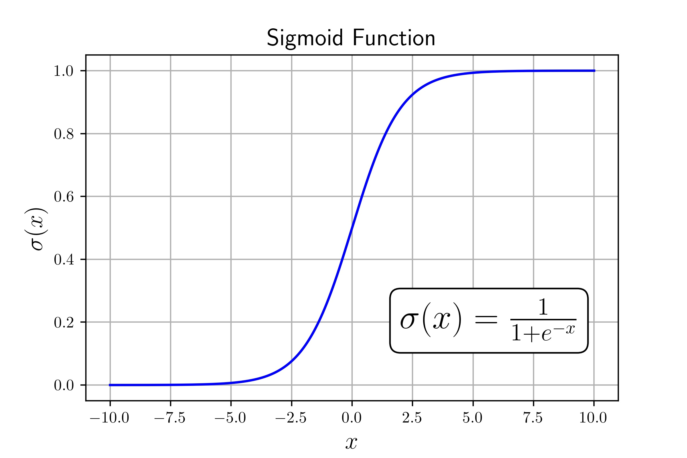

# Introduction

This post will introduce you to the principles behind logistic regression as a binary classification method. Using Python and NumPy we will implement the core principles from scratch on a test dataset. There are different ways to implement this particular algorithm but I will focus on an implementation with a neural network mindset as many of these ideas extend well into neural nets in later posts.

# What is Logistic Regression?

Logistic regression is a predictor borrowed from statistics used for binary classification. All this means is that we can use the algorithm to predict whether a given example belongs to a class or not. As an example, if we knew certain features about the weather (temperature, humidity, wind, etc.) we could try to predict if it's going to rain or not. To do so, we need many _labeled_ examples of data from other days. We'll get into this more moving forward.

# Math Representation

Before we can dive into the implementation, we first need to fully understand the required data and math for this problem.

## Data Organization

We represent a particular example as a vector of features and we store all these examples as one large matrix $X$ where $X_i$ is a particular example (a single day if we follow our prior rain metaphor). The labeled aspect means that we know whether or not that day had rain, we'll call this the ground-truth and save all labels for our examples in a vector $y$ where we store a 0 for the days it didn't rain and a 1 when it does rain.

As an example, let's imagine that we track 2 different aspects to describe each day such as average temperature and humidity. For a year, we would have 365 examples of temperature and humidity stored in our vector $X$ and the whether it rained or not in our vector $y$.

$$
X = [365 \times 2] =
\begin{bmatrix}
72 & 0.42\\
55 & 0.92\\
\vdots & \vdots \\
53 & 0.95\\
71 & 0.43\\
\end{bmatrix}
$$

$$
y=[365 \times 1] =
\begin{bmatrix}
0\\
1\\
\vdots \\
1\\
0\\
\end{bmatrix}
$$

## Forward Propagation

The forward propagation step is where we take an example $X_i$ and pass it through our model to yield a prediction $\hat{y_i}$. To do so, we have a vector $W$ that stores what we call the weights. We also have a bias term that we denote as $b$. Together with the sigmoid function ($\sigma$) we get the following:

$$
\hat{y_i} = \sigma (W^T X_i + b)
$$



Where $\hat{y_i}$ is the probability that the example is in the class we are trying to predict. For the rain example, this is the logistic regressions estimated probability that it will rain that day. The sigmoid function is well catered to this as it introduces a non-linearity that bounds the output between 0 and 1, perfect for a probability!

### Example Forward Propagation

Let's consider our example $X$ in the prior data organization section. I understand that at this point I have not discussed how to determine $W$ and $b$ but for now follow that we know it, we will discuss how to find the correct values in the next section. Let's use the following:

$$
W^T = [1 \times 2] =
\begin{bmatrix}
0.1 & 10
\end{bmatrix}
$$

$$
b = -13
$$

We can actually go ahead and bulk propagate all examples using matrix multiplication! Let's use $X$ and $y$ as the define days from before which is:

$$
X = [4 \times 2] =
\begin{bmatrix}
72 & 0.42\\
55 & 0.92\\
53 & 0.95\\
71 & 0.43\\
\end{bmatrix}
$$

$$
y=[4 \times 1] =
\begin{bmatrix}
0\\
1\\
1\\
0\\
\end{bmatrix}
$$

Following the equation for $\hat{y_i}$ we get the following:

$$
\hat{y_i} = [4 \times 1] = \sigma (W^T X^T + b)
$$

$$
\hat{y_i} = \sigma (
\begin{bmatrix}
0.1 & 10
\end{bmatrix}

\begin{bmatrix}
72 & 55 & 53 & 71\\
0.42 & 0.92 & 0.95 & 0.43\\
\end{bmatrix}
-13
)
$$

$$
\hat{y_i} =
\sigma(
    \begin{bmatrix}
    -1.6 & 1.7 & 1.8 &-1.6 \\
    \end{bmatrix}
)
$$

$$
=
\begin{bmatrix}
0.17 & 0.85 & 0.86 & 0.17 \\
\end{bmatrix}
$$

When we compare those probabilities to the known results we can see they match! Days that had rain (days 2 and 3) show high probabilities that it rained and the non rain days respectively show low probabilities. In practice you can get a prediction as a 1 or 0 by rounding the probability, the idea is you round towards the prediction that is more likely in the probability. In the case of logistic regression where there are only two possibilities (rain or didn't) you can estimate one from the other very easily.

$$
\text{P}_{\text{Clear}} = 1 - \text{P}_{\text{Rain}}
$$

Essentially, if the probability is greater or less than $0.5$ we round as the alternate probability becomes lower.

### Bias Simplification

Personally, I prefer to move the bias term ($b$) into the matrix multiplication ($W^T X_i$). This is done by adding a column of 1's to the end of $X$, adding a feature that is consistent across all examples. Then we increase the size of the weights by 1 (now $W',X'$ etc.) such that the last weight acts as the bias. Check the math below if you are still curious. This helps to simplify the training procedure as you only need to train for $W'$! Moving forward, I will refer to $W'$ as just $W$.

> $$
> W^T X + b  = w_1 x_1 + ... + w_n x_n + b
> $$
>
> $$
> = w_1 x_1 + ... + w_n x_n + w_{n+1} [1,1,...,1]
> $$
>
> $$
> = W'X'
> $$

### Finding the Correct $W$ and $b$

As mentioned prior I just gave you suitable values for $W$ and $b$ to go through the example by tweaking with the results in a python session. In practice, it can be difficult/impossible to self determine the correct values. To most correctly determine the values we use a process called training!

> Values of the weights are determined through training!

# Training

Training is the process where we take many labeled examples and use them to determine values for $w$ that will yield us the best _overall_ performance. To be precise, we will describe some formulations for what are called the cost and loss of the model.

## Cost and Loss Functions

Let's start with the loss function. The loss is a measure of the error for a particular example's prediction. Following our prior notation the loss for one example is:

$$
\mathcal{L} = -y \log(\hat{y}) - (1-y) \log(1-\hat{y})
$$

Let's play this out and see why it makes sense. For a given example that we know had no rain ($y=0$), we can consider the error as the log of the difference between the prediction $\hat{y}$ and 0 as the left side term goes to 0 and we're just left with $\log(1-\hat{y})$. As a reminder, $\log(1)=0$ so any deviation from 1 would create an error. Going back to if $y=0$, a perfect prediction would be if $\hat{y}=0$ and we'd be left with $\log(1)=0$. Therefore, the cost function accommodates for the two different possible values of $y$ and takes the log of the difference for the respective cases.

The cost function is easy, it's just the average of the loss functions so:

$$
Cost = \frac{1}{N}\sum_{i=1}^{N} \mathcal{L}_i
$$

Now that we have a formulation for a function to decrease let's just take the derivative and set it equal to 0 to see what the values of $W$ should be. In practice, this is not possible so we need to approach this as a numerical optimization problem.

## Gradient Descent

Gradient descent is fairly simple, given the gradient of a function with respect to the variable to be optimized take a step in the negative direction of the gradient (positive for gradient ascent) and update your inputs with the step. Keep repeating this until you are happy with the convergence. In general, it looks something like this:

$$
\theta_{i+1} = \theta_i - \alpha \nabla f(\theta)
$$

Where $\alpha$ is a tuneable parameter called the learning rate, it dictates what fraction of the gradient we should step by. I will not go through the derivation ([great resource](https://web.stanford.edu/class/archive/cs/cs109/cs109.1166/pdfs/40%20LogisticRegression.pdf)), but for our problem we would like to use gradient descent where $f$ is the cost function and we take the gradient in terms of $W$. For our use case this is:

$$
W_{i+1} = W_i - \alpha \frac{1}{N} X^T(\sigma(W^T X^T)-y)^T
$$

Now we have everything to implement!

# Implementation

Let's go ahead and import our python modules first as follow:

```python
import numpy as np
from sklearn.model_selection import train_test_split
from sklearn.datasets import load_breast_cancer
```

I will be using Python and NumPy for the implementation. The dataset used is imported in our prior code block with the rest of our libraries. The dataset takes a few human health metrics as features and tries to predict if the patient has breast cancer, you can read more [here](https://scikit-learn.org/stable/modules/generated/sklearn.datasets.load_breast_cancer.html).

## Model Class

As we have many parameters, helper functions, and repeated operations I will be creating the model as a Python class. Let's go ahead and initialize the class with all the methods we will be using.

```python
class LogisticRegression():

    def sigmoid(self, z):

    def prep_data(self, X):

    def add_dimension(self, X):

    def train(self, X_train, y_train, learning_rate, iterations):

    def predict(self, X_test):
```

- `sigmoid` will be where we write the sigmoid function
- `prep_data` is where we will normalize our data to between 0 and 1
- `add_dimension` is a helper function for adding the column of 1's to $X$
- `train` is where we will run the gradient descent iterations to determine our weights
- `predict` is where we will forward propagate on unseen (test) data to estimate the classes

Let's start with the `sigmoid` function, as mentioned before the function is $(1+\exp(-x))^{-1}$, using NumPy this is:

```python
def sigmoid(self, z):
    return 1 / (1 + np.exp(-z))
```

Let's go ahead to `prep_data` and `add_dimension` as they work together. `prep_data` takes the range of each column and brings them down to $[0,1]$, that way no particular feature dominates the result of $W^T X_i$. `add_dimension` creates a vector of ones the size of the number of samples and tacks it as the last column of $X$.

```python
def prep_data(self, X):
    temp = X - np.min(X, axis=0)
    X = temp / np.max(temp, axis=0)

    return X

def add_dimension(self, X):
    # Stacks a vector of ones with the same number of rows as X
    # horizontally on then end of X
    X_new = np.hstack((X, np.ones((X.shape[0], 1))))

    return X_new
```

The training process is going to be more involved, the comments explain what is going on but feel free to reach out if you would like more explanation.

```python
def train(self, X_train, y_train, learning_rate, iterations):
    self.learning_rate = learning_rate
    self.iterations = iterations

    X_train = self.prep_data(X_train)
    X_train = self.add_dimension(X_train)

    N,D = X_train.shape
    self.weights = np.random.random((D,1)) * 0.001

    # Iterate to train
    for i in range(self.iterations):

        # Compute the gradient
        A = self.sigmoid(np.dot(self.weights.T, X_train.T))
        grad = (1/N) * np.dot(X_train.T, (A - y_train).T)

        # Update Weights
        self.weights = self.weights - self.learning_rate * grad

        # Get Training Accuracy Every 100 Iterations
        if i % 100 == 0:
            y_est = self.predict(X_train)
            acc = np.sum(y_train == y_est) / y_train.size
            print("Training Accuracy on Iteration {}: {:0.4f}".format(i, acc))
```

To close out the model class, let's implement `predict` that computes the forward propagation of our test data.

```python
def predict(self, X_test):
    A = self.sigmoid(np.dot(self.weights.T, X_test.T))
    y_est = np.round(A)

    return y_est
```

## Data Import and Function Calls

Assuming you have downloaded the aforementioned dataset, you should make sure you have it in the same folder as your Python file! The following code will import it and split the data into a test and train set. I have not mentioned this yet but this is a good place to talk about it.

### Test/Train Split

Quick digression, a test and train split is a process of splitting your data into two groups based on a fraction (typical is 70/30 for train/test). This is very important to do as testing a model on the data it was trained on is not a good metric of its performance. To put it briefly, a model can learn to fit a training set very well but won't generalize well to new data. This is very bad as all we really care about is how it generalizes. This is as much as you need to know for now, but I would highly recommend you read more [here](https://developers.google.com/machine-learning/crash-course/training-and-test-sets/splitting-data).

```python
# Load in data
data = load_breast_cancer(return_X_y=True)

# Split into X and y
X = data[0]
y = data[1]

# Test Train Split
X_train, X_test, y_train, y_test = train_test_split(X, y, test_size=0.30,
                                                    random_state=1)
```

## Running the Model

We've made it! It's time to train our model and see how it does on the testing set! The following code will help you out:

```python{out={7}}
# Create an instance of our logistic regression class
MyModel = LogisticRegression()

# Train the model on the training set using a learning rate of 0.1
# and 300 iterations
MyModel.train(X_train, y_train, 0.1, 300)

# Prep test data and get predictions for y_test
X_test = MyModel.prep_data(X_test)
X_test = MyModel.add_dimension(X_test)
y_test_est = MyModel.predict(X_test)

Training Accuracy on Iteration 50: 0.8894
Training Accuracy on Iteration 100: 0.9196
Training Accuracy on Iteration 150: 0.9221
Training Accuracy on Iteration 200: 0.9271
Training Accuracy on Iteration 250: 0.9271
Training Accuracy on Iteration 300: 0.9271
```

Now all we have to is compute the accuracy and see how we did.

```python{out={2}}
# (Count of correct predictions) / (Total number of test samples)
test_accuracy = np.sum(y_test == y_test_est) / y_test.size
print("Test Accuracy: {:0.3f}".format(test_accuracy))

Test Accuracy: 0.912
```

This results in an accuracy of around 91%! Considering the low number of features in the dataset this is a great result.

# Moving Forward

As the intro suggests, this is just an introduction and there is much more that we can do with logistic regression. Just to list a few, here are the topics I am considering in extending the basics of logistic regression.

1. Underfitting and overfitting in the model, how do we know when this is happening and how can we mitigate it.
2. Multinomial logistic regression, let's extend the prediction space from in or not in a class to multiple classes.
3. Tuning of parameters, what other metrics can we look at to better understand the best values for our hyperparameters.
