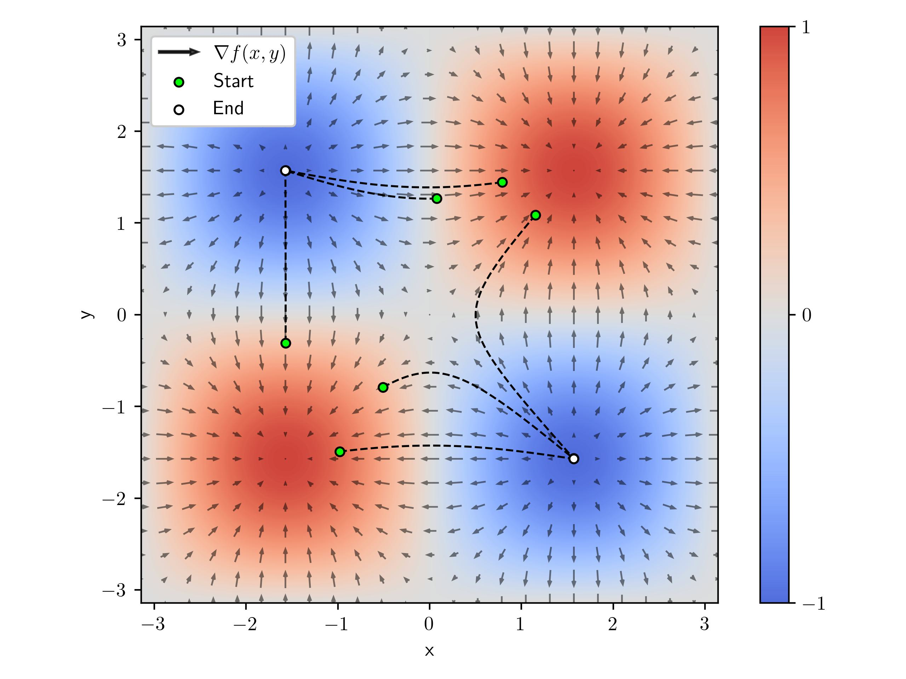
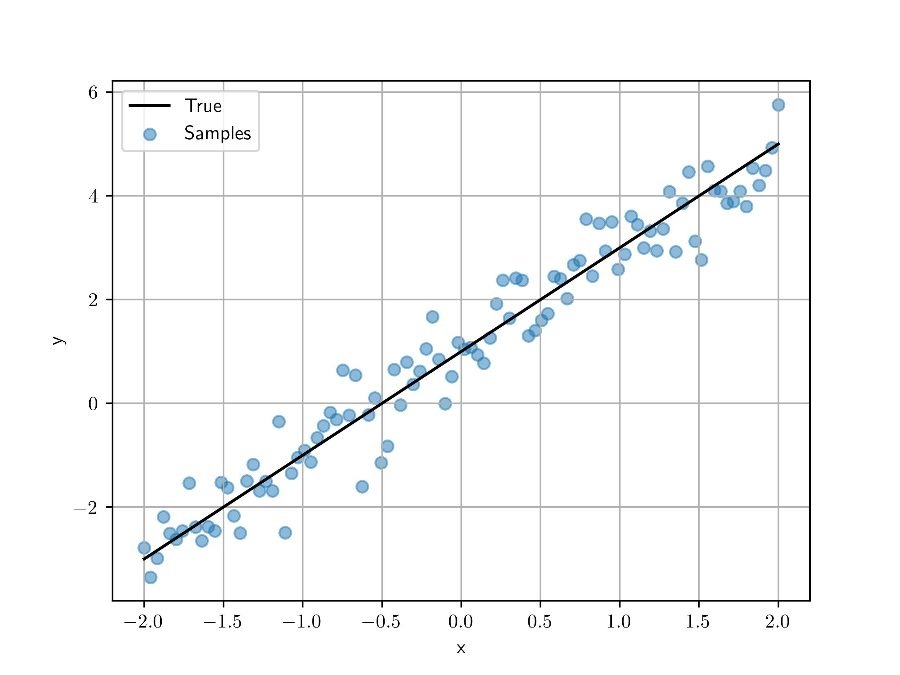
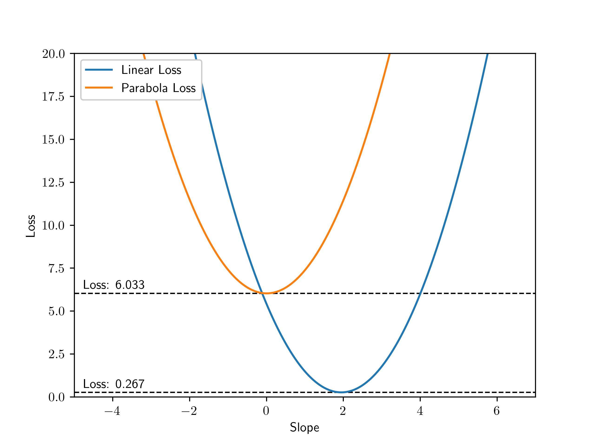
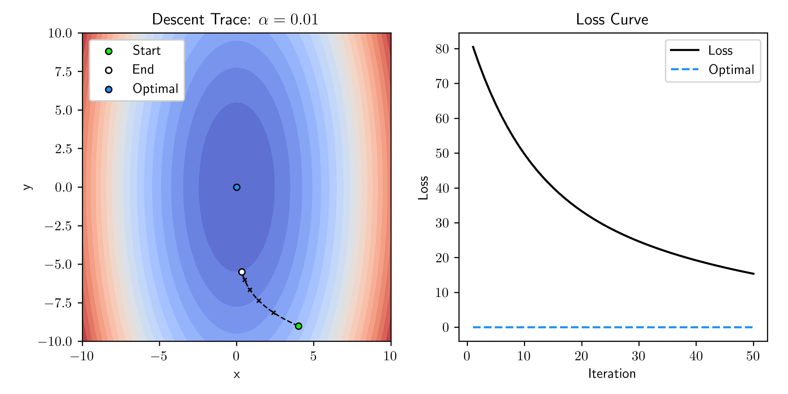
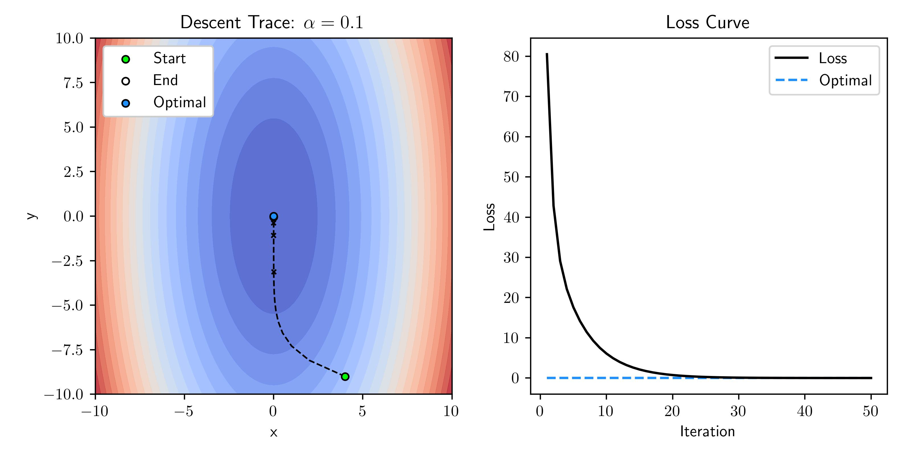
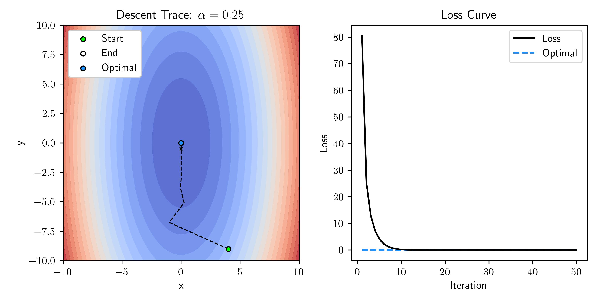
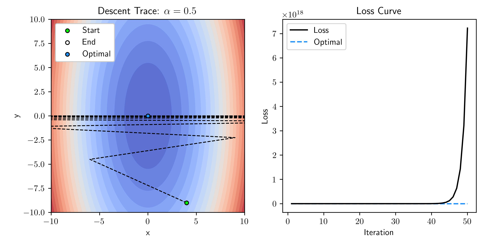
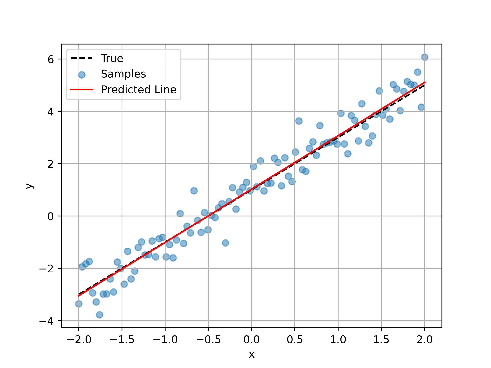
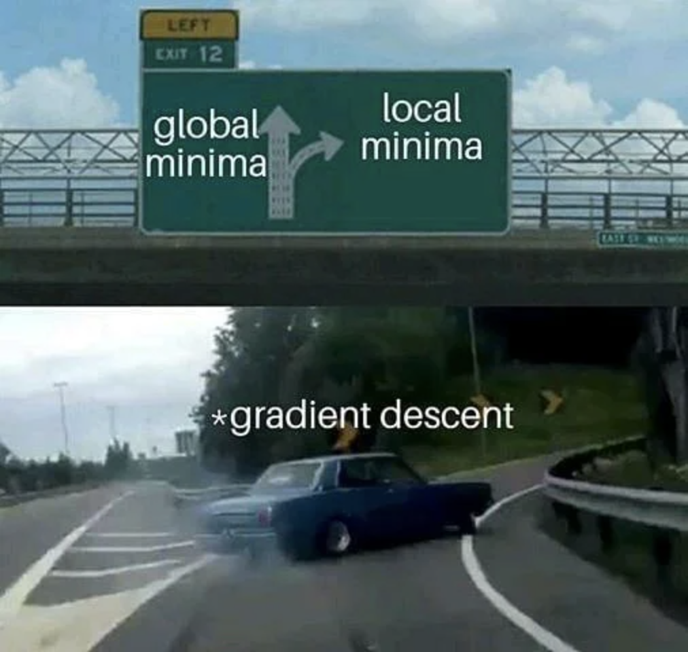

import SeriesIntro from "../SeriesIntro.mdx"

<SeriesIntro/>

# Introduction

Gradient descent is a simple and intuitive optimization method that is common across a large space of problems ranging from simple linear regression to neural networks. With this, we can optimize against a given function and determine parameters that give us the best performance. By the end of this post, you should have a good idea on how this optimizer works and how to apply it to new problems.

# Prior Knowledge

There are a few concepts that you should know before coming into this post, in general I try to explain everything clearly but it helps if you have prior exposure to these concepts.

- **NumPy:** We'll be using NumPy as the data storage and computation backbone. If you're not familiar with NumPy matrices and how to manipulate them take a look at [this resource](https://numpy.org/doc/stable/user/absolute_beginners.html).
- **Calculus:** We rely heavily on derivatives, in particular, [partial derivatives](https://www.mathsisfun.com/calculus/derivatives-partial.html) are important!

# Gradients

Before we step into how we use the gradient to help in our optimization problem, let's first build some understanding around the gradient. For those who are unfamiliar with partial derivatives or want a refresher you can take a look at the aside below.

import PartialDeriv from "./asides/PartialDeriv.mdx"

<Collapse title="Partial Derivative Refresher">
    <PartialDeriv/>
</Collapse>

## Gradient Intuition

The gradient of a function $\nabla f$ is actually quite a simple concept but can be so powerful when used correctly. The way to think about the gradient intuitively is that it's a vector that points in the direction of greatest increase of a certain function. 

It's a vector in the sense that it has the direction where max increase happens as well as the magnitude of the increase. The components of the vector lie in the space of the function so if the function takes one input the gradient is only one value and direction.

## Gradient Definition

To be more formal, we can define the gradient in terms of partial derivatives such that we could actually compute a gradient. Consider a function $f(x, y, z)$ that depends on multiple input variables. The gradient $\nabla f$ is a vector of partial derivatives.

$$
\nabla f = 
\begin{bmatrix}
\frac{\partial f}{\partial x} \\[5pt]
\frac{\partial f}{\partial y} \\[5pt]
\frac{\partial f}{\partial z} \\
\end{bmatrix}
$$

So if you're standing at a point $(x_0, y_0, z_0)$ and compute the associated gradient at that point, you'd be getting the vector pointing in the direction from where you are such that you would climb $f$ the fastest. A clearer way to show this is that we evaluate each partial derivative at our point.

$$
\nabla f(x_0, y_0, z_0) = 
\begin{bmatrix}
\frac{\partial f}{\partial x}(x_0, y_0, z_0) \\[5pt]
\frac{\partial f}{\partial y}(x_0, y_0, z_0) \\[5pt]
\frac{\partial f}{\partial z}(x_0, y_0, z_0) \\
\end{bmatrix}
$$

Don't be worried about the math for now, I just want you to take the intuition and roll with it for now. If you plan to implement this from scratch you'll need to actually evaluate this but for now just know it points to where we climb $f$ fastest!

# Gradient Descent

Now that we have an understanding of how to compute gradients and what information they give us, let's use it to optimize our problems through gradient descent.

## Descent Intuition

Let imagine that you are stranded on a large hill and really dense fog surrounds you such that you can only see a few feet around. You want to *descend* to the bottom of the hill back to safety but you can't see far enough to path out how to get to the bottom.

You decide that the best thing you can do is to follow the direction of greatest descent local to what you can see. As you continue to descend you get new information about your surroundings so you change your direction every so often to the new greatest descent. Eventually you'll either reach a valley in the hill landscape or the true bottom where you're trying to be.

What you've just done is gradient descent down the hill! In the next section we'll associate these bits of intuition to the math and see how it works.

## Descent Definition

Let's formally define gradient descent and associate our example back to the components of it. In the simplest form, gradient descent is repeatedly computing the following equation.

$$
\theta_{i+1} = \theta_i - \alpha \nabla f(\theta_i)
$$

- $f$ is the function we're minimizing with gradient descent, it's the surface height of the hill
- $\theta$ is the set of variables that $f$ needs, it's the $x$ and $y$ position on the hill looking top down
- $\nabla f(\theta)$ is the gradient of $f$ with respect to $\theta$, it's the direction we move in $x$ and $y$ on the hill
- $\alpha$ is a scalar for the gradient to decrease how big of a step we take, often called learning rate

## Local vs Global Minima

Another aspect of the problem we should try to connect is the idea of an intermediate valley in the hill landscape versus the true bottom. Formally this difference is called local and global minimas.

With gradient descent there is a problem in which depending on the loss function we are not guaranteed that we'll land at the global minima which is the lowest point over the entire landscape. Let's consider some simple cases to see why this is the case.

### Convex Function

In a convex function, there is only one minima and that implies it's the global minima. A simple convex function is a parabola so when we execute gradient descent over this function we always land at the global minimum no matter where we start.

import grad from "./videos/grad.mp4";

<PostVideo video={grad}/>

In the video, the blue represents the partial derivative $\partial f / \partial x$ so with descent we expect to go opposite this direction as we change the value of x with the negative of the gradient.

### Multiple Minima Function

Let's consider a function where there are multiple minimas, in particular we have two equivalent global minimas and one local minima in the center. When we start gradient descent at various points we see that we don't always get to the global minima.

import grad_problem from "./videos/grad_problem.mp4";

<PostVideo video={grad_problem}/>

### Resolutions

In practice, we don't even know what the loss landscape looks like for large models, but this problem exists no matter what. There is research done on variations of gradient descent to help mitigate these problems as well as improve training speed and overall performance. The go-to right now is the [Adam optimizer](https://optimization.cbe.cornell.edu/index.php?title=Adam) which varies $\alpha$ automatically based on patterns observed in prior iterations. 

Just to give you an idea what these more complicated landscapes look like, consider [this work](https://arxiv.org/abs/1712.09913) done to try to visualize them! Mind you, in most applications the number of inputs variables is larger than we can visualize so this is an attempt at visualizing.


# Hill Descent

Before we step into linear regression, let's try to emulate the hill descent.

## Surface and Gradient Equation

For our primary function $f$, we need to model the height of where we would be on the hill at a position $(x,y)$ which simply means we need something of the form $f(x,y)$. For this example I opted to use simple sin waves over the multiple variables.

$$
f(x,y) = \sin(x) \sin(y)
$$

Why is height the right equation to minimize? Well consider that whatever function we model we will end up minimizing its value so we want that behavior to match our goals. In this case, we are trying to get to the base of the hill which means we want to minimize our height. Let's go ahead and compute the corresponding partial derivatives. 

$$
\frac{\partial f}{\partial x} = \cos(x) \sin(y)
$$
$$
\frac{\partial f}{\partial y} = \sin(x) \cos(y)
$$

$$
\nabla f(x, y) = 
\begin{bmatrix}
\frac{\partial f}{\partial x} \\[5pt]
\frac{\partial f}{\partial y}
\end{bmatrix} = 
\begin{bmatrix}
\cos(x) \sin(y) \\
\sin(x) \cos(y)
\end{bmatrix}
$$

What we have now are the equations to know how high we are based on our position and the associated gradient for those positions to know which direction we should follow!

## Visualizing the Descent

Let's try to visualize what is going on and see if we can draw some conclusions to help our understanding. First, let's initialize some points randomly on these hills and execute gradient descent on each of them to see where they end up.

### Descent Animation

Let's go ahead and take a look at the hills example realized! What you can see is a 3D view and a top down view of the paths taken by each of the points.

import hill_descent from "./videos/hill_descent.mp4";

<PostVideo video={hill_descent}/>

 As we can see they all reach minimums which is what we expect! Something to note is that you can see that depending on where the points start they have a destined minimum they'll end up in, in other landscapes this may mean that a point will terminate at a local not a global minima!

### Gradient Field

We can evaluate the gradient at a grid of points across the space we're optimizing in. We know in this case that the gradient produces a vector over $x$ and $y$ so we can plot the gradient as an arrow pointing in the gradient direction. This grid of arrows is called a "gradient vector field".

Plotting the paths from before over the vector field we can see that the path the points take almost exactly follows the negative of the gradient which makes sense! The gradient points in the direction of greatest *increase* so when we descend we follow the negative of the gradient to follow the path of greatest *decrease*. We could just as easily follow the gradient if we wanted to maximize a function called gradient ascent but this isn't nearly as common.



# Linear Regression

Now that we have the foundation to apply this method, let's implement gradient descent for linear regression and analyze some of the behavior. In this section I focus more on the conceptual side of this problem and not the code but you can see how I implemented it in the [next section](/blog/neural-net-gradient-descent/#implementation).

## Problem Statement

The linear regression problem is to determine the line that best fits a set of data. To be precise, let's define some of the components of this.

### Dataset

We need the inputs $X$ and the corresponding results $y$. $X$ contains all of the samples in our dataset. An entry $X_i$ as a particular sample out of our whole dataset with it's corresponding $y_i$. The number of samples in our dataset is denoted as $N$.

### Model

The general model, as expected, is a simple linear model that takes in the input variables $X$ and computes a prediction $\hat{y}$. This can be thought of as the following equation.

$$
\hat{y} = w X + b
$$

Where the weight $w$ is the slope of the line and the bias $b$ is the line vertical offset. We are considering the scalar case here where $X$ is a single number for each example in our dataset but we could also have the case where $X$ is a vector of multiple inputs for each sample and as such $w$ would also be a vector. In the next post, we'll look more into what that looks like but I want start simple.

Often it will help to think about this model working on a single sample at a time which merely implies that we index a sample out of $X$ and that only results in the prediction for that sample.

$$
\hat{y_i} = w X_i + b
$$

## Function to Minimize

In this problem, we want to formulate a function that by minimizing we'll achieve the expected behavior. One way to think about this is we want a function that indicates how bad we are doing and we want to minimize this "badness". This is commonly referred to as a [loss function](https://en.wikipedia.org/wiki/Loss_function#:~:text=In%20mathematical%20optimization%20and%20decision,cost%22%20associated%20with%20the%20event.).

In the case of linear regression, we're looking to produce a real-valued number and compare it to the dataset samples. The loss function used for this is called the mean-squared error loss (MSE).

$$
\text{MSE} = \frac{1}{N} \sum^{n}_{i=1} (y_i - \hat{y_i})^2
$$

To be more inline with our prior labeling we'll call MSE our loss $L$. We can sub in our prior model for prediction for $\hat{y_i}$ to get the final loss description in terms of our model parameters $w$ and $b$. This is because we can think of $w$ and $b$ as our knobs that we can tweak to change where the line is!

$$
L = \frac{1}{N} \sum^{n}_{i=1} (y_i - (wx_i + b))^2
$$

As we are trying to minimize the loss using gradient descent, we need to compute the needed gradients for our model parameters $w$ and $b$ which are the following. If you want to see step by step how I computed these partials look at the aside below.

$$
\frac{\partial L}{\partial w} = \frac{-2}{N} \sum^{n}_{i=1} x_i (y_i - (wx_i + b))
$$

$$
\frac{\partial L}{\partial b} = \frac{-2}{N} \sum^{n}_{i=1} (y_i - (wx_i + b))
$$

import LinearRegressionGrad from "./asides/LinearRegressionGrad.mdx"

<Collapse title="Derivation of Gradients">
    <LinearRegressionGrad/>
</Collapse>

With these gradients, we can execute gradient descent by updating our model parameters by their associated gradients evaluated at each iteration.

## Linear Dataset Example

Let's actually step into an example where we can see how the model trains and eventually performs. We'll start with modeling a dataset where the underlying trend of the data is linear so we would expect this model to perform well.

## Linear Dataset

The construction of out linear dataset is very simple! We start with a line with a known $w$ and $b$, in this case $w=2$ and $b=1$, and we apply noise to the points just as we would expect real data to have. The noise is merely sampling from a normal distribution $\mathcal{N}(0, \sigma^2)$. In a real example, we would not know what the true line is and we use linear regression to estimate $w$ and $b$ of that line.



We can now execute a linear regression to solve for $w$ and $b$ and see how well we match our known true line based on fitting to the samples alone.

## Training Visualization

What you can see in the video below is the loss landscape on the left and the history of our $(w,b)$ values as the point traveling through it and on the right you can see the predicted line in red plotting the corresponding line for that $(w,b)$ based on the position in the descent. We can see the loss value is quite low and the fit seems good!

import loss_travel from "./videos/loss_travel.mp4";

<PostVideo video={loss_travel}/>

One way to think about this is that the position of the point $(w,b)$ defines a line that will have a corresponding height that is the current loss. By traversing down the loss landscape we find the $(w,b)$ such that the corresponding loss in minimal. 

## Parabolic Dataset Example

Let's consider a different example where the underlying trend of the data isn't a line anymore but instead a parabola. 

## Parabolic Dataset

In the same way that we created the linear data, we will sample points along the function and apply noise to each of the points from a normal distribution.

## Training Visualization

The visualization here is similar to the prior but just with the parabolic data. As we can see the method is working quite well as we've reached the minimum loss again.

import loss_travel_parabola from "./videos/loss_travel_parabola.mp4"; 

<PostVideo video={loss_travel_parabola}/>

## Comparing Losses

You may have noticed that both examples reach the minimum which would indicate that we should have reached a point where the model performs well, right? 

Not quite, in fact there is a whole concept in machine learning called the [bias/variance tradeoff](https://www.cs.cornell.edu/courses/cs4780/2018fa/lectures/lecturenote12.html). The general idea of this is that there are two extremes that result in poor performance.

- **High Bias**: The model is too *inflexible* to model the data correctly
    - Happens when models are too simple for patterns in the data
    - This is where we are, there is no world where a line will correctly fit a parabola
- **High Variance**: The model is too *flexible* to generalize the data correctly
    - Happens when models are too complex are starts fitting to patterns that aren't "real"
    - Large models can have an issue where they fit to noise and don't generalize the data well

Somewhere in the middle there is a goldilocks region where the model is flexible enough to encompass the complexity of the data but not so flexible that it starts [overfitting](https://en.wikipedia.org/wiki/Overfitting).

So when we compare slices along the minimums of the loss landscapes we see that sure we may have reached the minimum but that minimum is very high for the parabolic case! 



# Learning Rate Tuning

The learning rate $\alpha$ is generally regarded as how big of a step to take in the direction of the gradient during descent. Changing the value of the learning rate has massive implications on the descent time and results. Let's consider some example and try to understand how to pick an adequate value for the learning rate.

## General Behaviors

## Comparing Learning Rates

Let's consider the convex function below where we know the optimal value lies at $(0,0)$. With different learning rates we will see how the behavior and results change!

$$
f(x,y) = \frac{5 x ^ 2 + y ^ 2}{2}
$$

$$
\nabla f = 
\begin{bmatrix}
\frac{\partial f}{\partial x} \\[5pt]
\frac{\partial f}{\partial y} \\
\end{bmatrix} =
\begin{bmatrix}
5x \\[5pt]
y \\
\end{bmatrix}
$$

Across the following examples, the number of iterations is kept the same as to easily compare their behaviors but you could always adjust this when solving a problem.

### Small Learning Rate

When the learning rate $\alpha$ is too small there isn't a concern of instability but getting to a minima takes forever! This is not a big deal for small problems but on large problems where the computation is not trivial wasting time taking micro steps is not recommended. 



### Good Learning Rate

When the learning rate $\alpha$ is well chosen we swiftly converge to the minima without any oscillations or sporadic behavior. We reach the optimal point on our loss surface within ~25 iterations and hold there.



### Large Learning Rate

When the learning rate $\alpha$ is a bit large we have some oscillations as the descent settles into the final path. Looking just at the loss curve everything seems perfectly fine and in practice this is fine! One issue is sometimes you'll see a rapid decay of loss at first and then unstable behavior as you settle in closer.



### Unstable Learning Rate

When the learning rate $\alpha$ is way too large we have unmanageable oscillations and in fact instead of converging on the optimal it diverges out to a massive loss (loss scale is 10^18)!



## Where to Start

So how do you pick the right learning rate? In practice this is harder said then done and is a bit of an art. I would advise looking at similar models trained and what people used as a baseline but have fun experimenting with it too. Keep the behaviors in mind and change as you see necessary. 

With better optimizers like aforementioned [Adam optimizer](https://optimization.cbe.cornell.edu/index.php?title=Adam) much of these issues are handled automatically but it still helps to know general behaviors in plain gradient descent.

# Extending to More Variables

As I alluded to before we can scale this model to work over many input variables where the input $X$ does not just have a scalar for each entry but instead of vector of multiple features that describe that sample. In the next post, we build off this model and extend this into many variables and show how to execute this efficiently.

# Implementation

If you want to replicate this, I break down some of the code I used for linear regression here. I really wanted to focus on the conceptual understanding in this post so I pushed this to the end to focus on the process more than the code.

## Necessary Imports

Just importing the libraries that we intend to use for this example.

```python
import numpy as np
import matplotlib.pyplot as plt
```

## Creating Data

Here we create the data based on a line and add noise, if you wanted to try a different function you could add another function to represent your model but make sure to keep `line_func` for linear regression predictions!

```python
# We'll use this function to generate predictions
def line_func(x, w, b):
    return w * x + b

n = 100                          # Number of points
X = np.linspace(-2, 2, n)        # Many points between [-2,2]
Y = line_func(X, 2, 1)           # Generate baseline Ys
N = np.random.normal(0, 0.5, n)  # Noise to be added
S = Y + N                        # Add noise to create samples

# Plot Data
plt.plot(X, Y, label="True", color='black')
plt.scatter(X, S, label="Samples", alpha=0.5)
plt.xlabel("x")
plt.ylabel("y")
plt.legend()
plt.grid()
plt.show()
```

## Loss and Gradient

Here we define the function to compute our mean-squared error loss as well as getting the gradients from the input data $X$, the true results $y$ and the predictions $\hat{y}$.

```python
def MSE(Y, Yhat):
    return np.sum(np.square(Y-Yhat)) / Y.size

def get_gradient(X, Y, Yhat):
    # Get N
    N = X.size

    # Reused so calculating once
    error = Y - Yhat
    
    # Get gradients
    dm = -2 * np.sum(X * error) / N
    db = -2 * np.sum(error) / N
    return dm, db
```

## Example Gradient Descent

Here we just implement the iterative gradient descent that we've been talking about and print out the loss so we can see if it all works. At this point if you run the code you would expect something like the output on the code block.

```python{out={11}}
iterations = 100 # Total number of iterations
alpha = 0.015    # Alpha, often called learning rate
model = [np.random.uniform(), np.random.uniform()]  # Starting random w and b
N = X.size # Number of samples

for i in range(iterations):
    
    # Predict with current model params
    Yhat = line_func(X, *model)
    
    # Compute Loss
    loss = MSE(S, Yhat)
    if i % 10 == 0: # Every 10 iterations print
        print(f"Loss at iteration {i:3}: {loss:0.3f}")
    
    # Get Gradient
    dm, db = get_gradient(X, S, Yhat)
    
    # Update w and b
    model[0] -= alpha * dm
    model[1] -= alpha * db

Loss at iteration   0: 2.997
Loss at iteration  10: 1.483
Loss at iteration  20: 0.824
Loss at iteration  30: 0.537
Loss at iteration  40: 0.412
Loss at iteration  50: 0.358
Loss at iteration  60: 0.334
Loss at iteration  70: 0.323
Loss at iteration  80: 0.319
Loss at iteration  90: 0.317
```

## Plotting Results

As a check we can plot the results and see what we get! 

```python
plt.plot(X, Y, label="True", color='black', linestyle='dashed')
plt.scatter(X, S, label="Samples", alpha=0.5)
plt.plot(X, line_func(X, *model), label="Predicted Line", color='red')
plt.xlabel("x")
plt.ylabel("y")
plt.legend()
plt.grid()
plt.show()
```



# Additional Resources

As with anything, I learned this method through applying it but also external resources. I wanted to highlight a few that have helped me and might help you!

- [3Blue1Brown](https://youtu.be/IHZwWFHWa-w)
    - Math educator who essentially started a new genre of how math is taught, amazing!
- [Cyril Stachniss](https://youtu.be/4F0_V_0OO2Q)
    - Generally a great producer of robotics lectures.
- [Math for Machine Learning](https://mml-book.github.io/)
    - Freely available textbooks that is a great reference for purposeful mathematics!

# Closing

I hope you enjoyed this primer to the series, much of the material for the remaining posts is still up in the air so if there are aspects you liked or maybe didn't like let me know!

