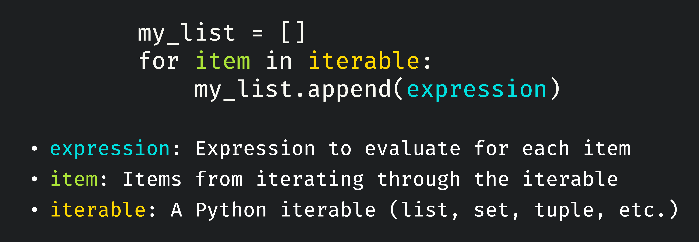
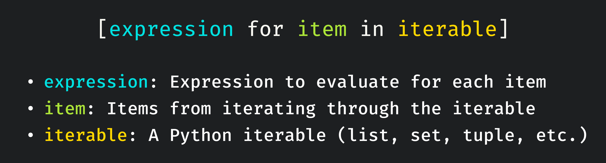
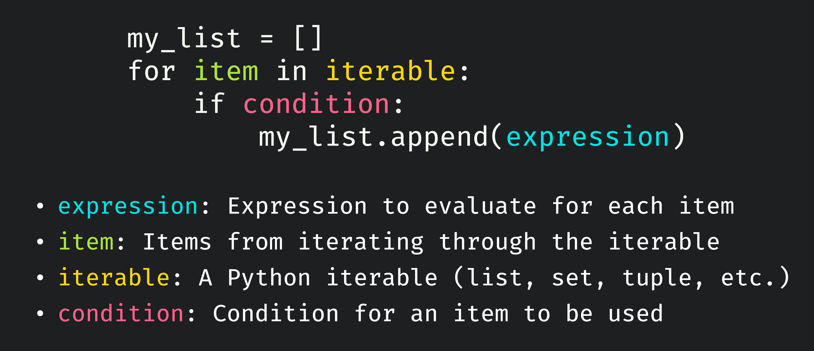
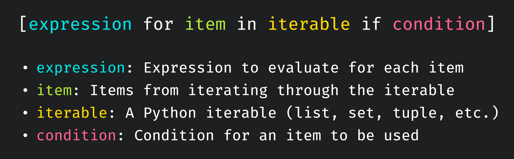
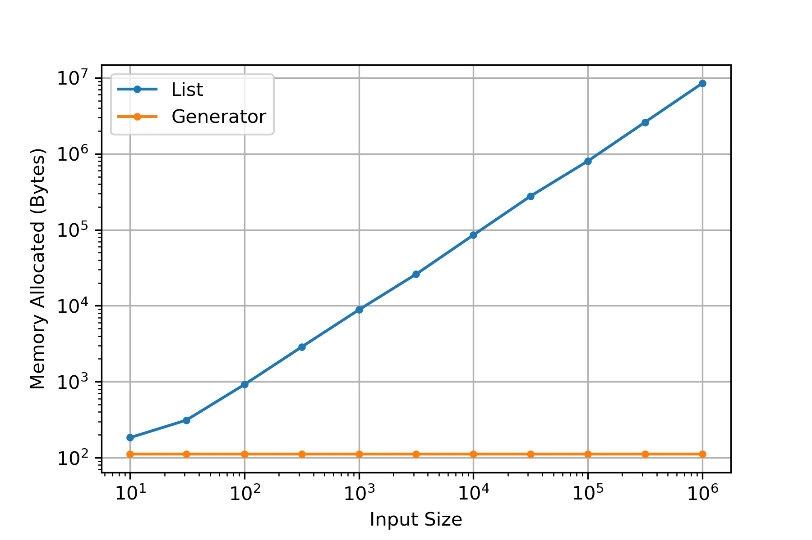
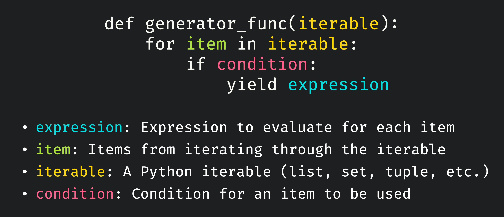
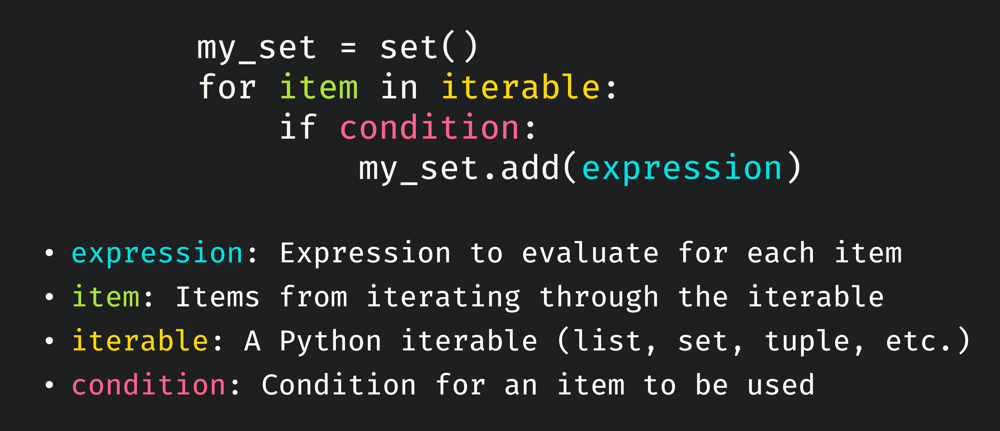
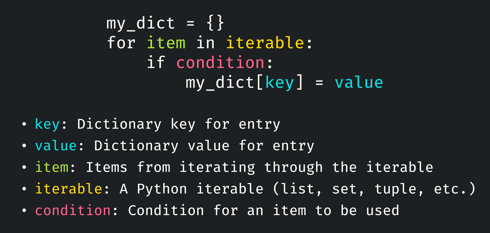
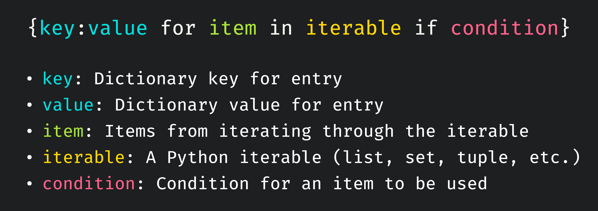

# Introduction

The comprehension structure is one of the most iconic utilities in Python. Many of you may already be familiar with list comprehensions but did you know there are actually 4 types of comprehensions? In this post, we'll review list comprehensions and introduce the others that you may have not seen before. For each type I will present the iterative forms you may currently know and how you consider converting them into comprehensions.

# Why Use Comprehensions?

Before we step into the material, let's consider why you'd want to use comprehensions in the first place. Generally speaking all types of comprehensions the benefits are as follows.

- Requires fewer lines of code to express the same concepts
- Transforms iterative code into a more readable one-liner
- More time and space efficient than the iterative (for loop) variant

# List Comprehensions

As I mentioned previously, list comprehensions are the most common and known comprehensions. To better understand how they work let's first look at how we can accomplish the same utility with a simple loop structure.

## List Creation via Loops

Consider how we might construct a basic list comprised of elements of a Python iterable when each item is passed through an expression. The general structure is something you may have already done before with a list initialization and a for loop to fill out the list based on the items passed into an expression.

> A Python [iterable](https://docs.python.org/3/glossary.html#term-iterable) is defined as an object that returns its members one at a time. Essentially they are collections of items where Python can iterate over the items one at a time to be used. Some examples of iterables that you may have already used are lists, sets, tuples, and more!



For smaller tasks, this structure is fine but as we add other bits of utility it can become harder to read the code while also adding additional overhead. Let's try to replicate this structure as a comprehension.

## List Creation via Comprehension

For a list comprehension, we wrap part of our prior for loop does code within brackets to produce a resultant list that is equivalent to the list from before.



The list comprehension handles the list initialization and appending needed before and reduces the code to just the important bits, what are we iterating over and what are we doing to each of the elements.

## Adding a Condition

When iterating through a collection of items, we often only want to produce a list where the items pass a certain condition. We can extend the prior structure to have a condition quite easily. Let's start with extending the loop variant.



It's pretty simple to also extend this condition format into our comprehensions.



> From now on I will just be including a condition in the structures of later iterations but they are always optional and depend on what you need!

## Reducing to a Comprehension

One trend you may have noticed about comprehensions is that the part of the statement after the expression is just reading down each line of our iterative variant. Let's look closer at the case with a condition to see what I mean.


```python{high={3-4}}
# Iterative Variant
my_list = []
for item in iterable:
    if condition:
        my_list.append(expression)
```

If you were to unravel the highlighted lines of the above code block and remove any additional formatting (:) then you would get what we wrote for our comprehension. This is a helpful way of thinking for taking iterative code that you're used to and writing it as comprehensions.

## Nested Comprehensions

If you read other resources you might also see nested comprehensions where you can put a list comprehension into another list comprehension to generate a matrix or iterate over a matrix. To me, these kind of step away from the core principles of readability and simplicity that make comprehensions so great. I would recommend staying away from complicated comprehensions and rather expand that code for the sake of readability.

## Examples

Let's look at some basic examples to see how we can write the tasks both as loops and comprehensions.

### Squaring Numbers in an Iterable

Let's assume we're given some iterable full of numbers (likely a set or list) and we want to produce a list of the squares of these numbers.

```python{out={3}}
# List of Numbers
numbers = [0, 1, 2, 3, 4, 5]

# Loop Variant
my_list = []
for num in numbers:
    my_list.append(num ** 2)
print(my_list) 

# Comprehension Variant
my_list = [num ** 2 for num in numbers]
print(my_list) 

[0, 1, 4, 9, 16, 25]
[0, 1, 4, 9, 16, 25]
```

As you can see we get the exact same result! Let's go ahead and break down each of the important parts highlighted in the structure.

- **Iterable**: The iterable is the list `numbers`
- **Item**: Each number we retrieve out of the list is our item
- **Expression**: The expression is merely the squaring of the number `num ** 2`

### Flooring Floats

Let's assume we're given a different iterable full of floating point numbers and we wish to use the function `floor` which rounds down to the nearest integer, but only if the numbers are positive.

```python{out={3}}
# Importing the floor function
from math import floor

# List of Numbers
numbers = [0.15, 3.14, -5.8, 11.2]

# Loop Variant
my_list = []
for num in numbers:
    if num >= 0:
        my_list.append(floor(num))
print(my_list) 

# Comprehension Variant
my_list = [floor(num) for num in numbers if num >= 0]
print(my_list) 

[0, 3, 11]
[0, 3, 11]
```

As you can see, we can call functions or really execute any bit of code as the expression as we need! Often I will write a larger function and call that function from a simple comprehension.

### Capitalizing Names

Given a list of names, create a new list where every name is capitalized.


```python{out={3}}
# List of Names
names = ["james", "stephanie", "Patrick", "elaine"]

# Loop Variant
my_list = []
for name in names:
    my_list.append(name.capitalize())
print(my_list) 

# Comprehension Variant
my_list = [name.capitalize() for name in names]
print(my_list) 

['James', 'Stephanie', 'Patrick', 'Elaine']
['James', 'Stephanie', 'Patrick', 'Elaine']
```

I hope at this point you have a decent grasp of how simple list comprehensions work. For later comprehensions we'll build off this so make sure this section makes sense!

# Generator Comprehensions

You may not believe me, but you already grasp most of the information to understand generator comprehensions, even if they sound unfamiliar! Generator comprehensions are extremely similar to list comprehensions with some changes that can be very useful.

## What's a Generator?

> TLDR: Generators don't store all the results but just pass them one at a time when you call the generator. This is great for saving memory but not great if you want to save the resultant list.

I could write a whole blog post on just [generators](https://realpython.com/introduction-to-python-generators/), but the important part to understand for this post is that generators are functions that you can write that act like iterators. Let's work through a simple example and see why generators are useful. Let's consider our prior example of squaring numbers, the steps taken when creating a list are as follows.

- Initialize a list to store the results
- Iterate through the numbers and append the square of each number

Seems simple enough! The issue is each number in our original list produces a square that has to be stored in the new list which can create a big memory problem. It's easy to start creating variations of an already large list and use up memory.

With generators, the elements that would comprise the result aren't stored but instead the steps to produce them are kept in history. For our example, the generator would be an object that essentially contains "when I am called, I will iterate over the list of numbers and return the squared result for each number one at a time". With this, we never have to store all of the results at once. This is a good thing if you only need the results at runtime but bad if you want to keep the results. 

The below graph shows how the memory allocation changes with increasing input list size. As you can see the generator has a constant amount of space used as it only has to keep the process stored whereas the list variant has to store a larger and larger list that scales directly with input size.



## Generator via Loops

Let's look at the basic structure of a generator following our prior list comprehension examples.



You might say this looks similar to the list and you would be right! The differences are that the generator we're interested in is actually the returned product of calling this function. 

## Generator via Comprehension

Phew that was a lot, luckily extending these concepts into a comprehension is trivial. All we need to do is replace the brackets from the list comprehensions with parentheses! 


## Examples

Let's go through the same examples as before in the list comprehension section. One key difference that you'll notice is that the generator itself does not have the resultant list stored so we have to call `list` on it to produce a list comprised of the generator results such that we can print and compare them.

### Squaring Numbers in an Iterable

Let's assume we're given some iterable full of numbers (likely a set or list) and we want to produce a list of the squares of these numbers.

```python{out={3}}
# List of Numbers
numbers = [0, 1, 2, 3, 4, 5]

# Iterative Generator
def generator_func(numbers):
    for num in numbers:
        yield num ** 2

my_generator = generator_func(numbers)
print(list(my_generator))
        
# Generator Comprehension
my_generator = (num ** 2 for num in numbers)
print(list(my_generator))

[0, 1, 4, 9, 16, 25]
[0, 1, 4, 9, 16, 25]
```

As expected we get the same result as the list comprehension but in practice if our lists were very large the generators can help us keep memory under control.

### Flooring Floats

Let's assume we're given a different iterable full of floating point numbers and we wish to use the function `floor` which rounds down to the nearest integer, but only if the numbers are positive.


```python{out={3}}
# Importing the floor function
from math import floor

# List of Numbers
numbers = [0.15, 3.14, -5.8, 11.2]

# Loop Variant
def generator_func(numbers):
    for num in numbers:
        if num >= 0:
            yield floor(num)

my_generator = generator_func(numbers)
print(list(my_generator))

# Comprehension Variant
my_generator = (floor(num) for num in numbers if num >= 0)
print(list(my_generator))

[0, 3, 11]
[0, 3, 11]
```

### Capitalizing Names

Given a list of names, create a new list where every name is capitalized.

```python{out={3}}
# List of Names
names = ["james", "stephanie", "Patrick", "elaine"]

# Loop Variant
def generator_func(names):
    for name in names:
        yield name.capitalize()

my_generator = generator_func(names)
print(list(my_generator))

# Comprehension Variant
my_generator = (name.capitalize() for name in names)
print(list(my_generator))

['James', 'Stephanie', 'Patrick', 'Elaine']
['James', 'Stephanie', 'Patrick', 'Elaine']
```

# Set Comprehensions

In my opinion, generator comprehensions are the hardest to understand so I think the hardest is over! Set comprehensions are ones that I often use and luckily they're super simple as well!

## Set Comprehensions as List Comprehensions

A set comprehension can be thought of as a list comprehension but the list is converted to a set after. As a reminder, a set is an unordered collection of items where no items can repeat.

```python
# List => Set
# Native set comprehensions are faster but this is a good way of understanding
my_list = [num ** 2 for num in numbers]
my_set = set(my_list)
```

## Set Creation via Loops

Following the same theme of these being similar to lists, you'll see that the creation using loops is very similar. The only differences is initializing a set instead of a list and sets use the `add` method.



## Set Creation via Comprehension

As you might expect, these are also similar to list comprehensions except we need to change the brackets to curly brackets.


## Examples

Let's go through the prior examples again but with sets!

### Squaring Numbers in an Iterable

Let's assume we're given some iterable full of numbers (likely a set or list) and we want to produce a set of the squares of these numbers.

```python{out={3}}
# List of Numbers
numbers = [0, 1, 2, 3, 4, 5]

# Loop Variant
my_set = set()
for num in numbers:
    my_set.append(num ** 2)
print(my_set) 

# Comprehension Variant
my_set = {num ** 2 for num in numbers}
print(my_set) 

{0, 1, 4, 9, 16, 25}
{0, 1, 4, 9, 16, 25}
```

As you can see we get the exact same result! Let's go ahead and break down each of the important parts highlighted in the structure.

- **Iterable**: The iterable is the list `numbers`
- **Item**: Each number we retrieve out of the list is our item
- **Expression**: The expression is merely the squaring of the number `num ** 2`

### Flooring Floats

Let's assume we're given a different iterable full of floating point numbers and we wish to use the function `floor` which rounds down to the nearest integer, but only if the numbers are positive.

```python{out={3}}
# Importing the floor function
from math import floor

# List of Numbers
numbers = [0.15, 3.14, -5.8, 11.2]

# Loop Variant
my_set = set()
for num in numbers:
    if num >= 0:
        my_set.add(floor(num))
print(my_set) 

# Comprehension Variant
my_set = {floor(num) for num in numbers if num >= 0}
print(my_set) 

{0, 3, 11}
{0, 3, 11}
```

As you can see, we can call functions or really execute any bit of code as the expression as we need! Often I will write a larger function and call that function from a simple comprehension.

### Capitalizing Names

Given a list of names, create a new list where every name is capitalized.


```python{out={3}}
# List of Names
names = ["james", "stephanie", "Patrick", "elaine"]

# Loop Variant
my_set = set()
for name in names:
    my_set.add(name.capitalize())
print(my_set) 

# Comprehension Variant
my_set = {name.capitalize() for name in names}
print(my_set) 

{'James', 'Stephanie', 'Patrick', 'Elaine'}
{'James', 'Stephanie', 'Patrick', 'Elaine'}
```

# Dictionary Comprehensions

Dictionary comprehensions are mostly the same as prior examples but just a little different because we need to create not just an element in the collection but a pair of values. I think these are best understood through examples so stick through to the end!

## Dictionary Creation via Loops

It's about what you would expect at this point where we do some sort of initialization, get items from out iterable, and run some code to define changes to our data structure.



What you'll notice is that there are essentially two expressions that are based on the item, both key and value! Often key will just be the item or item id whereas the value will be some processing done on the item.

## Dictionary Creation via Comprehension

The comprehension variant is extremely similar to prior examples, except the returned expression is a pair of values and not one singular expression. Note that both set and dictionary comprehensions use the same curly brackets.



## Examples

I will not be exactly repeating the prior examples as it's not really possible to map them but I will instead do examples inspired by each prior example.

### Squaring Numbers in an Iterable

We will proceed with squaring numbers as before but now we'll store the square as the value paired with the original number.

```python{out={3}}
# List of Numbers
numbers = [0, 1, 2, 3, 4, 5]

# Loop Variant
my_dict = {}
for num in numbers:
    my_dict[num] = num ** 2
print(my_dict) 

# Comprehension Variant
my_dict = {num:num ** 2 for num in numbers}
print(my_dict)

{0: 0, 1: 1, 2: 4, 3: 9, 4: 16, 5: 25}
{0: 0, 1: 1, 2: 4, 3: 9, 4: 16, 5: 25}
```

### Flooring Floats

We will do a similar case as before where the key is the input number and the value is the floored value while keeping the positive value only condition.

```python{out={3}}
# Importing the floor function
from math import floor

# List of Numbers
numbers = [0.15, 3.14, -5.8, 11.2]

# Loop Variant
my_dict = {}
for num in numbers:
    if num >= 0:
        my_dict[num] = floor(num)
print(my_dict) 

# Comprehension Variant
my_dict = {num:floor(num) for num in numbers if num >= 0}
print(my_dict) 

{0.15: 0, 3.14: 3, 11.2: 11}
{0.15: 0, 3.14: 3, 11.2: 11}
```

### Capitalizing Names

Lastly, let's capitalize the names for the keys and the value will be `True` if the name needed to be capitalized or false if it was capitalized already.

```python{out={3}}
# List of Names
names = ["james", "stephanie", "Patrick", "elaine"]

# Loop Variant
my_dict = {}
for name in names:
    new_name = name.capitalize()
    my_dict[new_name] = name[0] != new_name[0]
print(my_dict) 

# Comprehension Variant
new_names = [name.capitalize() for name in names]
my_dict = {new_name:name[0] != new_name[0] for name, new_name in zip(names, new_names)}
print(my_dict)

{'James': True, 'Stephanie': True, 'Patrick': False, 'Elaine': True}
{'James': True, 'Stephanie': True, 'Patrick': False, 'Elaine': True}
```

I decided to end on a mixed example where I also used a list comprehension and zipping! In this case, I didn't want to have to capitalize the name twice in my comprehension (key side and value side) so I created a list of the capitalized names. I then got out the pair of both original name and capitalized name using `zip` such that I could do the same thing as my iterative variant.

# Closing

I hope you found this post informative and enjoyable! Comprehensions are some of my favorite bits of Python and I'm glad I got to share my understanding with you. Please let me know if anything didn't make sense or any suggestions and I'd be happy to make changes.