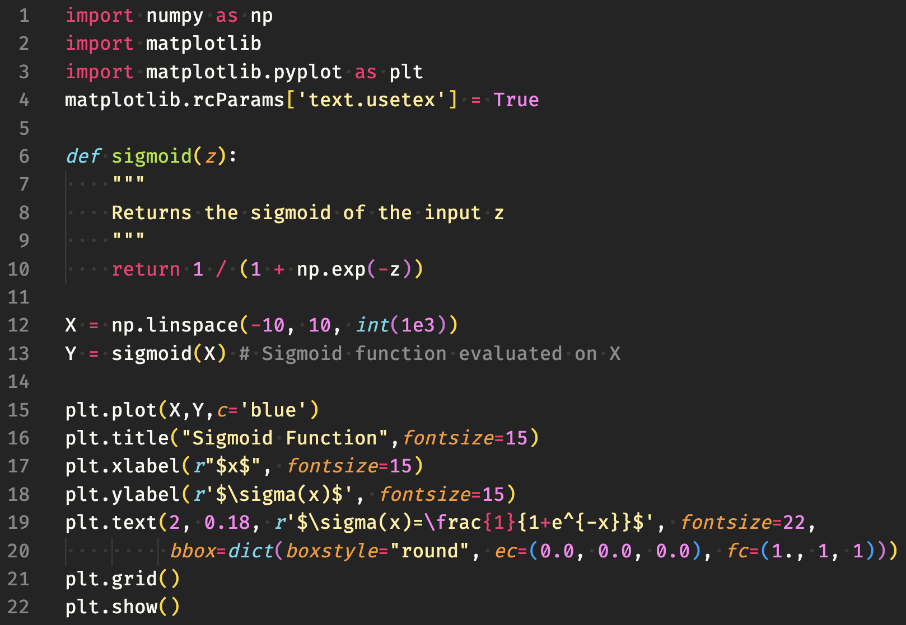
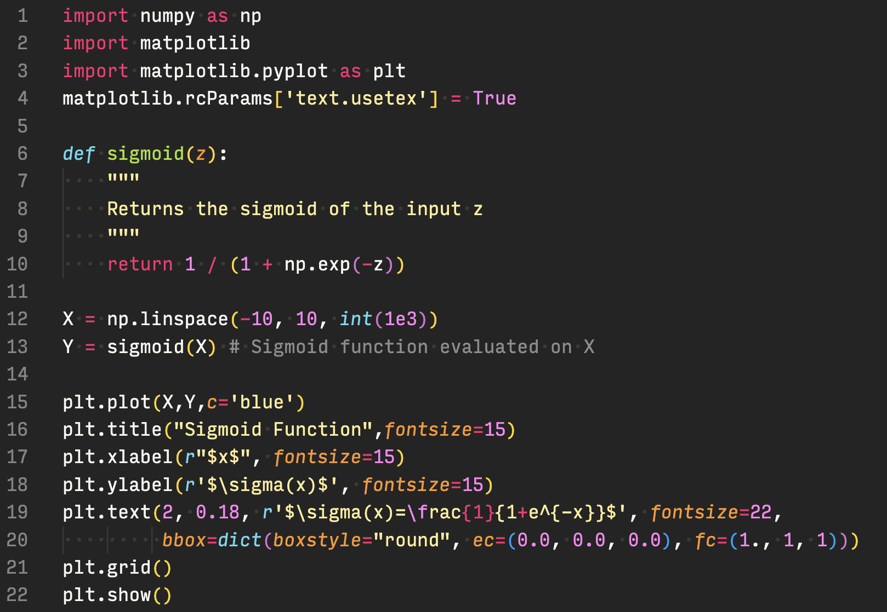
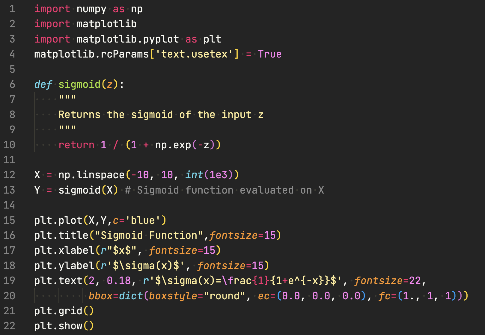
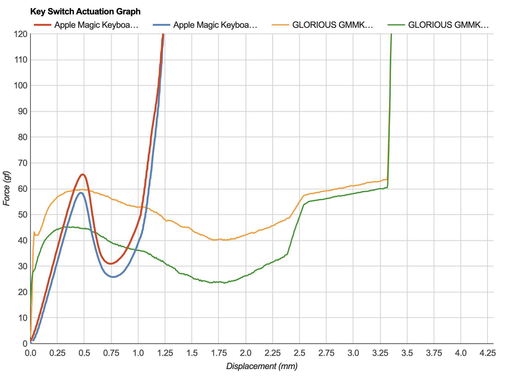

# TLDR

- Intel MacBook Pro
    - Waiting for M2, plus Intel MKL is nice
- Ubuntu 20.04 Desktop
    - Typically remote over SSH for deep learning (GPU!) or longer executions
- Vim for the Small, VS Code for the Big
    - Battle between overhead and helpfulness
- ZSH All The Things For Terminal
    - ZSH + Oh My Zsh + Candy Theme
- Fira Code
    - My favorite editor and terminal font with ligatures
- Apple Magic Keyboard or MX Keys Mini 
    - Not the biggest fan of mechanical
- Trackpad or Light Mouse
    - I really take advantage of gestures on a trackpad
- Coffee Mornings, Tea Afternoons
    - Typical day looks like an americano + green tea

# Introduction

One fun conversation to have with any dev is what tools they use and why, it's such a personal thing and you can often learn about new tools to try. I thought I'd share what I have distilled out of my many attempts at finding an efficient environment to do my work in.

# Systems

I think the system you work on greatly depends on the kind of work that you do. Sometimes it's impossible to do work on any system other than a Mac (IOS dev as an example) but for me I am partial to anything other than Windows.

## Intel MacBook

I have not hopped on the Apple Silicon train yet as much of my workflow depends on [Intel MKL](https://www.intel.com/content/www/us/en/develop/documentation/get-started-with-mkl-for-dpcpp/top.html) I have opted to stay on Intel for now. It's also out of not wanting to deal with migration pains.

I do have a strong preference for Mac OS after trialing many linux laptops. I get the majority of the utility out of Mac OS that I can get out of linux but there are just so many little issues and no integration with other aspects of my workflow on linux. Drivers for certain laptop parts was a big pain on linux (touchpad, power management, etc.). My experience on my MacBook has just been so streamlined it would hard to convince me to switch.

## Ubuntu Desktop

When it comes to the desktop, I prefer to build my own systems so this leaves me with Windows and Ubuntu. I dual boot both Windows 11 (this was a mistake) and Ubuntu 20.04 for the occasional times I need to use Windows but I really only do work on Ubuntu. Over time, I have settled into working primarily on my laptop and treating my desktop as a remote compute server.

# Python Environment

This is more of a PSA than anything to have a long conversation over. Please please please, if you are doing anything other than super random occasional Python scripts use an environment manager such as [Anaconda](https://www.anaconda.com/) or [pyenv](https://www.google.com/search?q=pyenv&oq=pyenv&aqs=chrome.0.69i59j0i20i263i512j0i131i433i512l4j0i512l3j0i131i433.575j0j4&sourceid=chrome&ie=UTF-8), you will thank yourself in the long run. In all seriousness, being able to containerize your different workflows or replicate a different environment so easily has saved me many times over now.

# Editor

Editors are one of the most debated topics and at the end of the day you'll have to try them for a bit of time to know but I have settled into a set that I am very happy with.

## Smaller Tasks

I find that when I am doing simple stuff that is isolated to a few spurious files nothing is easier to use than a terminal editor. For me my favorite happens to be Vim but I have no firm opinions on this. Spooling up a whole editor just to change one line is infuriating so I end up spending a lot of time in the terminal making these small changes.

## Larger Tasks

If my work is more demanding and focused it becomes worth it to spool up a VS Code session for me for all the support tools and navigation within the working directory. As an example, I could never imagine myself writing my website in Vim.

## VS Code Settings

Speaking of VS Code, here's a quick overview of some of my settings.

- **Font:** More on this later, but I am partial to [Fira Code](https://github.com/tonsky/FiraCode)
- **Theme:** Monokai Dark Soda or Night Owl
- **Icons:** Material Icon Theme

Other than those changes I am running pretty vanilla VS Code.

# Terminal

I am not someone who cares too much about extra terminal features or super crazy themes but I am a big big fan of Zsh. In particular I setup my terminal on both my systems with the following.

- **Zsh:** Default in Mac OS but I need to change this in Ubuntu
- **Oh My Zsh:** I don't mess with plugins too much but I like the candy theme in Oh My Zsh
- **Theme:** Monokai Dark Soda once again

Other than that I tend to use the default terminal on my system and try to avoid heavier terminal emulators.

# Editor/Terminal Font

As I mentioned prior, I really like Fira Code. At this point, I don't even know how many editor fonts I have tried but I will show some of my other favorites here. A fun note on Input is that they have an online configurator to produce our own variant of the font!

# Keyboard

As I spend countless hours on my computer, my keyboard is a crucial element of my setup and one that I have trialed and tested a lot.

## Mechanical Keyboards

Following up on the fan war of terminal editors, I will probably start some fires here as I am not the biggest fan of mechanical keyboards. While they're fun to type on, I find that over a long session they can be quite fatiguing and often annoying to me and anyone nearby. 

I had a stint with low-profile mechanical keyboard but in practice the travel is not that dissimilar to normal mechanical keyboards so they suffer from many of the same fatigue problems.

## What Do I Like?

With that said, I am quite a fan of lower profile and lower key weight keyboard such as the Logitech MX Keys Mini and Apple Magic Keyboard. One non-negotiable for me is a smaller keyboard (75%)! Having my primary typing space centered between my shoulders has been a great improver in long-term comfort when working and I can really only achieve that with a smaller keyboard if I intend to use a mouse.

## Using Right Now

I'm typing this on my MacBook which is essentially the magic keyboard, but when I am not working on Mac OS I love my MX Keys Mini.

# Mouse

I'm not super picky about the mouse that I am using as I try to work with just my keyboard as much as possible. With that said, having a trackpad for gestures such as changing desktops or zooming in to a location is something I really enjoy.

When I do use a mouse I prefer to use as light a mouse as possible, I just find that it's simpler to zip around with that than a swiss army knife of a mouse that weighs more than my keyboard.

# Drink of Choice

I, like many, am in need of some daily caffeine to function well. For me I prefer an espresso-based coffee drink in the morning and some tea to hold me over in the afternoon. Alongside either I always have plenty of water (sometimes sparkling) to make sure I am hydrated. During the *pandemic*, I invested in an espresso machine and have really enjoyed learning to make myself and friends my favorite drinks.

# Closing Remarks

This is definitely a different post than most of mine but I hope it shed some light into my character and interests and was of help!