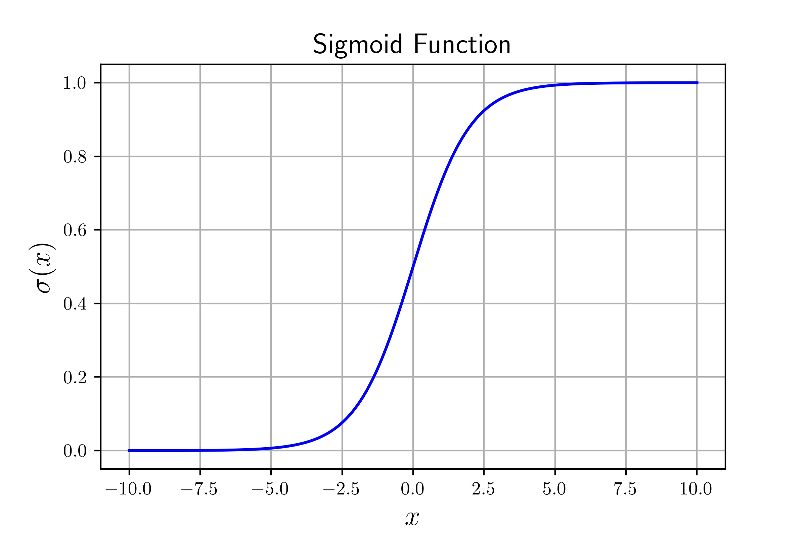

# Introduction

I've been getting some questions on how I created the sigmoid figure from my [logistic regression post](/blog/logistic-regression-intro/), in particular how I integrated LaTeX into matplotlib. It's quite easy so I thought I'd share some tips and break down how I made that plot.


# Prerequisites

## Installing LaTeX

You'll first need to make sure that you have an installation of LaTeX on your computer. Many of us are used to using Overleaf so if you haven't installed LaTeX locally I would go head and [start here](https://www.latex-project.org/get/).

## Enabling LaTeX

Outside of your typical matplotlib imports you'll need to enable an `rcParam` to enable LaTeX, this is highlighted in the below code block.

```python{high={3}}
import numpy as np
import matplotlib
matplotlib.rcParams['text.usetex'] = True
import matplotlib.pyplot as plt
%matplotlib inline

# Useful for running matplotlib on high-dpi displays
%config InlineBackend.figure_format='retina'
```

After that it's really simple to pass LaTeX style equations into your plotting kit. As an example, let's build up the prior figure.

# Creating Plot

## Evaluating Sigmoid

Not that it's relevant to using LaTeX but the below code was used to compute points for plotting.

```python
X = np.linspace(-10,10,int(1e3))
Y = 1 / (1 + np.exp(-X)) # Sigmoid function evaluated on X
```

And for generating the plot itself we'll do go ahead and proceed in two steps.

## Primary Plot Axes

To generate the primary plot I went ahead and used the following code. As you can see, to indicate you want to render a LaTeX equation all you need to do is pass a raw string with `$$` around the equation.

```python
plt.plot(X,Y,c='blue')
plt.title("Sigmoid Function",fontsize=15)
plt.xlabel(r"$x$", fontsize=15)
plt.ylabel(r'$\sigma(x)$', fontsize=15)
plt.grid()
plt.show()
```

This gives you the same plot you saw before without the written equation.



## Equation Box

The additional equation box is nothing more than a matplotlib text box with some additional specifiers for styling.

```python
plt.text(2, 0.18, r'$\sigma(x)=\frac{1}{1+e^{-x}}$', fontsize=22,
         bbox=dict(boxstyle="round", ec=(0.0, 0.0, 0.0), fc=(1., 1, 1)))
```

Let's go through the arguments to understand what's going on here. Generally speaking you can find many more details on this [here](https://matplotlib.org/stable/api/_as_gen/matplotlib.pyplot.text.html).

- `2, 0.18` are the position arguments
- `r$...$` is the input text, in this case an equation
- `fontsize` is self-explanatory
- `bbox` is the style specifier.
  - `boxstyle` determines the bounding box style
  - `ec` is a tuple of normalized RGB values for the border color
  - `fc` is the same as `ec` except for fill color

With everything combined we get the original plot that is part of the original post.


# Questions

If you have any questions feel free to reach out, I've enjoyed being able to help where I can. Let me know if you would be interested in a more in depth writeup regarding my usage of matplotlib and tips.
