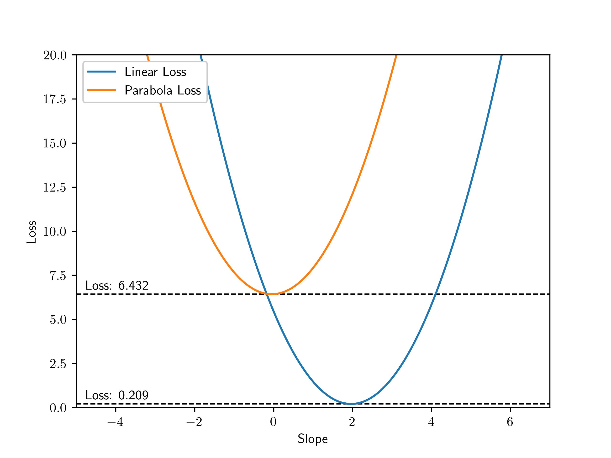

# Introduction

This is the first of a series I have planned where I hope to build intuition and understanding of many machine learning topics leading up to modern neural networks. Below is the current plan for the series. 
- [Gradient Descent](/blog/neural-net-gradient-descent/)
- Logistic Regression for Classification
- Two Layer Neural Network
- Gradients Over Many Layers
- Modern Deep Learning Frameworks

Gradient descent is a simple and intuitive optimization method that is common across a large space of problems ranging from simple linear regression to neural networks. With this, we can optimize against a given function and determine parameters that give us the best performance. By the end of this post, you should have a good idea on how this optimizer works and how to apply it to a linear regression problem.

# Assumption of Prior Knowledge

There are a few concepts that you should know before coming into this post, in general I try to explain everything clearly but it helps if you have prior exposure to these concepts.

- **NumPy:** We'll be using NumPy as the primary data storage and computation backbone. If you're not familiar with NumPy matrices and how to manipulate them take a look at [this resource](https://numpy.org/doc/stable/user/absolute_beginners.html).
- **Calculus:** We will rely heavily on derivatives, I will do a short review of what a derivative is but all the future posts will extend into more theory. In particular, [partial derivatives](https://www.mathsisfun.com/calculus/derivatives-partial.html) are used for nearly everything.

# Gradients

TODO: No concept of descent here or the iterative process, the goal here is to just introduce the gradient

import PartialDeriv from "./asides/PartialDeriv.mdx"

<Collapse title="Quick Partial Derivative Lesson">
    <PartialDeriv/>
</Collapse>

# Gradient Descent

Now that we have an understanding of how to compute gradients and what information they give us, let's use it to optimize our problems.

TODO: Talk about the hill descending example in the fog, map the gradient to this concept and try to bring the theory in after.

# Gradient Descent for Linear Regression

import loss_travel from "./videos/loss_travel.mp4";

<PostVideo video={loss_travel}/>

import loss_travel_parabola from "./videos/loss_travel_parabola.mp4";

<PostVideo video={loss_travel_parabola}/>

