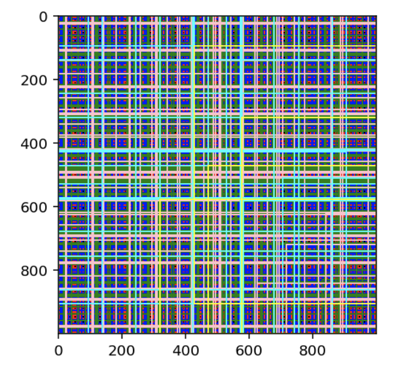
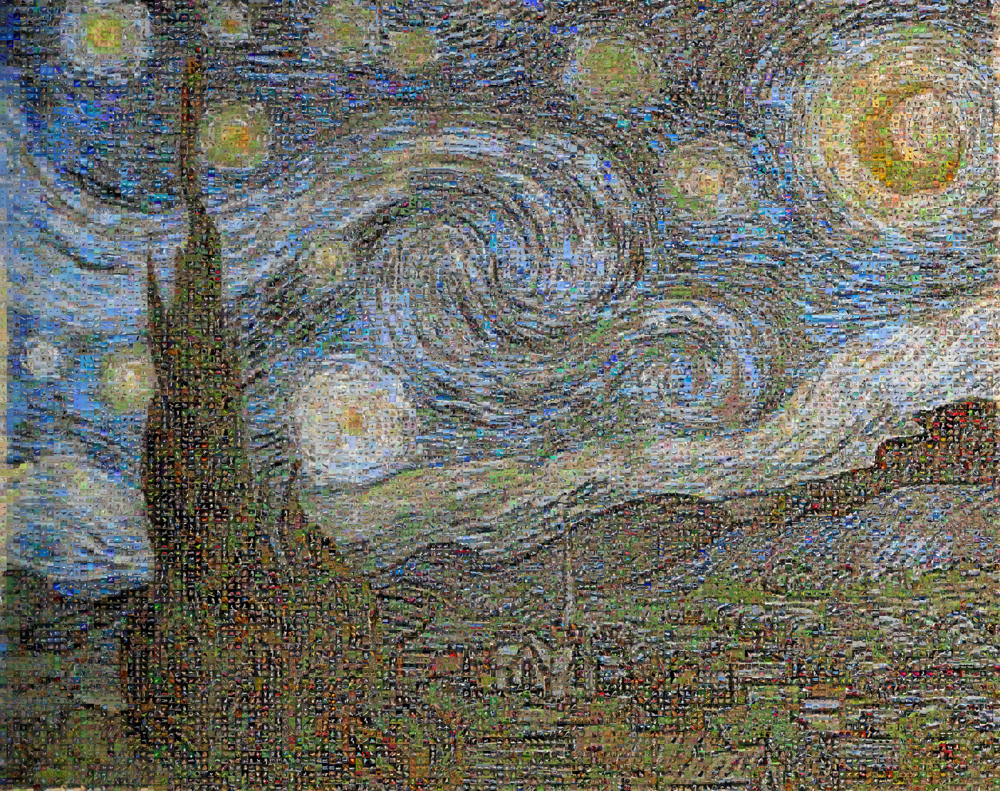

# Introduction

As the final year of my graduate degree is starting I thought it would be fitting to post an update on what to expect on this site in the near future.

# Posts

## Intro to PyTorch

This one has been asked about a lot, I presume because many people want to step into a deep learning framework such as PyTorch or Keras. Given that I have done most of my deep learning work on vision models, I've become much more comfortable working in PyTorch but many of the concepts are easily transferrable between PyTorch and TF/Keras.

I plan to introduce some high level machine learning ideas through a basic multi-layer perceptron network in this framework. We'll talk a bit about how to develop the framework from data import to model evaluation.

> I would really appreciate any comments or interests here, the field is massive so I can step in many directions after this post.

## Summary of Visual Learning Problems

Alongside an intro to frameworks, I think it's helpful to understand the categories of problems that exist in visual learning. I'll try to answer questions such as:

- What is the difference between segmentation and detection?
- What makes each type of problem difficult?
- What are some common architectures for each problem?

I think this will be a good primer in stepping from "Hey I know some deep learning but how do I used it for computer vision" to "Wow! Visual learning is a very difficult & interesting space!".

# Projects

## Single Shot Detector

One of the fundamental object detection models is [Single Shot Detector](https://arxiv.org/pdf/1512.02325v5.pdf). I'm nearly done with most of the code to begin training where I will inevitably find additional issues so expect a writeup on this sometime in the next few weeks. As a small show of progress, the below figure shows all of the prior boxes used in SSD!

## Image Mosaic

This was a fun weekend project for me that I was recommended to post on the site. Given a dataset of images, the program will create a mosaic of a base image composed of images from the dataset. In the example below I created [Starry Night](hhttps://en.wikipedia.org/wiki/The_Starry_Night) composed of images from the [CIFAR dataset](https://www.cs.toronto.edu/~kriz/cifar.html).

## SegFormer

This one is in the very early stages, but I intend on implementing the [SegFormer](https://arxiv.org/pdf/2105.15203v2.pdf) network for semantic segmentation. Although performance is not SOTA, it would be a great primer for vision transformers and is a very efficient model in terms of performance/params.

# Questions

As always, let me know if you have any questions or suggestions on future posts. Such as what you'd like to see in PyTorch, examples I could give, etc.
