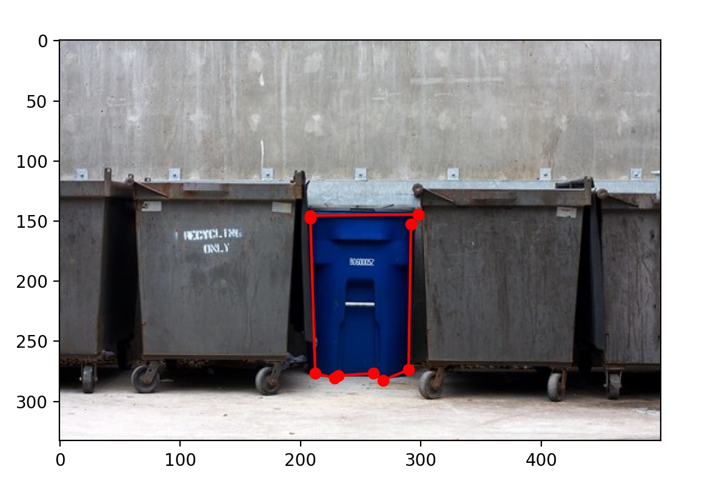
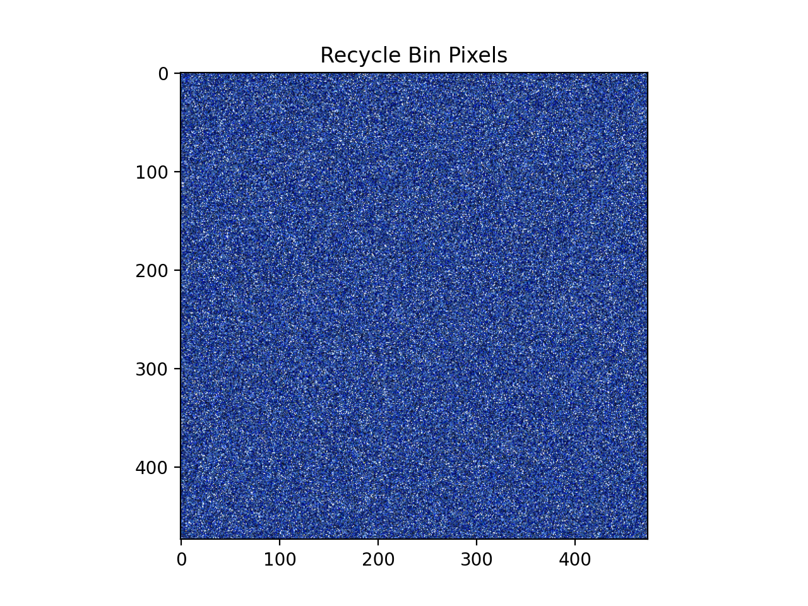
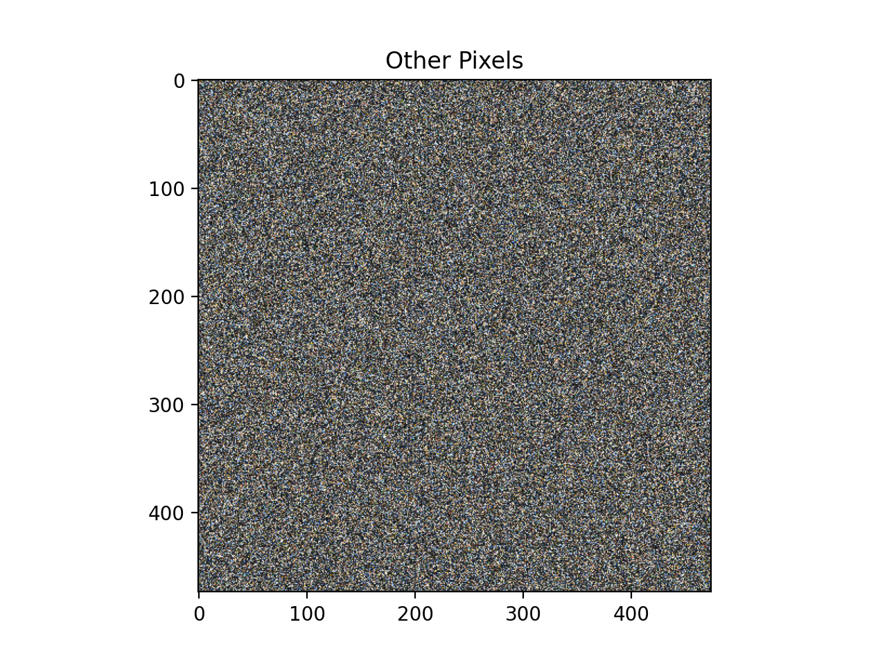
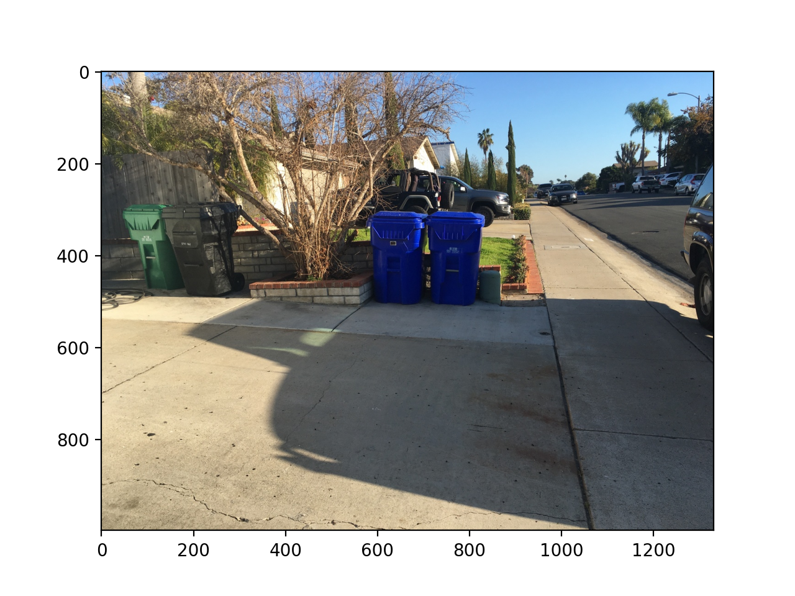
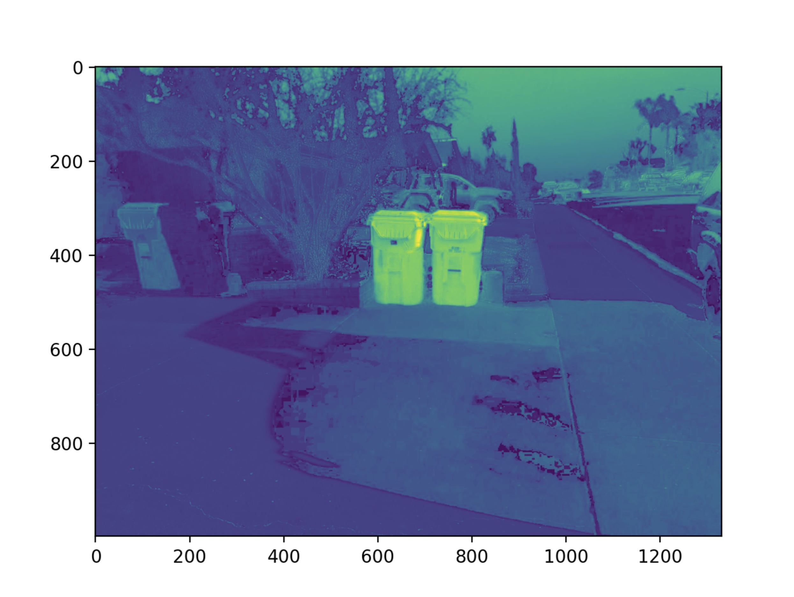
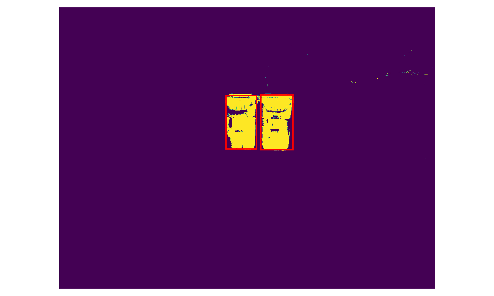
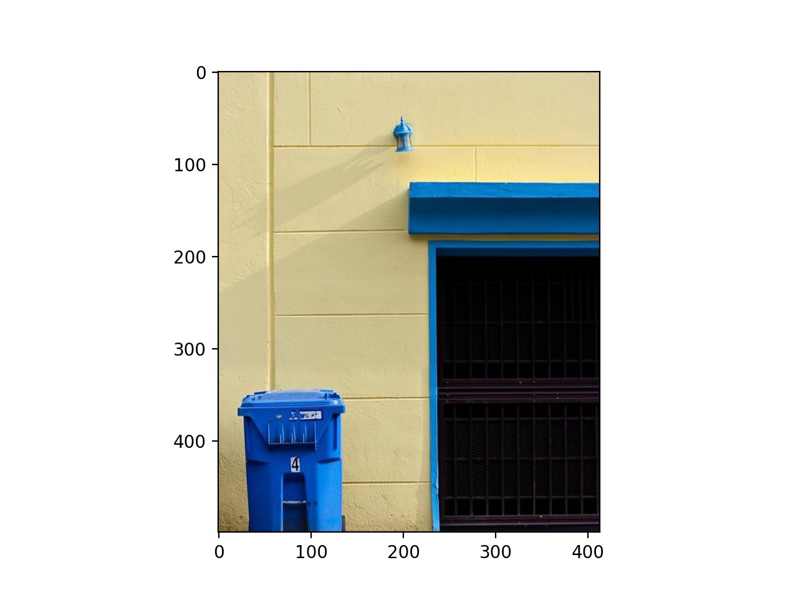
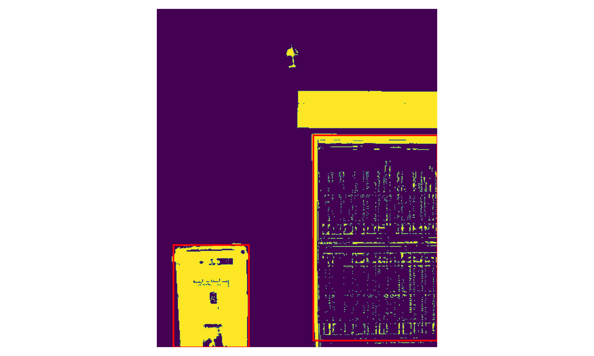

# Project Report

As this was part of my graduate studies I cannot publish the code but the below button will take you to the formal writeup associated with the project. Also the report has _much_ more detail than this post will so I highly advice you look through it for more information, here I will be focusing on high level principles and results.

<PostButton text={"Report"} target={"/reports/logit_segmentation.pdf"} />

# Introduction

In this post we will discuss an approach to detecting US household recycling bins and attempt to understand the shortcomings of the given implementation.

# Problem Statement

In this problem we are tasked with establishing bounding boxes for recycle bins in images. In particular the formal goal is to first establish a binary segmentation and then use [`regionprops`](https://scikit-image.org/docs/dev/api/skimage.measure.html#skimage.measure.regionprops) from scikit-image to determine a bounding box.

# Approach

I opted to train a logistic regression model to classify each pixel in the image as either being a recycle bin or not. For a reference on how to implement logistic regression and what it is refer to [this post](/blog/logistic-regression-intro/) I made before.

# Dataset

Here I will describe how I accumulated the dataset and any feature engineering done before training.

## Labeling

The problem is we were only given images that may or may not contain recycling bins but we do not have labeled data for what regions contain a bin. To solve this, I used the [`roipoly`](https://github.com/jdoepfert/roipoly.py) module to manually section off regions and capture all pixels within the region as recycling bin pixels and labeling all others as not recycling bin.



After going through the entire set of images (~70 images), I then had a corpus of pixels for each label. To validate this, I created a collage of pixels to see if the captured pixels seemed reasonable. Given the colors I would expect for a recycling bin I think the separation is quite good.





## Feature Engineering

Currently the only features present for each example are the RGB values of each pixel. To attempt to help the model in classifying the pixels I thought it would be beneficial to add the [HSV](https://en.wikipedia.org/wiki/HSL_and_HSV) color space alongside RGB. In the past, I've used HSV thresholding for simple segmentation so I believe that adding it here will help resolve some as the color is directly encoded in one of the values as opposed to requiring all values in RGB. So for each pixel we'll classify on a feature set that looks like:

$$
[R,G,B,H,S,V]
$$

Given all this information we can continue to model construction and training.

# Model Construction

As mentioned prior, I chose to implement a logistic regression for the individual binary classification of each pixel.

## Forward Pass

To construct the model all I needed to do was to create all the necessary functions for the forward pass. Again, I am omitting many of the smaller helper functions and such and giving a general overview of my process here, if you would like a more in depth (tutorial like) post let me know!

```python
# Reshape image for segmenting
img_reshape = np.reshape(img, (-1, 3)) / 255
X_img = prep_X(img_reshape)

# Classify pixels
A, B, _ = img.shape
scores = sigmoid(self.w @ X_img.T)
pred = scores
scores_img = np.reshape(pred, (A, B))

# Return mask
mask_img = np.zeros_like(scores_img)
mask_img[scores_img >= self.thresh] = 1
```

# Training

A change I made from my prior blog post was to implement stochastic gradient descent to improve training speed. The training is identical to that of my prior blog post except that the batch used to compute the gradient is a subset of the entire dataset. This is why the training accuracy is quite rough in the below plot.


The below code makes up the main portion of all the training code. A change I would make in hindsight is to not make the subset selection entirely stochastic, but instead pre-allocated mini batches.

```python
# Prep Training and Test
X_train = prep_X(X_train_sub)

# Get training dimensions and init weights
N_train, D = X_train.shape
w = np.random.randn(n_class, D) * 0.0001

# Init the gradient and accuracy lists
grad = np.zeros(w.shape)
acc_train = []
epoch_count = []

# Run iterations
for it in range(epochs):

    # Stochastic Gradient Descent
    # Subset the training data randomly to reduce compute time
    N_SGD = int(5e4)
    ind_vals = random.sample(range(N_train), N_SGD)
    X_SGD = X_train[ind_vals]
    y_SGD = y_train[ind_vals]

    # Computing the gradient
    temp = sigmoid(-y_SGD * (w @ X_SGD.T))
    temp = temp * (y_SGD * X_SGD.T)
    temp = np.sum(temp, axis=1)
    grad = temp / (-N_SGD)

    # Print status
    if it % 10 == 0:
        print("On iteration: {}".format(it))

    # Saving new weights
    w = w - lr * (wd * w + grad)

    # For my testing, tuning of hyperparameters
    if it % 2 == 0:

        test = False
        if test:
            # Save Epoch
            epoch_count.append(it+1)

            # Training Accuracy
            scores = sigmoid(w @ X_SGD.T)
            pred_train = np.round(scores)
            pred_train[pred_train == 0] = -1
            acc_train.append(np.sum(pred_train == y_SGD) / N_SGD)

    # Plotting of training and testing accuracy
    if test:
        import matplotlib.pyplot as plt
        plt.plot(epoch_count, acc_train, label="Training Accuracy")
        plt.legend()
        plt.show()
print(w)
np.save("logit_weights.npy", w)
```

# Evaluation

Now that we have a trained model, we can go ahead and pass the entire reshaped image through the model to get an array of probabilities that can be reshaped back into an image. From the second image, we can see that the recycling bins are clearly "hotter" than the surrounding pixels. After tuning the threshold to determine the classification we can get to quite a good result as in the third image!





# Improvements

I want to make it clear that this is not a great architecture to solve this problem, but one that is convenient and tractable. As we are treating each pixel as an independent classification problem, there is no spatial correspondence. With modern architectures like CNNs, not only would color play a role in detection but also structure and shape. This is easily shown as a problem where right now all I can do is a rough aspect ratio check but even that can be fooled.




# Questions

As always let me know if you have any questions and I'd be happy to answer!
