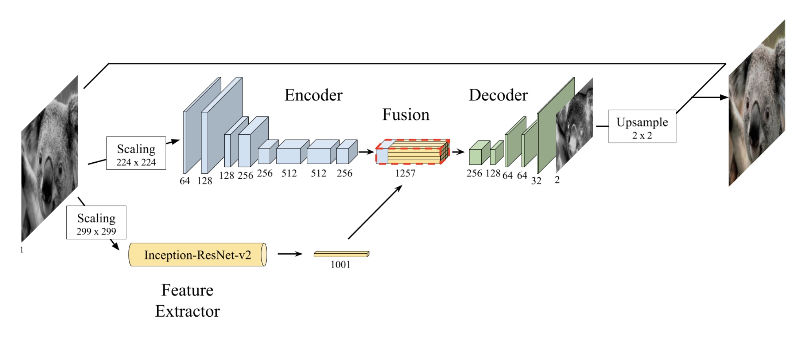
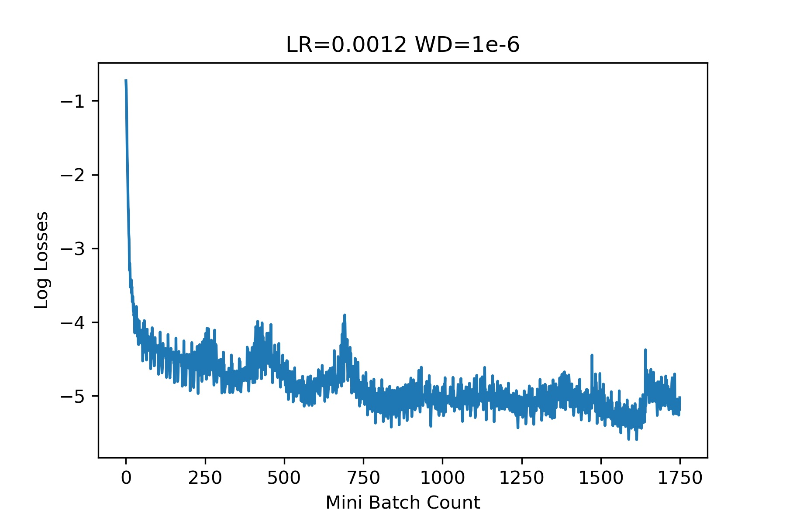
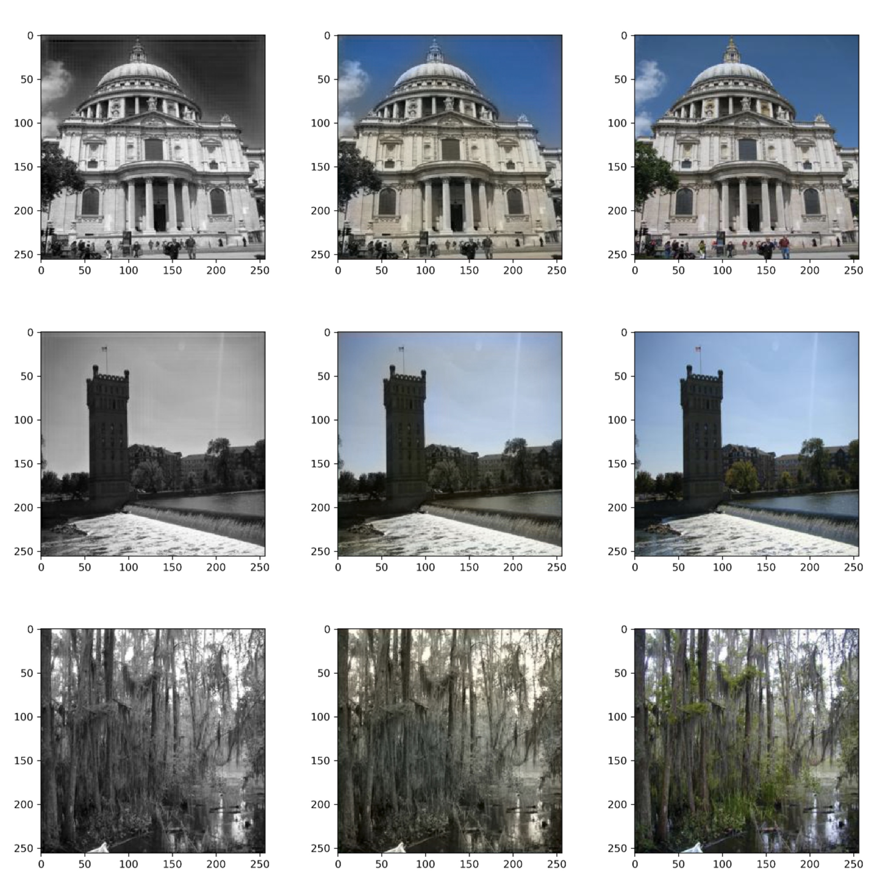
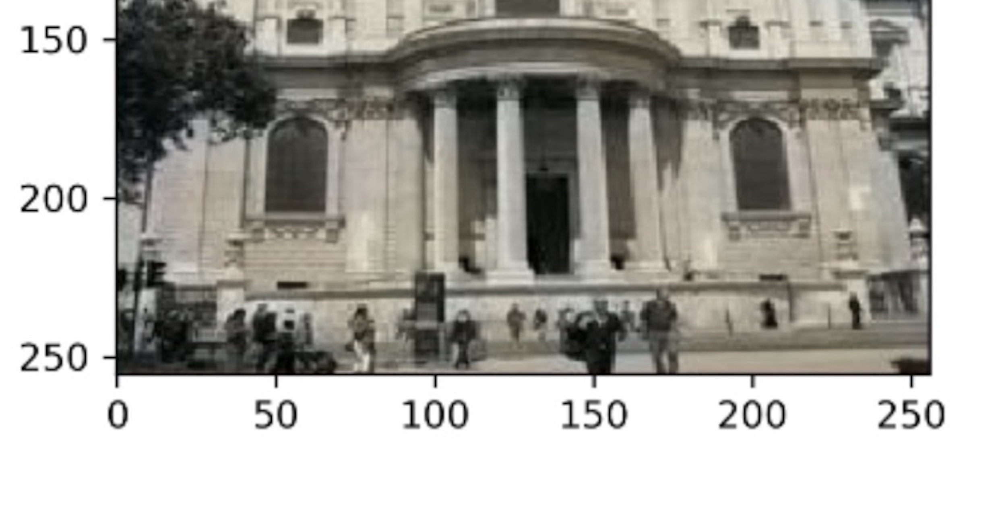
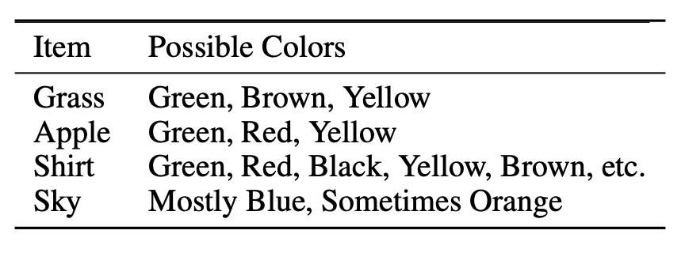

# Introduction

Although this was a school project, this was open-ended as opposed to a consistent assignment so I am able to share much of the code here! Alongside this project page, you can also find more details in the report that was submitted for this work. Generally speaking this page serves as a summary of key points but is not granular enough to re-implement.

<PostButton text={"Report"} target={"/reports/image_colorization.pdf"} />

## Model Overview

I opted to implement the model as detailed in [Deep Koalarization: Image Colorization using
CNNs and Inception-Resnet-v2](https://arxiv.org/pdf/1712.03400v1.pdf). The main points of the network are as follows:

- CNN encoder for initial feature extraction
- Additional feature extractor using a pre-trained Inception-ResNet-V2
- Fusion layer to combine both sets of features
- Decoder to upsample and estimate the output from the fused features



I enjoy this network as it combines many of the benefits of transfer learning with an additional bare network for fine tuning as the domain transfer will never be perfect with a pre-trained encoder. The paper linked prior goes into much more detail and was a great guide for my implementation, if you are interested I advise you read it.

# Problem Statement

The problem if image colorization is quite an interesting one the simplifies into an elegant self-supervised problem. Given a grayscale image, can we estimate the additional color channels required to gave a full-color image. This sounds difficult at first but with some tweaks to the images, it's quite easy to formulate this as a simple problem.

In the RGB color space, it's hard to imagine how you may split the original image into a set of components, but if you convert the image to be in the [LAB color space](https://en.wikipedia.org/wiki/CIELAB_color_space) the problem can easily be self-supervised. In the LAB color space, the L component is the grayscale component and the AB channels encode color information. Now if we convert our dataset images to be in the LAB space, we easily get our input L channel and our ground truth AB channels! Therefore, the dataset requirements are just full-color images. The problem statement simplified as such, we are looking to estimate a function f such that:

$$
f(I_L) \rightarrow (I_a, I_b)
$$

Where $f$ will be our large convolutional net.

# Dataset

I opted to use the [places2 dataset](hhttp://places2.csail.mit.edu/download.html) as the context of colorizing an image of scenery or typical views from the human perspective are well captured in this dataset. As the dataset is very large and I had limited hardware to train on, I opted to subset the dataset into smaller splits.

I first created folders to store the subsets.

```python
from skimage import io
import os

# Create New Directories
for name in ['train', 'validation','test']:
    path = "dataset/" + name + "/"
    os.makedirs(path, exist_ok=True)
```

I then split images from the validation set into specified counts for each split.

```python
# Setting up Breakpoints
num_train = 1000
num_val = 200
num_test = 100

base_dir = './data/validation/'
files = os.listdir(base_dir)
index = 0
for i,image in enumerate(files):

    test = io.imread(base_dir + image)
    if test.ndim != 3:
        continue

    # Pick what folder to place image into
    if i < num_train:
        os.rename(base_dir + image, "./dataset/train/" + image)
    elif i < (num_train + num_val):
        os.rename(base_dir + image, "./dataset/validation/" + image)
    elif i < (num_train + num_val + num_test):
        os.rename(base_dir + image, "./dataset/test/" + image)
    else:
        break
    index += 1
```

Now that I have folders containing my data, I needed to work on a PyTorch dataset for data loading. There are a few things to consider when creating the dataloader.

- The input image is the grayscale channel (L channel in LAB space) so we'll need to retrieve that component after converting the RGB dataset images
- The two other components (AB in LAB) are our ground truth output so we'll also retrieve those as such
- Pre-Trained ResNet requires a different input image size than the base encoder
  - We'll need to resize the dataset images to have each variant

All things considered, the following code achieves all of these goals and helps us bring all the necessary data into PyTorch.

```python
# Torch dataloader likes having a class instance that represents the data
# We preprocess images here
# ref: https://pytorch.org/tutorials/beginner/data_loading_tutorial.html
# ref: https://discuss.pytorch.org/t/how-to-load-images-without-using-imagefolder/59999

from skimage.transform import resize

class ModelData(torch.utils.data.Dataset):

    def __init__(self, base_dir):
        self.base_dir = base_dir
        self.all_imgs = os.listdir(base_dir)

    def __len__(self):
        return len(self.all_imgs)

    def __getitem__(self, idx):

        # Import Image and get LAB Image
        img_name = os.path.join(self.base_dir, self.all_imgs[idx])
        image = io.imread(img_name)
        image  = image / 255.0
        lab = rgb2lab(image)

        # L Channel
        L = np.expand_dims(lab[:,:,0], axis=2)
        L /= 50.0
        L -= 1.0

        # AB Channels
        AB = lab[:,:,1:].transpose(2,0,1).astype(np.float32)
        AB /= 128.0

        # Scale For Inception
        L_inc = resize(np.repeat(L,3,axis=2), (299, 299)).transpose(2,0,1).astype(np.float32)

        # Scale for Encoder
        L_enc = resize(np.repeat(L,3,axis=2), (256, 256)).transpose(2,0,1).astype(np.float32)

        # Build Sample Dict.
        sample = {"L":L.transpose(2,0,1).astype(np.float32),
                 "L_inc":L_inc, "L_enc":L_enc, "AB":AB,
                 "RGB": image}

        return sample
```

Then it's as simple retrieving the relevant categories of images and passing them through the PyTorch `DataLoader`.

```python
# PyTorch Loaders for Train and Validation

# Get Dataset Objects
train_images = ModelData(base_dir="./dataset/train")
val_images = ModelData(base_dir="./dataset/validation")
test_images = ModelData(base_dir="./dataset/test")

# Pass Into Loaders
train_loader = torch.utils.data.DataLoader(train_images, batch_size=40, num_workers=2)
val_loader = torch.utils.data.DataLoader(val_images, batch_size=40, num_workers=2)
test_loader = torch.utils.data.DataLoader(test_images, batch_size=40)
```

Now we have all of our required dataloaders to move forward with model construction.

# Model Construction

Here I will discuss how I constructed the entire model as specified in the original paper.

## Base Encoder

Here is where I construct the layers for the base encoder block. These layers will not be pre-trained and will help in refining results more specific to this dataset as opposed to the dataset the pre-trained net is based on. This is a simple CNN network so we can model it as a sequential model wrapped in a module API class.

```python
class ImgEncoder(nn.Module):

    def __init__(self):
        super(ImgEncoder, self).__init__()

        self.layers = nn.Sequential(
            # Conv1
            nn.Conv2d(3, 64, 3, stride=2, padding=1),
            nn.ReLU(inplace=True),
            nn.BatchNorm2d(64),

            # Conv2
            nn.Conv2d(64, 128, 3, stride=1, padding=1),
            nn.ReLU(inplace=True),
            nn.BatchNorm2d(128),

            # Conv3
            nn.Conv2d(128, 128, 3, stride=2, padding=1),
            nn.ReLU(inplace=True),
            nn.BatchNorm2d(128),

            # Conv4
            nn.Conv2d(128, 256, 3, stride=1, padding=1),
            nn.ReLU(inplace=True),
            nn.BatchNorm2d(256),

            # Conv5
            nn.Conv2d(256, 256, 3, stride=2, padding=1),
            nn.ReLU(inplace=True),
            nn.BatchNorm2d(256),

            # Conv6
            nn.Conv2d(256, 512, 3, stride=1, padding=1),
            nn.ReLU(inplace=True),
            nn.BatchNorm2d(512),

            # Conv7
            nn.Conv2d(512, 512, 3, stride=1, padding=1),
            nn.ReLU(inplace=True),
            nn.BatchNorm2d(512),

            # Conv8
            nn.Conv2d(512, 256, 3, stride=1, padding=1),
            nn.ReLU(inplace=True),
            nn.BatchNorm2d(256),
        )

    def forward(self, x):
        return self.layers(x)
```

## Pre-Trained Encoder

The pre-trained encoder is quite simple, PyTorch has models available that are pre-trained on ImageNet so all we need to do is call an instance of the network.

```python
import torchvision.models as models

inception = models.inception_v3(pretrained=True)
```

## Fusion

The fusion layer combines the features from the base encoder and the pre-trained encoder into a single input for the decoder network.

```python
class ImgFusion(nn.Module):

    def __init__(self):
        super(ImgFusion, self).__init__()
        # In practice nothing here

    def forward(self, img1, img2):

        img2 = torch.stack([torch.stack([img2],dim=2)],dim=3)
        img2 = img2.repeat(1, 1, img1.shape[2], img1.shape[3])
        return torch.cat((img1, img2),1)
```

## Decoder

The decoder is very similar to the encoder but in reverse, the number of channels reduces as the feature map sizes increase through the upsampling layers. This is where the encoded features from the base encoder and pre-trained encoder post fusion are used to estimate the AB channels.

```python
class ImgDecoder(nn.Module):

    def __init__(self):
        super(ImgDecoder, self).__init__()

        self.layers = nn.Sequential(

            # Conv1
            nn.Conv2d(256, 128, 3, stride=1, padding=1),
            nn.ReLU(inplace=True),
            nn.BatchNorm2d(128),

            # Upsample1
            nn.Upsample(scale_factor=2.0),

            # Conv2
            nn.Conv2d(128, 64, 3, stride=1, padding=1),
            nn.ReLU(inplace=True),
            nn.BatchNorm2d(64),

            # Conv3
            nn.Conv2d(64, 64, 3, stride=1, padding=1),
            nn.ReLU(inplace=True),
            nn.BatchNorm2d(64),

            # Upsample2
            nn.Upsample(scale_factor=2.0),

            # Conv4
            nn.Conv2d(64, 32, 3, stride=1, padding=1),
            nn.ReLU(inplace=True),
            nn.BatchNorm2d(32),

            # Conv5
            nn.Conv2d(32, 2, 3, stride=1, padding=1),
            nn.Tanh(),

            # Upsample3
            nn.Upsample(scale_factor=2.0),
        )

    def forward(self, x):
        return self.layers(x)
```

## Whole Network

Lastly, we just need to connect all the prior blocks into our whole network!

```python
class ColorNet(nn.Module):

    def __init__(self):
        super(ColorNet, self).__init__()
        self.encoder = ImgEncoder()
        self.fusion = ImgFusion()
        self.decoder = ImgDecoder(256)
        self.post_fuse = nn.Conv2d(1256, 256, 1, stride=1, padding=0)
        self.relu = nn.ReLU(inplace=True)

    def forward(self, img1, img2):

        # Encoder Output
        out_enc = self.encoder(img1)

        # Fusion
        temp = self.fusion(out_enc, img2)
        temp = self.post_fuse(temp)
        temp = self.relu(temp)

        return self.decoder(temp)
```

# Training

Here I will go over decisions made for training, results of training, and some issues I came across.

## Optimizer

I chose to use the Adam optimizer with the following parameters:

| Parameter     | Value  |
| ------------- | ------ |
| Learning Rate | 0.0012 |
| Weight Decay  | 1e-6   |

In PyTorch that looks like this:

```python
import torch.optim as optim
optimizer = optim.Adam(model.parameters(), lr=0.0012, weight_decay=1e-6)
```

## Criterion

As we will be comparing the expected AB results with the ground truth we can use a simple MSE loss for this problem.

```python
criterion = nn.MSELoss()
```

## Training Loop

Nothing too special here. Given the prior dataloaders we made it's easy to enumerate over the loader and proceed with moving data to the GPU, running the forward pass, computing loss, and run an optimizer step. Sadly, given my hardware limitation I was not able to compute the validation loss during training which made backtracking to the best model impossible, I just had to assume training was at a reasonable point from the training loss.

```python
epochs = 50

for i in range(epochs):

    train_total_loss = 0
    val_total_loss = 0
    print("Epoch:", i+1)

    model.train()

    # Train
    for i,data in enumerate(train_loader,0):

        # Move Data to GPU
        enc_in = data["L_enc"].cuda()
        inc_in = data["L_inc"].cuda()
        AB = data["AB"].cuda()

        # Init. Optim. Params.
        optimizer.zero_grad()

        # Forward Prop.
        # Get Inception Output
        out_incept = inception(inc_in)
        # Get Network AB
        net_AB = model(enc_in, out_incept)

        # Determine Loss
        loss = criterion(net_AB, AB)

        # Back Prop.
        loss.backward()

        # Update Weights
        optimizer.step()

        # Update Loss Saves
        train_batch_loss.append(loss.item())
        train_total_loss += loss.item()

    train_epoch_loss.append(train_total_loss)

    # Print Info Every Epoch
    print("Train Loss: ", train_total_loss)
    # print("Val. Loss: ", val_total_loss)
```

## Loss Results

The training loss was very interesting for this model, a shape I've never seen before. In hindsight, this seems like too large of a learning rate but I didn't know better back then.



At the end of training a checkpoint is saved for us in inference later on.

```python
checkpoint = {'model': ColorNet(),
          'state_dict': model.state_dict(),
          'optimizer' : optimizer.state_dict()}

torch.save(checkpoint, 'checkpoint.pth')
```

And a little helper function to retrieve the model back.

```python
def load_checkpoint(filepath):
    checkpoint = torch.load(filepath)
    model = checkpoint['model']
    model.load_state_dict(checkpoint['state_dict'])
    for parameter in model.parameters():
        parameter.requires_grad = False

    model.eval()
    return model

model = load_checkpoint('checkpoint.pth')
```

After that we can test some images!

# Results

Below we see a set of sample images from the test set that were passed through the model. The left column are the input grayscale images, the center are the predicted images, and the right side are the original images. As we can see, this hardly passes the human eye but the performance isn't too bad.



It's interesting to start to characterize the performance. For example, consider the first row images of the building. The model does quite well on the sky and building color as buildings don't come in too many colors so it's easier to be more confident about what the color is. On the other hand, people's clothing greatly vary in color and so it's much more difficult to tell what color they should be.

## Loss Problem

The MSE loss promotes predicting unsaturated colors for objects that are harder to tell. An intuitive way to think about this is considering two objects that look identical in grayscale bt vary in true color. The model could choose to be confident and choose a saturated color but if it's wrong it's VERY wrong. So to minimize MSE, the model is conservative and chooses median colors to represent objects of ambiguity. We see this as a fairly vibrant sky whereas the people are drab and gray.



Another way to think about this is to consider what are the possible colors for a given object, we see those that are well-defined are more vibrant whereas others are not as vibrant.



Either way the solution is a loss that allows for many possibilities for a given object as opposed to dictating a single correct solution. Such losses exist and are detailed [here](https://arxiv.org/pdf/1603.08511v5.pdf) but I did not implement it.

# Conclusion

As always let me know if you have any questions or suggestions but I hope you enjoyed the post!
