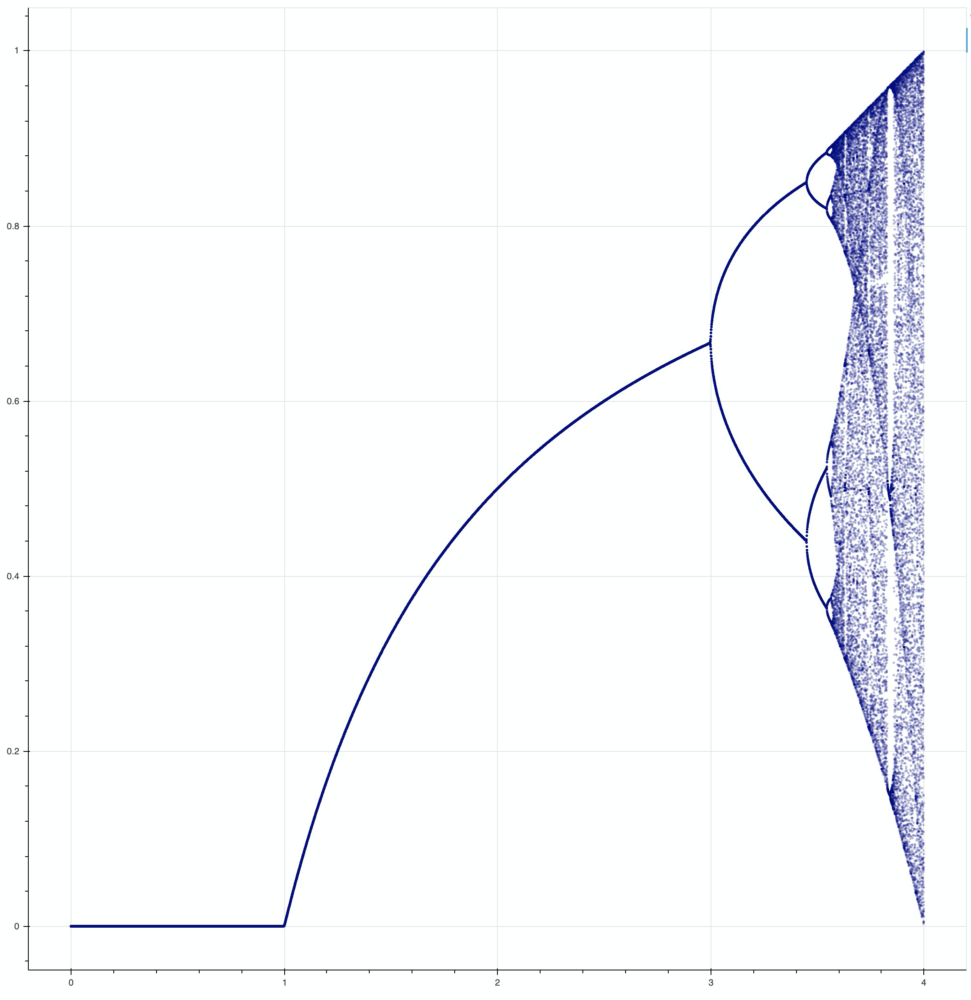

# Introduction

This was a fun weekend project that I thought would be interesting to share as this is one of the prettier visualizations I've done in a bit. This post is a reflection of the entire GitHub repo so if you want to see more I advise you look into the actual codebase.

<PostButton
  text={"GitHub Repo"}
  target={"https://github.com/patricksyoussef/LogisticMapVisualization/"}
/>

# Usage

Usage is quite simple, you just need to modify the parameters in the code shown below:

```python
num_base_iters = 1000   # Base iterations to reach steady-state, 1000 is plenty
num_final_iters = 500   # How many iterations to save for plotting
r_start = 2.9           # The lower bound of r values to plot for
r_stop = 3.99           # The upper bound of r values to plot for
n = 1000                # Number of equally space r values
```

If you want to read more about the path to the final code and more information on the equation itself, read ahead.

# What Is The Logistic Map?

The [logistic map](https://en.wikipedia.org/wiki/Logistic_map) is a math equation that was often used to describe population growth in natural systems, but more commonly is cited as an interesting case of chaotic nature arising out of simple mathematics.

$$
x_{n+1} = rx_n(1-x_n)
$$

The equation is a recursive relation wherein the updated value on the left hand side is the new population some time-step. For a typical system we would expect this to steady state to some value over many iterations. For values of the growth constant R that are just greater than ~3 the stead-state population oscillates between two values and as $r$ progresses becomes more and more chaotic.

# Code Summary

I will give a brief summary of the components that much up the main notebook.

## Helper Functions

First piece of code for this are some helper functions for the logistic map function and collecting values of the functions over iterations. The second function iterates the logistic function for `i` initial iterations to get to a steady state and then `n` iterations of points are sampled after that. Thie gives us an array that is n long containing a history of values for $x_n$ at a given $r$ value.

```python
def logistic_eq(r, xn):
    return r*xn*(1-xn)


def run_generation(r,i,n):
    # i defines the initial iterations
    # n is for what range to find discrete points
    x = 0.01
    for _ in range(i):
        x = logistic_eq(r,x)

    pts = np.array([])
    for _ in range(n):
        x = logistic_eq(r,x)
        pts = np.append(pts, np.array([x]))

    return pts
```

## Calling Iterations

The next step is to iterate through a list of $r$ values and maintain a list for each. Later we will scatter plot the list of points against each $r$ to produce the plots you see.

```python
num_base_iters = 1000
num_final_iters = 500


# One of my favorite ranges
# r_start = 3.8475
# r_stop = 3.8505

# Test your own!
# To emulate images like mine takes a long time to compute and generate image
num_base_iters = 1000   # Base iterations to reach steady-state, 1000 is plenty
num_final_iters = 500   # How many iterations to save for plotting
r_start = 2.9           # The lower bound of r values to plot for
r_stop = 3.99           # The upper bound of r values to plot for
n = 1000                # Number of equally space r values
r_list = np.linspace(r_start, r_stop, num=n)

# Initializing the data matrix
data = np.zeros([len(r_list)*num_final_iters])

i = 0;
p = 0;
percent_count = np.round(len(r_list)/10)
for r in r_list:
    if i % percent_count == 0:
        print(p,"% done!")
        p += 10;
    result = run_generation(r, num_base_iters, num_final_iters)

    # Data Indexing
    s = i * num_final_iters
    e = s + num_final_iters
    data[s:e] = result

    i += 1;

print("Done!")

# Reshaping data for plotting
r_array = np.array([r_list]*num_final_iters).transpose()
r_array = np.squeeze(np.reshape(r_array, (1, r_array.size)))
D = np.array([[r_array],[data]])
D = D[:,(D[1,:] >= 0.0) & (D[1,:] <= 1.0)]
```

When plotted with matplotlib we get the following which I find quite beautiful. I wanted to make this look better so I opted to improve the visualization using some more artistic plotting packages.



## Pretty Plotting

Lastly, I use Bokeh to generate the better looking plots and save an HTML where you can explore the plot, or for the photos on here save a `.PNG`.

```python
p = figure(plot_width=2560, plot_height=1440, output_backend="webgl")

p.circle(D[0,:], D[1,:], size=0.25, color="#e4f0fc", alpha=0.3)
p.xgrid.visible = False
p.ygrid.visible = False
p.background_fill_color = "black"
p.background_fill_alpha = 0.85

show(p)
output_file("LogisticMapTest.html", title="LogisticMapVis")
```

With this Bokeh code, we get some really amazing looking plots!


# Questions

Please let me know if you have any questions and I hope you like it!
