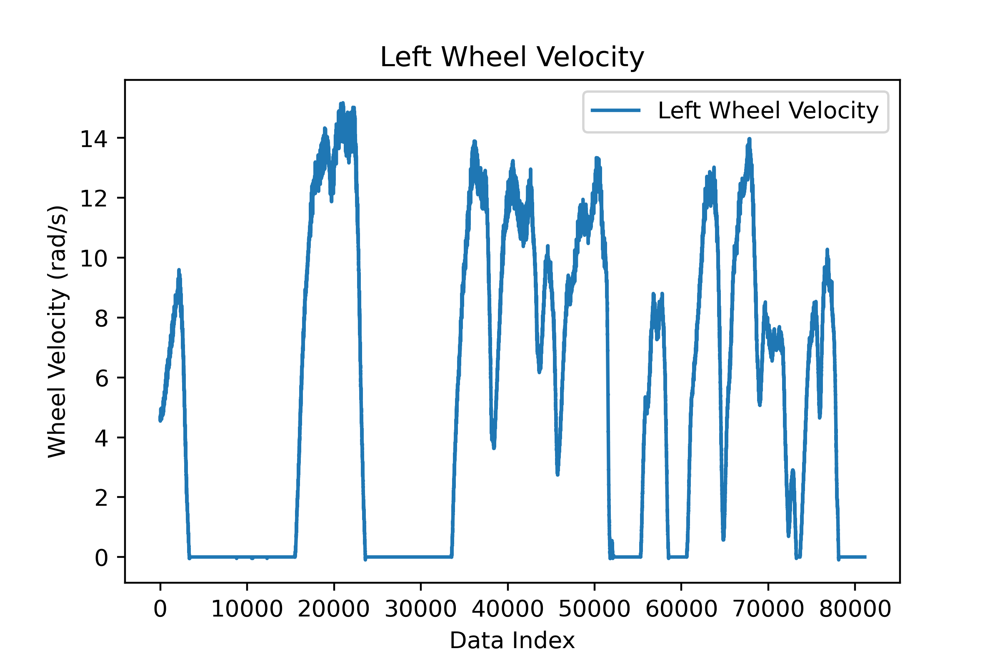
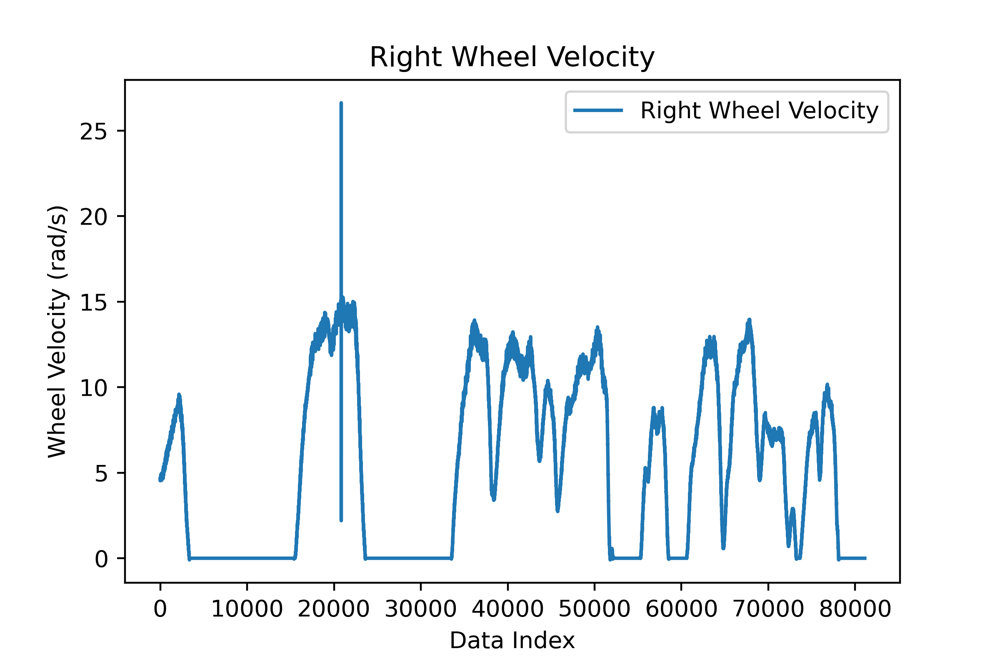
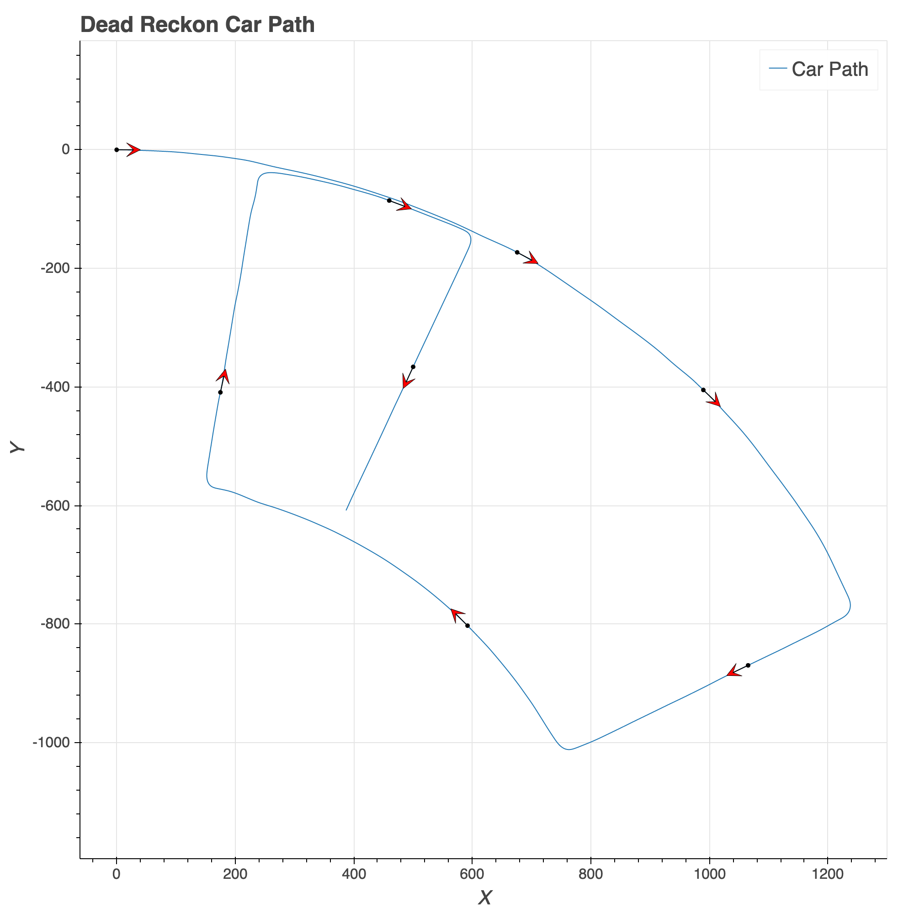
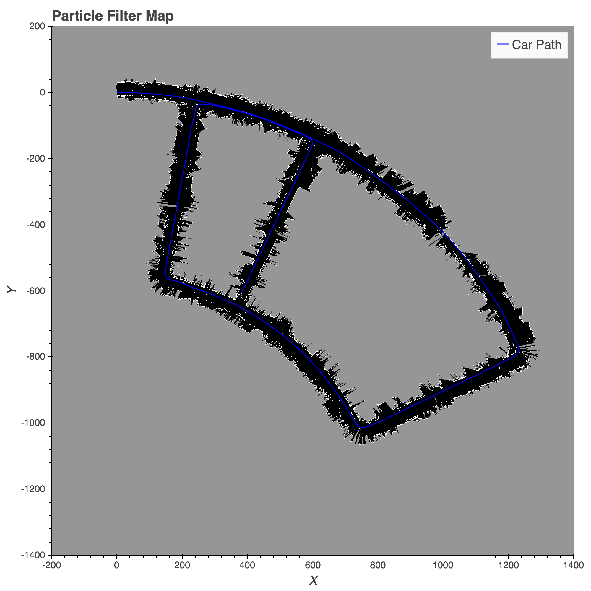
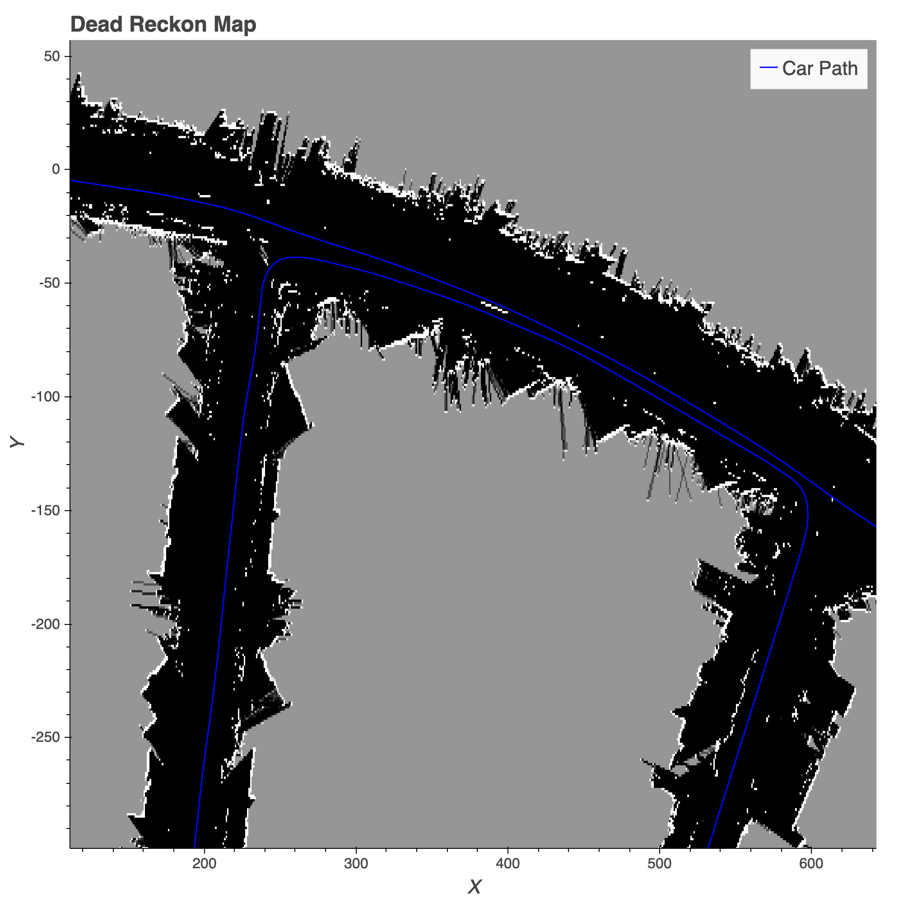
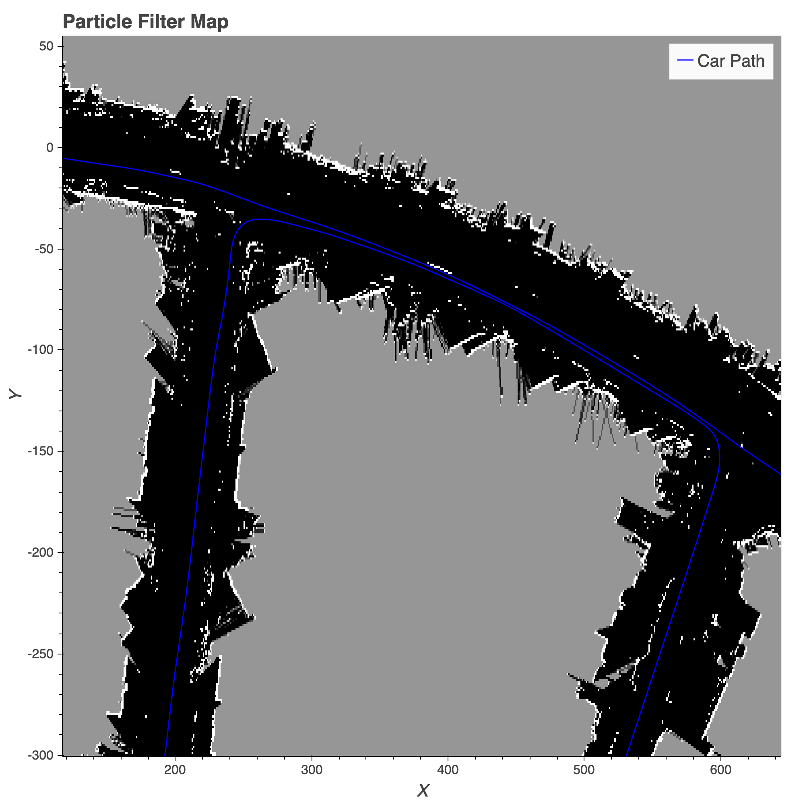

import mapping_video from "./videos/mapping_video.mp4";

# Report

As this was part of my graduate studies I cannot publish the code but the below button will take you to the formal writeup associated with the project. Also the report has _much_ more detail than this post will so I highly advice you look through it for more information, here I will be focusing on high level principles and results.

<PostButton text={"Report"} target={"/reports/pf_slam.pdf"} />

# Introduction

In this paper we will discuss an approach to solving the simultaneous localization and mapping (SLAM) problem for a mobile vehicle and attempt to understand the shortcomings of the given implementation. Possible improvements will be suggested along the way alongside the state of the current results.

<PostVideo video={mapping_video} />

# Importance of SLAM

The problem of localizing a mobile robot within an unknown map is one that has many novel uses in modern robotics. In many applications we don't have the luxury of a predetermined map, but the usage of landmarks and correspondence can help to maintain a correct localization. A solution to this problem falls into the family of problems called SLAM. A utility of this method is for navigation and creation of a map for any unknown or changing space where a map is either not available or needs to be updated realtime.

# Summary of Approach

There are a variety of ways to solve this family of problems but we are tasked to solve this using a particle filter for state prediction and lidar correspondence for landmarks within the map. The process of creating the map and maintaining a position within the map is as follows:

- Initialize map with first lidar scan and start coordinate system there.
- Initialize particles with the same state as the vehicle $[0,0,0]$ and equal weights.
- Predict the state of a set of dispersed particles and measure the degree of correspondence of each particle against the map up to the point.
- Normalize the weights of the particles such that the sum of all weights is 1.
- Predict new robot state with a weighted average of the particle states.
- Update the map with a new prediction of the robot state given the best approximation of state. Repeat 3-6.

# Problem Formulation

Here we will discuss more precisely the problem we are trying to solve and the associated mathematical quantities that will help us.

# Problem Statement

In this problem we are given sensor data from a mobile vehicle and are tasked with predicting the state of the vehicle over time using a map of its surroundings that we generate along the way. We are given the data of 3 different sensors: a fiber optic gyroscope (FOG), wheel encoder readings, and a front-scanning lidar.

## Localization Problem

Localization deals with understanding the position of a robot in a given map.

- Input: A given map $m$ and a sequence of controls $u$
- Objective: Obtain a sequence of states $x$ of the robot's path

## Mapping Problem

Mapping deals with logging the landmarks of a robot's surroundings.

- Input: A sequence of states $x$ and observations $z$
- Objective: Obtain a map $m$ of the robot's surroundings

## SLAM Problem

SLAM is doing both localization and mapping with a limited understanding of both.

- Input: A sequence of controls $u$ and observations $z$
- Output: A sequence of states $x$ and a map of surroundings $m$

A particle filter is a special kind of bayes filter that does not assume anything about the world that we'll use to solve this problem.

# Data Cleaning

A good first step is to process the data into a form that makes this problem more tractable and allow for easier correspondence between sensors. We'll go through the step taken for each sensor's data.

## Fiber Optic Gyroscope

The data from the FOG is in $\text{rad/s}$ which is not immediately useful to us. It's also sampled 10x faster than both the lidar and encoders. I chose to compute $\Delta \theta$ as $\tau \dot{\theta}$ and summed the changes over every 10 samples to bring the samples inline with the other sensors.

## Wheel Encoders

Wheel encoders were more straightforward than the FOG. Given $\frac{ticks}{rev}$ and the sample time it was easy to compute $\tau$ and $\Delta Ticks$ to determine the wheel linear velocity at each sample time as:

$$
    \dot{x}=\frac{\Delta \text{Ticks} \, \pi \, \text{D}_{\text{wheel}}}{\Delta \tau \, \text{TPR}}
$$

The result of this are estimated linear velocities at the wheels,but as we can see we cannot really purely on the readings as we can see some slipping on the right wheel.




## Lidar

Lidar did not have much preprocessing as much of the processing happens during the mapping steps. All I did was reform the data structures here to be inline with how I present the data from before.

## Across All Sensors

Once I had all sensors cleaned up and at the same sampling rate I trimmed the data such that I had the largest data set where all sensors were sampled and times were inline.

# Dead Reckoning

Although dead reckoning is not necessary for the particle filter SLAM, it's a good step to build some intuition of the data and many of the steps translate well into the SLAM predict step. The integration steps done here are the base of updating the particle states in the prediction step.

## Motion Model

The motion model used to describe the rates of the states of the vehicle is a differential drive model. The motion model is as follows:

$$
\dot{X} = \left[ v \cos(\theta), v \sin(\theta), \dot{\theta}\right]
$$

Where $v$ is the centerline velocity (average wheel velocity) and theta is the heading of the robot.

## Euler Integration

Once the rates were determined at each time I compute the changes in the 3 states over each sample and applied a cumulative sum to get the estimated state over time. The changes were computed as an euler integration:

$$
    X_{t+1}=X_i + \tau \dot{X}
$$

where $X$ is a vector of states and $\dot{X}$ are the state derivatives from the motion model. The code below produces the path plotted below.

```python
# Dead-Reckon (Euler)
v = np.sum(wheel_v[1:], axis=0) / 2
w = fog_w[3]
dt = wheel_v[0] - np.hstack((np.array([0]), wheel_v[0,:-1]))
theta = np.cumsum(np.multiply(w, dt))
time = np.cumsum(dt)

# Get derivs [xdot, ydot, thetadot] x N
derivs = np.zeros((3, dt.size))
derivs[0] = np.multiply(v, np.cos(theta + w*dt))
derivs[1] = np.multiply(v, np.sin(theta + w*dt))
derivs[2] = w

# Compute Changes
deltas = np.multiply(derivs, dt)

# Compute estimated state by summulative sum or prior deltas
state = np.cumsum(deltas, axis=1)
```



# Particle Filter SLAM

Here we will go into detail about how the implementation for particle filter SLAM was formed. I will relay the steps that map well to function defined in my code that I determined as distinct steps in this process. Note that I can't publish much code here as this was the meat of the assignment.

## Initialize Particles

First step taken is to initialize N particles to the initial state of the vehicle $[0, 0, 0]$ with weights of $\frac{1}{N}$. As we are not trying to localize the robot in a given map it does not make sense to disperse the particles initially but to instead start them on top of the robot.

## Lidar Projection

This helper function makes it easier to project the lidar scan into the robot coordinate system. it utilizes the rotation and translation matrix as given by the geometry of the robot. The primary equation used is:

$$
    X_{car} = R \, X_{lidar} + T
$$

Where $X_{car}$ is the 3D coordinate of a lidar scan in the car coordinates, $R$ is the rotation matrix from the lidar coordinates to the car, $X_{lidar}$ is the position of the scan in lidar coordinates, and $T$ is the translation from lidar to car.

## Initialize Map

We initialize a map of all zeros and apply the first lidar scan where endpoints increase the value in the grid by 4 and open space decreases the value of the grid by 4. The sign conventions of these changes are based on applying a sigmoid to the map later to determine the probabilities that a space if occupied.

## Predict New Particle States

Here the particles are updated to new states following the integrated motion model output at the given time. The difference compared to dead reckoning is that we add noise to disperse the particles around the dead reckoned state to capture other possible states. The update for a given particle is as follows:

$$
    X_{t+1}=X_i + \tau \dot{X} + \mathcal{N}(0, \sigma)
$$

As you can see, normal noise is added to the particles with a different standard deviation for translational noise ($x$ and $y$) and rotational noise ($\theta$).

## Update Particle Weights

Here the particle weights are updated with the aforementioned lidar map correlation metric. This is done by applying the $t+1$ lidar scan to all particles and seeing how well they correspond with the prior map. Weights are stored as this correlation score with the particles.

## Normalize Weights

For the following step, we need to normalize the weights such that they sum to 1. This is done using the softmax activation method as follows:

$$
    W = \frac{e^{w_i}}{\sum_{j = 1}^{N} e^{w_j}}
$$

Where $W$ is the vector of weights for all particles being overwritten by the softmax activation over each prior weight (Note: overwriting occurs after all new elements have been computed), and $N$ is the number of particles.

## Estimate Robot State

We now have a set of $N$ particles and their respective weights. We approximate the new state of the robot as a weighted average of the particle states. This is as follows:

$$
    X_{robot}= \sum_{i = 1}^{N} X_i \, W_i
$$

We can now also compute the weighted variance of the estimation as:

$$
    Var = \sum_{i = 1}^{N} (X_i - X_{robot})^2 \, W_i
$$

Note: The states and variance are vectors in the prior equations.

## Update Map

This step is very similar to the initialize map step but instead of a matrix of zeros we have the matrix of the prior map. We apply the same $\pm 4$ with the current lidar scan applied to the estimated robot state. To ensure we don't get numerical overflow and overly confident probabilities for cell occupancy we cap the values of grid sums to $\pm 100$.

## Resample

Lastly, if need be we resample the particles via sample important resampling. This method repositions particles relative to the weights of the prior particles. This way we focus our efforts on particles that performed well.

## Filter Map

The prior steps, starting with predict new particles, are repeated for the robot runtime but in post if you want to save the map as probabilities you can apply the sigmoid function to convert the log-odds grid sums to occupancy probabilities. This is done as follows:

$$
    p(m_{i,j}) = \frac{e^{m_{i,j}}}{1+e^{m_{i,j}}}
$$

Where $m_{i,j}$ is the sum of a particular grid element. This normalizes the sums in the grid elements to probabilities that they are occupied. This also explains why we start the matrix for the map as all zeros. When passed into the sigmoid, grids of 0 would yield $p_{i,j}=0.5$. In other words, we are equally uncertain about whether the grid space if occupied or not.

## Main Code Loop

Many of the prior steps are written as helper functions and are pieced together as follows:

```python
# Number of particles
N = 30
particles = init_particles(N)

# Motion Model Noise
# Translational noise and rotational noise
std_noise = np.array([0.002, 0.00003])

# Estimated robot state data structure [x,y,heading] and variance
rob_state = np.zeros((dts.size, 3))
rob_var = np.zeros((dts.size, 3))

# Define Starting Map
rob_map = init_map(1600, 1600, 200, 200, d_lids[0])

# Iterate over data
for i in range(dts.size-1):

    # Determine Control
    control = motion_model(vs[i], ws[i], dts[i], rob_state[i,2])

    # Predict new states
    particles = predict(particles, control, dts[i], std_noise)

    # Update Weights
    particles = update(rob_map, particles, d_lids[i+1])

    # Norm Weights
    particles = norm_weights(particles)

    # Estimate New State
    new_state, state_var = estimate_state(particles)
    rob_state[i+1] = new_state
    rob_var[i+1] = state_var

    # Update Map
    rob_map = update_map(rob_map, rob_state[i+1], d_lids[i+1])

    # Resample If Needed
    n_eff = 1 / np.sum(particles[:,-1] ** 2)
    if n_eff <= 5:
        particles = resample(particles)
```

# Results

I'll discuss the results of the filtering and present some of the maps created during the process.

## Mapping

The resultant maps looks quite nice!




The changes aren't very apparent which means that the dead reckon was already quite good for determining the path. If we zoom in the changes are a little clearer.




We can see that the particle filter has done a much better job of rectifying that the vehicle merged back into the same lane that was traveled prior whereas the deadreckon map implies otherwise.

# Questions

As always let me know if you have any questions and I'd be happy to answer!
