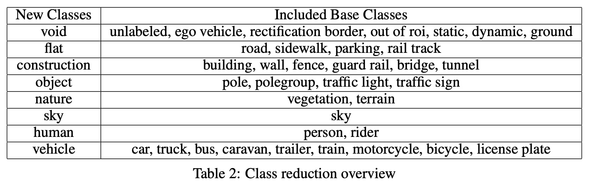
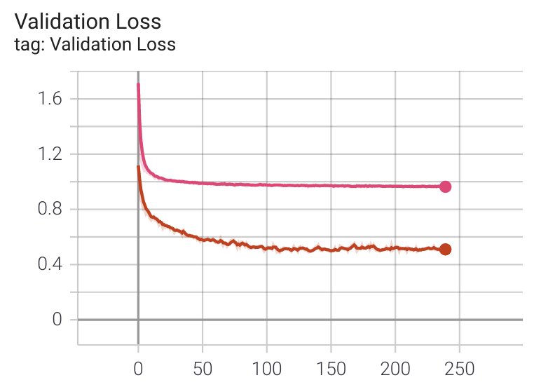
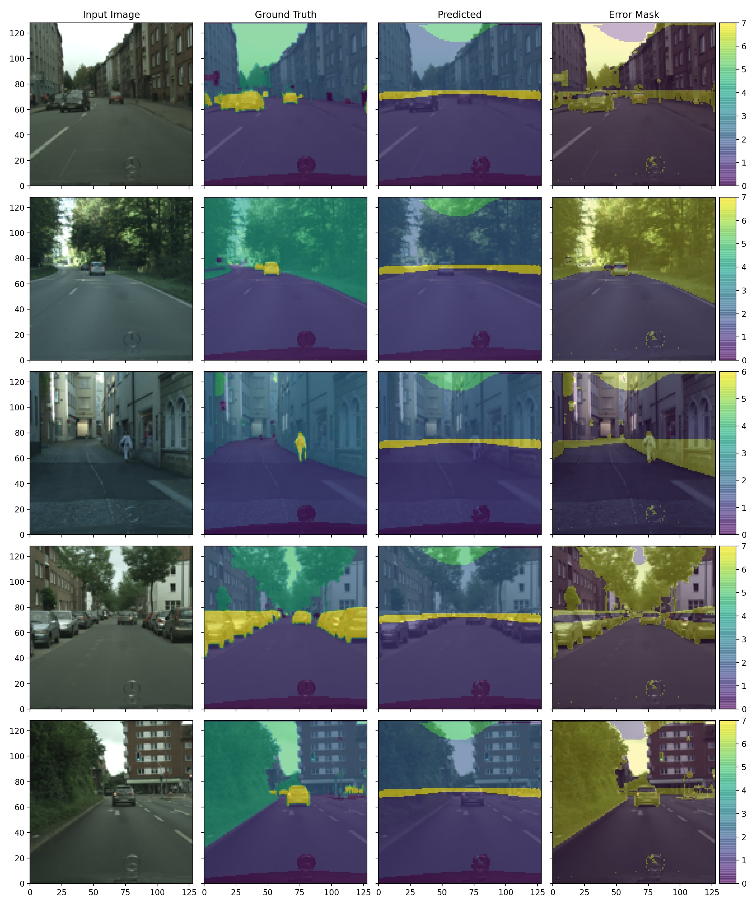
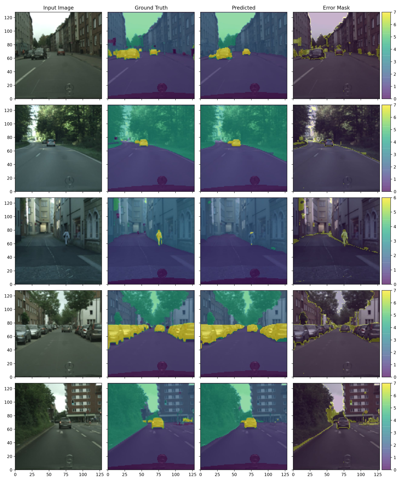

# Report

You can find more details in the report that was submitted for this work.

<PostButton text={"Report"} target={"/reports/road_segmentation.pdf"} />

# Introduction

In this post we'll go over some foundational techniques used for semantic segmentation using Convolutional Neural Networks (CNNs). After covering some recent, we will implement a well-know model and present results and improvements. In particular we will implement a U-Net model and improve the performance modern techniques such as batch norm and transfer learning. At the end of the post I will train the model on the CityScapes dataset and present the results.

# Problem Statement

Semantic segmentation is the problem of predicting classes for each pixel of an input image. Given an image of $[H, W, C]$ (where $C$ is the number of channels) the goal is predict class scores over each pixel. The result is a matrix of size $[H, W, \text{N}_\text{classes}]$. To convert the class scores into a resulting segmentation of size $[H, W, 1]$ we assign the class with the highest score to each pixel using `argmax` along the class dimension. At this point we have a format that is similar to the ground truth for supervised learning. Generally speaking our model is a function such that:

$$
f(\text{Image} [H, W, C]) \rightarrow \text{Class Scores} \, [H, W, \text{N}_\text{classes}]
$$

# Dataset and Preparation

As one of the common uses of semantic segmentation is in the autonomous vehicle industry I thought it would be fitting to use a dataset associated with that. I opted on using the finely segmented set of images from the [CityScapes](https://www.cityscapes-dataset.com/), a set of 5000 images segmented across 30 classes. I had to make some changes for the architecture I was using as well as hardware limitation during training.


## Size Reduction

The original images were not only not square but quite large for the hardware I was training on. Due to these constraints I center-cropped a square segment of every images and resized them to $[128 \times 128]$. Even with these changes I could barely train up to a batch size of 32, this is something I want to revisit as I get access to better hardware (most importantly more VRAM).

## Class Reduction

With the modified input images I also opted to reduce the classes to more general classes. I opted to reduce classes to their associated group, as an example: cars, trucks, bus, etc. were condensed to a vehicle class. This reduced the 30 classes to just 8.



# Model Construction

As mentioned before, I decided to use a U-Net for the primary model architecture. Using PyTorch, I implemented the core components of the model. I modified the encoder by using pre-trained VGG19 layers trained on ImageNet. Part of this project was comparing the results of the base model with random initialization and implementing the pre-trained layers.


## Contraction Block

The contraction, or encoder, steps of the U-Net compose the left half of the model where the input image is broken down into multi-level features that are saved to be concatenated alongside the expansion, or decoder, steps. Each level of contraction is implemented as a PyTorch module API block that returns the intermediate features at each step.

```python
class ContractionBlock(nn.Module):

    def __init__(self, c_in, c_out, pres=None):
        super(ContractionBlock, self).__init__()

        self.act = nn.ReLU(inplace=True)
        self.norm1 = nn.BatchNorm2d(c_out)
        self.norm2 = nn.BatchNorm2d(c_out)
        self.pretrained = False
        self.drop = nn.Dropout2d(0.3)

        # If you give pretrained layer used them!
        # Otherwise default U-Net layers
        if pres is not None:
            self.pretrained = True
            self.layers = pres
        else:
            self.conv1 = nn.Conv2d(c_in, c_out, kernel_size=3, padding=1)
            self.conv2 = nn.Conv2d(c_out, c_out, kernel_size=3, padding=1)

    def forward(self, x):

        if self.pretrained:
            # Pretrained layers already have BN!
            x = self.layers(x)
        else:
            x = self.conv1(x)
            x = self.act(x)
            x = self.drop(x)
            x = self.norm1(x)
            x = self.conv2(x)
            x = self.act(x)
            x = self.drop(x)
            x = self.norm2(x)

        return x
```

The code determines whether or not pre-trained layers are to be used or to initialize with new layers. Essentially if the argument `pres` contains layers they will be used.

## Expansion Block

The expansion block is very similar in principle to the contraction blocks but without pre-trained layers and of course serving a different purpose as they are decoding the input features. Here the results of the prior decoder level and saved encoder features are concatenated together along with continued forward propagation.

```python
class ExpansionBlock(nn.Module):

    def __init__(self, c_in, c_out):
        super(ExpansionBlock, self).__init__()

        self.act = nn.ReLU(inplace=True)
        self.norm1 = nn.BatchNorm2d(c_out)
        self.norm2 = nn.BatchNorm2d(c_out)
        self.norm3 = nn.BatchNorm2d(c_out)
        self.drop = nn.Dropout2d(0.3)
        self.up = nn.ConvTranspose2d(c_in, c_out, kernel_size=2, stride=2)
        self.conv1 = nn.Conv2d(c_in, c_out, kernel_size=3, padding=1)
        self.conv2 = nn.Conv2d(c_out, c_out, kernel_size=3, padding=1)

    def forward(self, x, save):

        # Upsample
        # Tranpose convolution to increase feature map size
        x = self.up(x)
        x = self.act(x)
        x = self.drop(x)
        x = self.norm1(x)

        # Concatenate
        # Combine saved encoder results with current upsampling
        x = torch.cat((save, x), 1)

        # More Convs
        # Apply convolutions to merged data for further feature reconstruction
        x = self.conv1(x)
        x = self.act(x)
        x = self.drop(x)
        x = self.norm2(x)
        x = self.conv2(x)
        x = self.act(x)
        x = self.drop(x)
        x = self.norm3(x)

        return x
```

## Combining Components

With the helper functions, all we need to do now is to initialize and compose each level of both the encoder and decoder.

```python
class UNet(nn.Module):

    def __init__(self):
        super(UNet, self).__init__()

        # Add Convs
        # Used to raise channel count to 1024 for final contraction level
        # after VGG pretrained
        self.add_conv = nn.Conv2d(512, 1024, kernel_size=3, padding=1)
        init_weights(self.add_conv)

        # Pool
        # Only one needed, no trainable params
        self.pool = nn.MaxPool2d(2)

        # Contraction
        # Blocks with a third argument are the pretrained blocks
        # Init weights for all other blocks
        self.c1 = ContractionBlock(3,64, pre[0:6])
        self.c2 = ContractionBlock(64,128, pre[7:13])
        self.c3 = ContractionBlock(128,256, pre[14:26])
        self.c4 = ContractionBlock(256,512, pre[27:39])
        self.c5 = ContractionBlock(512,1024, pre[40:52])
        init_weights(self.c5)

        # Expansion
        self.e1 = ExpansionBlock(1024,512)
        init_weights(self.e1)
        self.e2 = ExpansionBlock(512,256)
        init_weights(self.e2)
        self.e3 = ExpansionBlock(256,128)
        init_weights(self.e3)
        self.e4 = ExpansionBlock(128,64)
        init_weights(self.e4)

        # Final Convs
        # Convolve final features into raw prediction scores
        self.f1 = nn.Conv2d(64, args['n_class'], kernel_size=1)

    def forward(self, x):

        # Contraction
        x1 = self.c1(x)
        x = self.pool(x1)
        x2 = self.c2(x)
        x = self.pool(x2)
        x3 = self.c3(x)
        x = self.pool(x3)
        x4 = self.c4(x)
        x = self.pool(x4)
        x = self.c5(x)
        x = self.add_conv(x)

        # Expansion
        x = self.e1(x, x4)
        x = self.e2(x, x3)
        x = self.e3(x, x2)
        x = self.e4(x, x1)

        # Final Conv
        x = self.f1(x)

        return x
```

## Testing Forward Pass

To ensure that the forward pass is working correctly (at least dimensionally) I test an arbitrary input and check the output size.

```python{out={2}}
# Assemble Entire Model
model = UNet()

# Test on fake input
x_test = torch.rand((1,3,128,128))
out = model(x_test)

# Check Size
print("Segmentation Mask Size:", out.shape)

Segmentation Mask Size: torch.Size([1, 8, 128, 128])
```

As we can see, the output dimensions are as expected with as many channels as there are classes.

# Training

There's nothing too special in my training process but I will give a summary of decisions here.

## Parameters

With some informal testing I decided on using the following training parameters:

- Adam Optimizer
- Learning Rate: 0.001
  - Decay: 0.95/epoch
- Batch Size: 32
- Epochs: 20 (Should be more)

When training, the validation loss is computed on each epoch and if a better loss is found the model is saved in favor of the prior model. All evaluation is done on the final saved model.

## Loss

After training both the base and pre-trained models it was easy to compare the loss curves. The pink curve is for the base model whereas the red curve is for the pre-trained model. Moving into evaluation I would expect to see a distinct performance improvement from the pre-trained layers.



# Evaluation

I first evaluated the random initialization model and then compared what improvements were to be found using pre-trained encoder layers. I tested a mix of images that were selected as representing some distinct scenes from the dataset. I also computed the mean pixel accuracy and intersection over union.

| Model       | Pixel Acc. | IOU   |
| ----------- | ---------- | ----- |
| Base        | 0.635      | 0.243 |
| Pre-Trained | 0.857      | 0.53  |

As expected there is a very large difference in the model performance, this trend continues into the test images.

## Base Model Images

As we can see the bulk trends are correct but this is not passable as a correct segmentation. This is indicated well by the decent pixel accuracy but terrible intersection over union. The last column indicated where a mistake is made and we can see large regions where the model misclassified the pixel.



## Pre-Trained Model Images

This is much better! As we can see the overall performance is much better as objects are decently segmented from their foreground. There are some obvious mistakes but this could be rectified with larger images and more training (both of which were limited by hardware). The error masks are much tighter and we can see errors on the boundaries of classes.

One of the larger mistakes is on detecting humans, I believe this is due to the small size of the image. Small objects will only be represented by a few pixels in the early feature decoding, this makes it more difficult to decode out the small objects and as such they wash out into their bulk surrounding. Clearly, a larger image would greatly improve this aspect of the performance.



# Questions

As mentioned prior, this page serves as a summary of my process and findings. There are many more details in the report but past that if you have more questions feel free to reach out!
