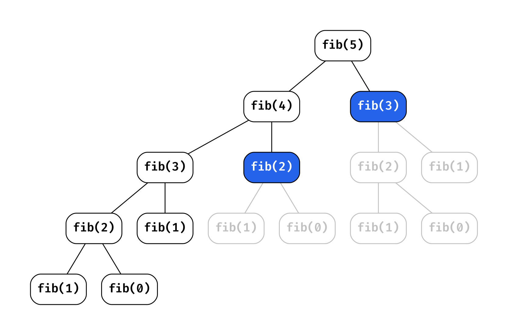
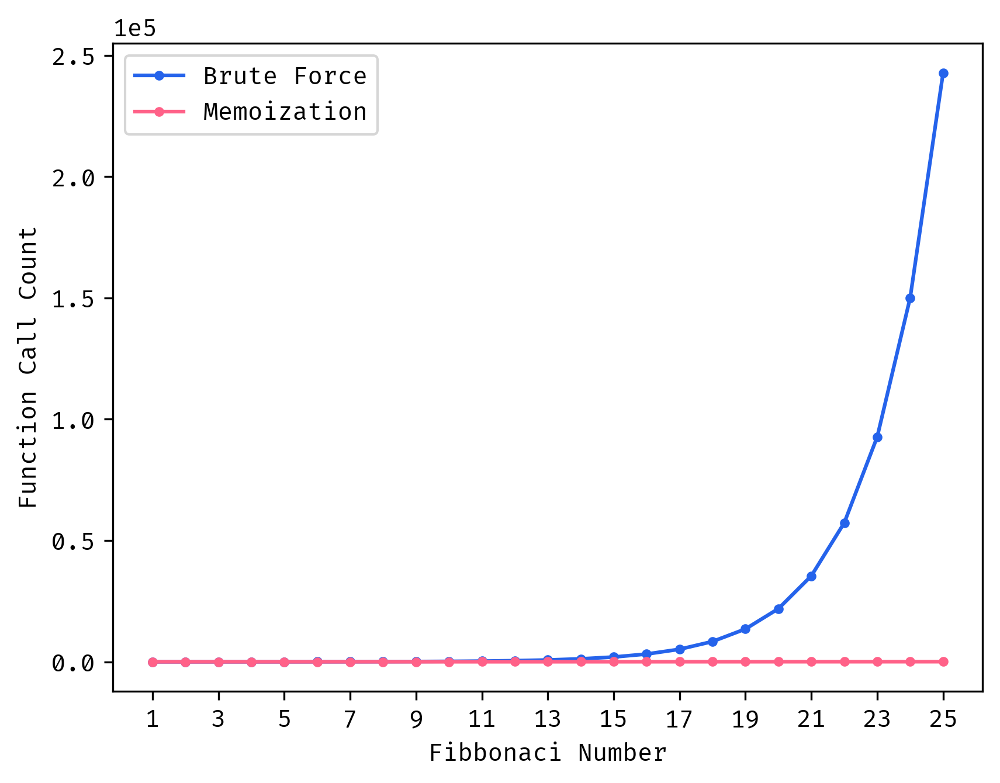

Dynamic programming is one of the most feared and misunderstood algorithmic problem solving strategies. In this post, I hope to offer some perspective on how to approach DP problems and shed light on the beauty and efficiency of this approach.

# What is Dynamic Programming?

If you ask [Introduction To Algorithms](http://mitpress.mit.edu/9780262046305/introduction-to-algorithms/), "A dynamic-programming algorithm solves each subsubproblem just once and then saves its answer in a table, thereby avoiding the work of recomputing the answer every time it solves each subsubproblem."

I'm fond of this description now, but at first read I was a bit lost. What's a subsubproblem? What does a table that saves answers look like? Like many, I was confused with how to some intuition to descriptions of dynamic programming like this and use them to solve problems.

To me, this all reduces to **don't repeat work that you've already done before**.

# Steps to Solving

Solving dynamic programming (DP) problems can be a concrete and procedural 5-step process. I think these are best understood through example, but we'll begin with a brief overview of them to get a general idea of what we're doing.

## Step 1: Recognizing a DP Problem

First, we need to determine whether or not a problem is well suited to be solved with dynamic programming. Dynamic programming is merely an optimization step that we add to a base solution, and problems where we can break the problem into subproblems are well suited to this optimization. You'll often revisit these subproblems multiple times so saving the results of your prior subproblem solutions can be very beneficial for speed ups.

## Step 2: Determine Recurrence Relations

These types of problems are well-suited to recursive solutions, so before we can write that base solution we need to determine what recursive calls we'll have. More formally, the recursive calls in your solution are based on a problem's recurrence relations.

## Step 3: Determine Base Cases

TODO: Second part of the recursive formulation

## Step 4: Write Recursive Solution

TODO: Explain general form of how you can architect these problems

## Step 5: Add Memoization

TODO: Explain that we need to keep track of prior answers and I opt to default to memoization, further explanation in LINKED ASIDE

# Fibonacci Sequence

The Fibonacci Sequence is one of the most iconic sequences in math and lucky for us in dynamic programming. This will serve as a good stepping stop to see how to implement the prior steps and what kind of benefits we can gain from dynamic programming.

## Step 1: Recognizing a DP Problem

## Step 2: Determine Recurrence Relations

## Step 3: Determine Base Cases

## Step 4: Write Recursive Solution


## Step 5: Add Memoization



So how much faster does this make our code? We're concerned with larger problems, let's see how the number of function calls scales for the brute force and memoized solutions.



Woah! The brute force solution gets exponentially more demanding as we increase the input number whereas the memoized solution stays much flatter in its scaling. To get a better idea of the scale of the difference, let's plot this on a [log y-scale](https://en.wikipedia.org/wiki/Logarithmic_scale).


For `fib(25)`, memoization makes the code around 5000x faster! The reduction in function calls and therefore runtime will only get better with higher inputs. For my laptop, I find any input greater than around 35 very difficult to compute without memoization.

# Coin Change

## Step 1: Recognizing a DP Problem

## Step 2: Determine Recurrence Relations

## Step 3: Determine Base Cases

## Step 4: Write Recursive Solution

## Step 5: Add Memoization

# Minimum Path Sum

## Step 1: Recognizing a DP Problem

## Step 2: Determine Recurrence Relations

## Step 3: Determine Base Cases

## Step 4: Write Recursive Solution

## Step 5: Add Memoization

# Memoization Decorator

I hope it's clear now that memoization is actually a very structured and clear process. After solving many problems this way it'll start to feel repetitive and maybe a bit annoying.

Python has this wonderful tool called [decorators](https://realpython.com/primer-on-python-decorators/). As Real Python says, _"...a decorator is a function that takes another function and extends the behavior of the latter function without explicitly modifying it."_ We can create a simple decorator to easily memoize a function.

import Decorator from "./asides/Decorator.mdx";

<Collapse title="Decorator Intro/Template">
  <Decorator />
</Collapse>

To write one, we create a wrapper that has its own memo and wraps the function call with a check to see if we've gotten that result before, essentially an external memo base case.

```python
def memoize(func):
    memo = {}
    def wrapper(*args):
        if args not in memo:
            memo[args] = func(*args)
        return memo[args]
    return wrapper
```

To use the decorator we just need to add `@memoize` to the line just before the function that we want to apply memoization to. Trying this on our prior non-memoized Fibonacci code we can _easily_ compute `fib(1000)` where this would be very intractable without it.

```python output=1
@memoize
def fib(n):
    if n < 2:
        return n
    return fib(n-1) + fib(n-2)

# Function Runtime
%timeit -n 10_000 fib(1000)

232 ns ± 55.2 ns per loop (mean ± std. dev. of 7 runs, 10,000 loops each)
```

> `%timeit` is an iPython magic function that it accessible in a Jupyter Notebook, don't be surprised if you can't run that line in your own Python environment.

Turns out we are not the first to come up with this, in the Python standard library module `functools` there is a `cache` decorator that does exactly this.

```python output=1
from functools import cache

@cache
def fib(n):
    if n < 2:
        return n
    return fib(n-1) + fib(n-2)

# Function Runtime
%timeit -n 10_000 fib(1000)

225 ns ± 48.1 ns per loop (mean ± std. dev. of 7 runs, 10,000 loops each)
```

Unsurprisingly we get a nearly identical runtime. My advice is to use `@cache` when you're writing production/project code but reimplement a memo from scratch in an interview!

# Conclusion


