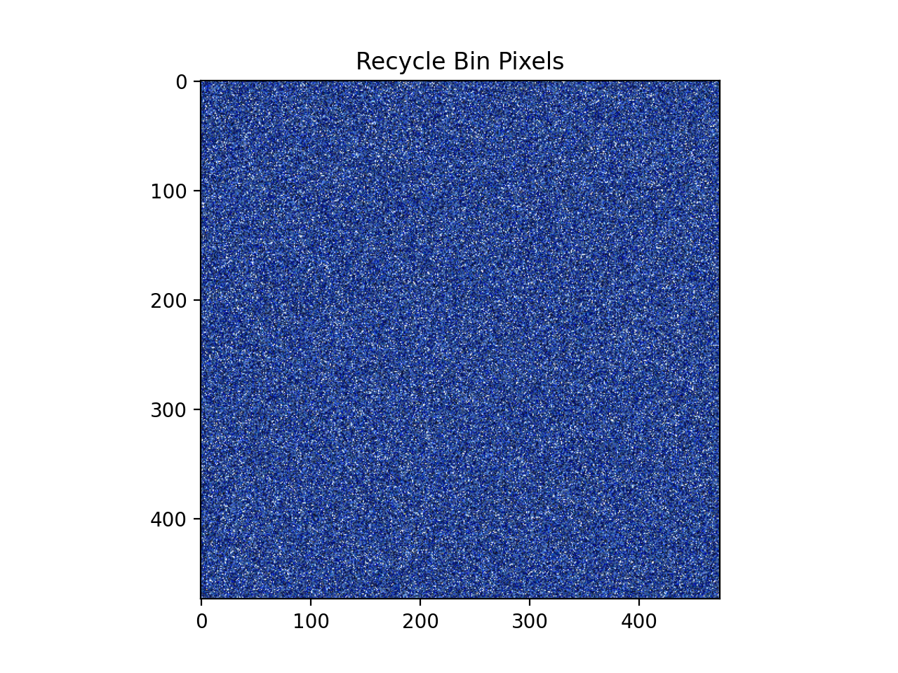
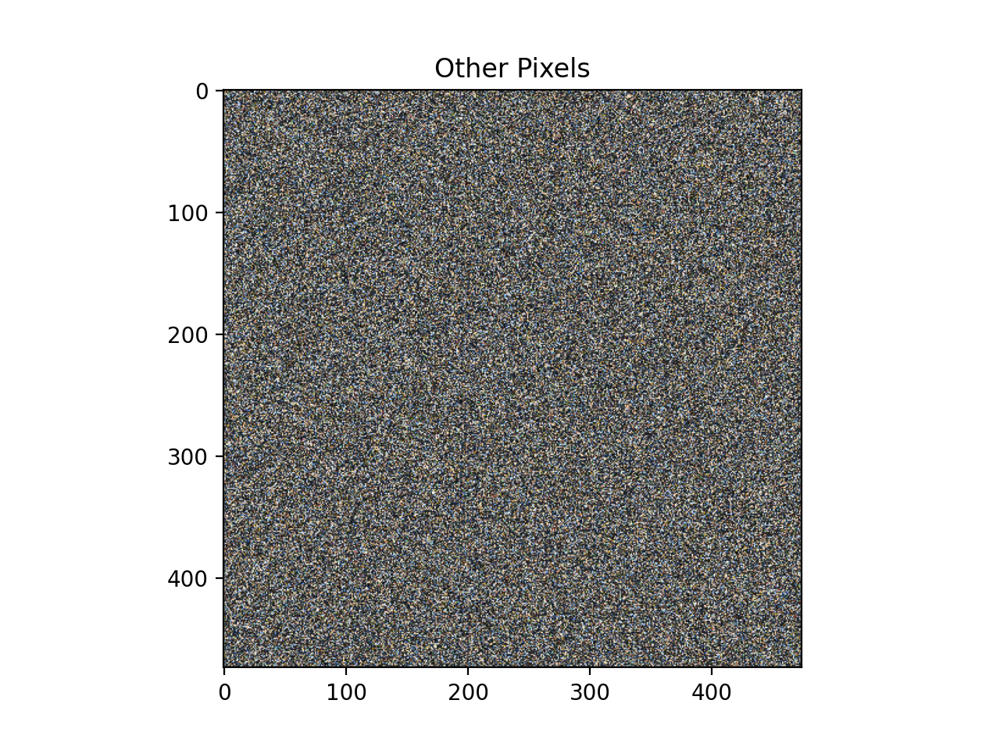
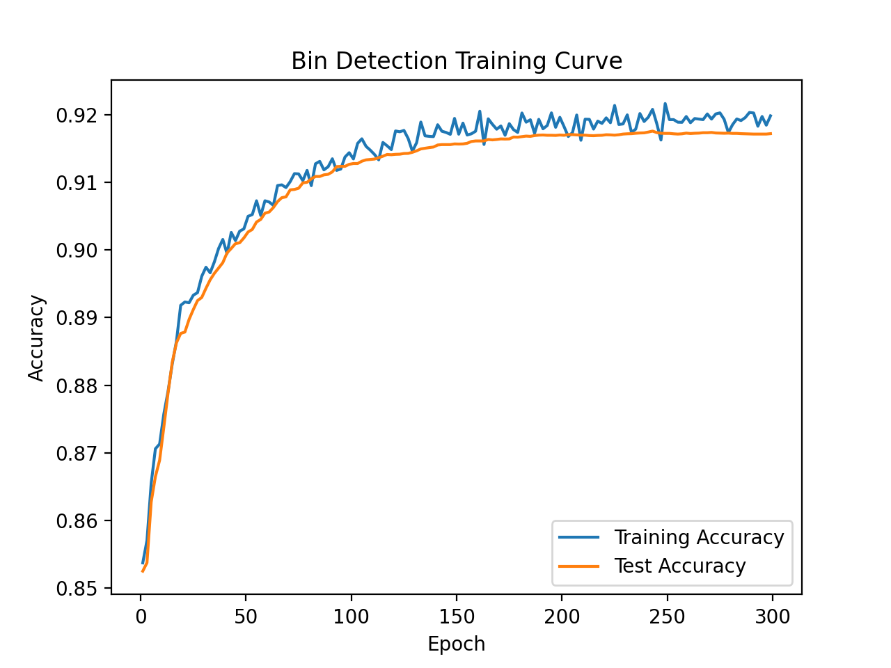
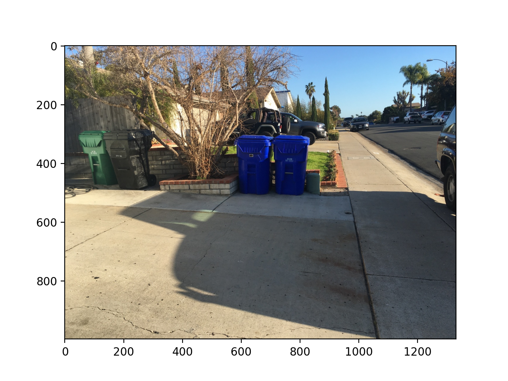
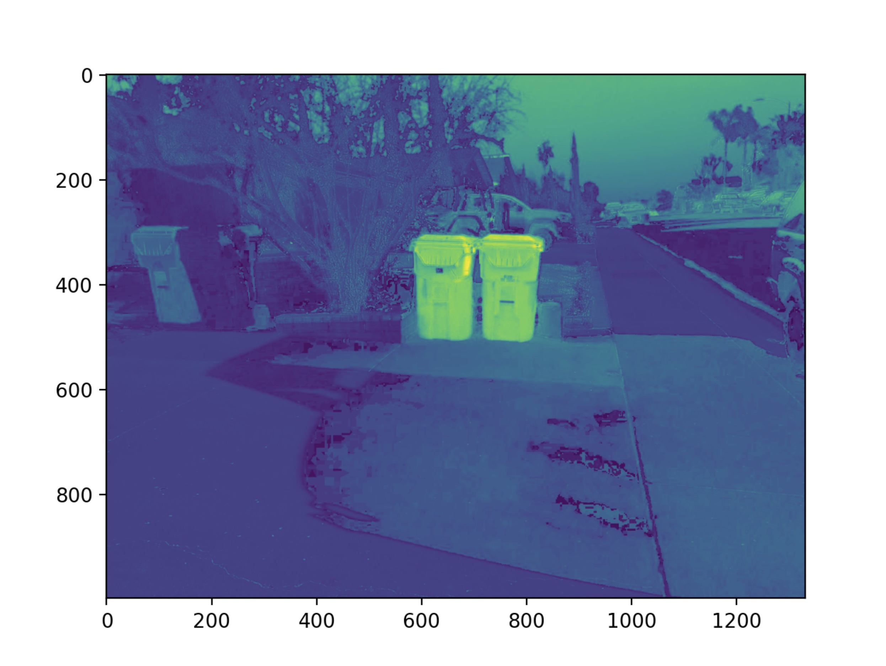
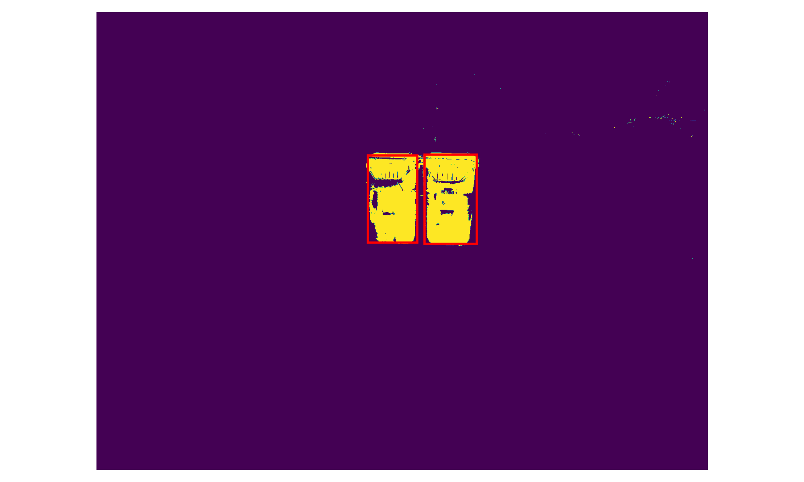

## Table of Contents

```toc

```

# Project Report

As this was part of my graduate studies I cannot publish the code but the below button will take you to the formal writeup associated with the project. Also the report has _much_ more detail than this post will so I highly advice you look through it for more information, here I will be focusing on high level principles and results.

<PostButton text={"Report Link"} target={"/reports/logit_segmentation.pdf"} />

# Introduction

In this post we will discuss an approach to detecting US household recycling bins and attempt to understand the shortcomings of the given implementation.

# Problem Statement

# Approach

# Dataset





# Model Construction

# Training



# Evaluation




