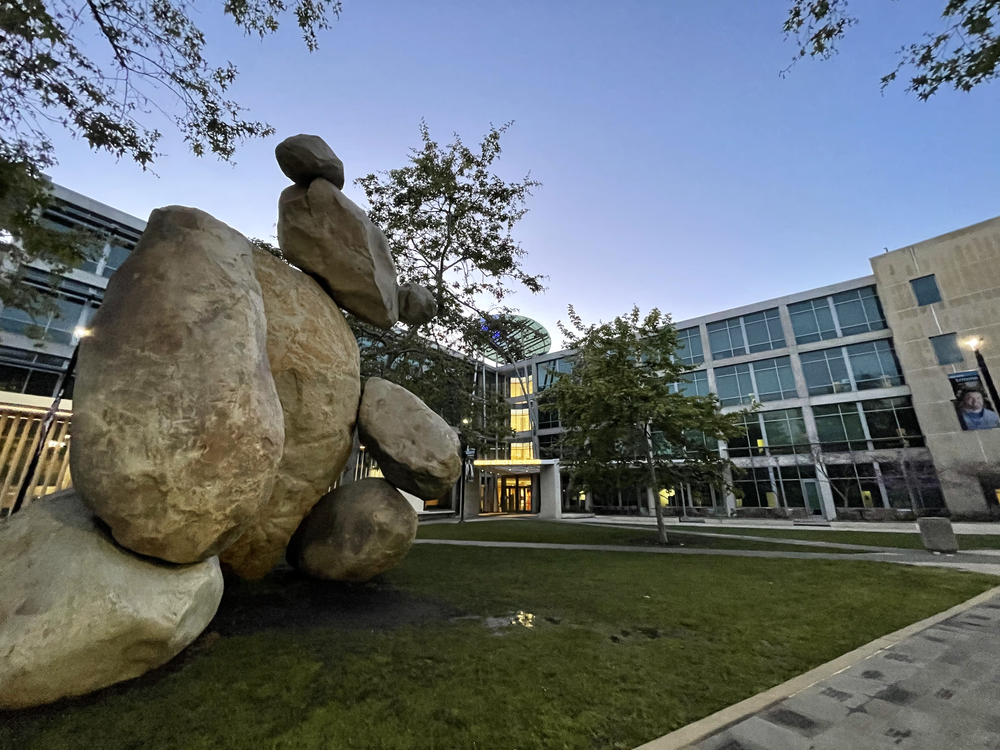
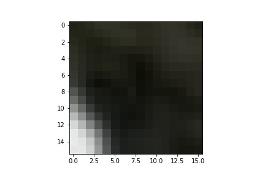
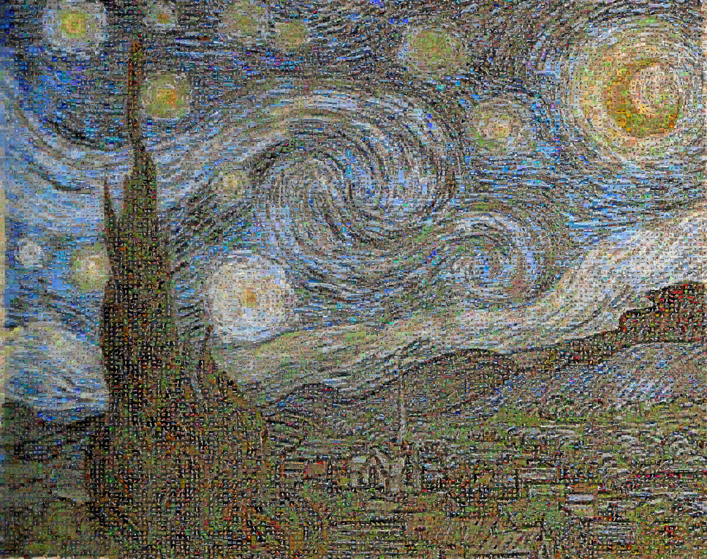
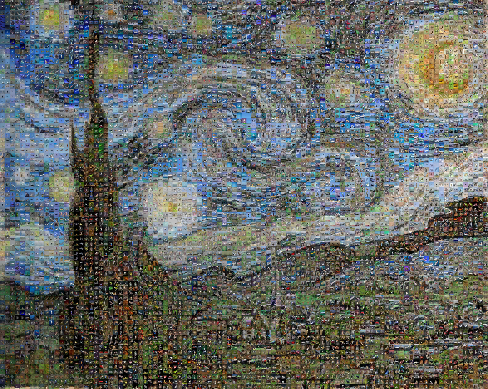

import mosaic_anim from "./videos/mosaic_anim.mp4";

# Introduction

We've all seen images where when you zoom in you realize that it's made up of many smaller images and harkens to some greater theme. While cool, I found the problem of actually creating this mosaic quite interesting so this weekend project is me doing so. The dream was to replicate starry night made of galaxies but we'll see it didn't quite work out that way!

<PostVideo video={mosaic_anim} _autoplay={true}/>

# Code

I'll go through my steps for solving this problem by creating a mosaic of UCSD's beloved CSE bear! For those that don't know, right outside CSE at UCSD, there is a large stone bear art piece!



## Importing Base Image

The first step is just importing your target image, this is easily done using OpenCV.

```python
# Importing Image
img_base = cv2.imread("./images/bear.jpg")
img_base = cv2.cvtColor(img_base, cv2.COLOR_BGR2RGB)
```

## Tiling

The next step is to tile the base image into all the spots where new images will replace the original pixels. I opted to specify square tiles of a given number of pixels on each side and then cropped the image to the largest region occupied by the specified tile size.

```python
a,b,c = img_base.shape
tile_size = 16

tile_x = np.floor(b/tile_size)
tile_y = np.floor(a/tile_size)

img_x = tile_x * tile_size
img_y = tile_y * tile_size

# Get Image to even size
even_x = int(np.floor(b/2)*2)
even_y = int(np.floor(a/2)*2)
img_crop = img_base[:even_y, :even_x]

# Center Crop
a,b,c = img_crop.shape
C1 = int((a-img_y) / 2)
C2 = int((b-img_x) / 2)

img_crop = img_crop[C1:a-C1, C2:b-C2, :]
```

This looks extremely similar to the original image as the number of pixels removed is quite small in the scale of the image. In the case of this image and the prior sizes we have $[252 \times 189]$ tiles!



## Resizing Image

Now that we have a tile size in the original image we can either make our entire dataset of sample images match the tile size or scale up the original image such that the original tile size maps to the dataset image size. I opted to do the latter to maintain resolution and not have to resize many thousands of images.

```python
img_data_size = 32 # Size of images in sample set
scale = img_data_size / tile_size # Determine scaling factor
a,b,c = img_crop.shape
dim = (int(b*scale), int(a*scale))
img_scale = cv2.resize(img_crop, dim, interpolation = cv2.INTER_AREA) # Scale to new size
img_scale = img_scale.astype("int16")
```

## Dataset Import

I opted to use the [cifar dataset](https://www.cs.toronto.edu/~kriz/cifar.html) as there is a wide range of colors and textures that I believed will replace the original tiles well! For my convenience I aggregated all the images into one large list.

```python
import cifar10

images = []
for image, label in cifar10.data_batch_generator():
    images.append(image.astype("int16"))
```

## Comparison and Replacing

To replace every tile with an appropriate sample image we need a means of comparing the tile to the dataset. Initially I had the idea of using a mean pixel color metric and finding the most similar example in the dataset but I found that even for a small tile the texture across the tile is important to making a realistic looking image. I opted instead to do a pixel-wise comparison of each tile against the entire dataset, which is simply the L2 norm of the difference between the tile and sample image. To aid in speeding this process up, I used the `multiprocessing` library in Python.

```python
# Init. Target Image
img_mos = copy.deepcopy(img_scale)

N = 40000 # Number of images to use from sample set
step = img_data_size

# Define Pool
pool = mp.Pool(18)

# Defining pool worker
def worker(tar):
    diffs = np.zeros((N))
    for i in range(N):
        comp = images[i] # Get image to compare to tile
        diffs[i] = np.linalg.norm(comp-tar) # Comparison metric
    return np.argmin(diffs) # Return index of closest image to tar image

# Iterate Across Grid
for ty in range(int(tile_y)): # Iterate through all y tiles

    clear_output(wait=True) # Made keeping track of progress easier
    print("Ty: {:0.3f} ".format((ty+1)/tile_y))

    # Aggregate all tiles along a row
    tars = []
    for tx in range(int(tile_x)): # Iterate through all x tiles
        tars.append(img_scale[(ty*step):((ty+1)*step), (tx*step):((tx+1)*step), :])

    # Get best indexes for all tiles along row
    results = pool.map(worker, tars)

    # Replace each tile with the best replacement image
    for i,tx in enumerate(range(int(tile_x))):
        img_mos[(ty*step):((ty+1)*step), (tx*step):((tx+1)*step),:] = images[results[i]]
```

While this is quite slow it gets the job done! If you have any ideas to make it faster let me know! The result is quite nice for our bear!


# Other Examples

## Galaxy Starry Night

As mentioned before, my original idea was to create a rendition of Starry Night using galaxies. Using one of the [astroNN datasets](https://astronn.readthedocs.io/en/latest/) I attempted to do this.


The problem is the diversity of images and the textures from images of galaxies is not enough to have decent replacements for the original tiles. Other people have solved this problem with tinting and other image augmentations to make them work but I did not want to do this.

## Cifar Starry Night

I opted to try the same image but now with cifar and the results were MUCH better. Even with a coarser tile arrangement it still looks quite nice.





I really enjoy the art style that you get from different mosaics like this, and plan to try out other dataset and image combinations. If you have a request let me know and I may just run it!
