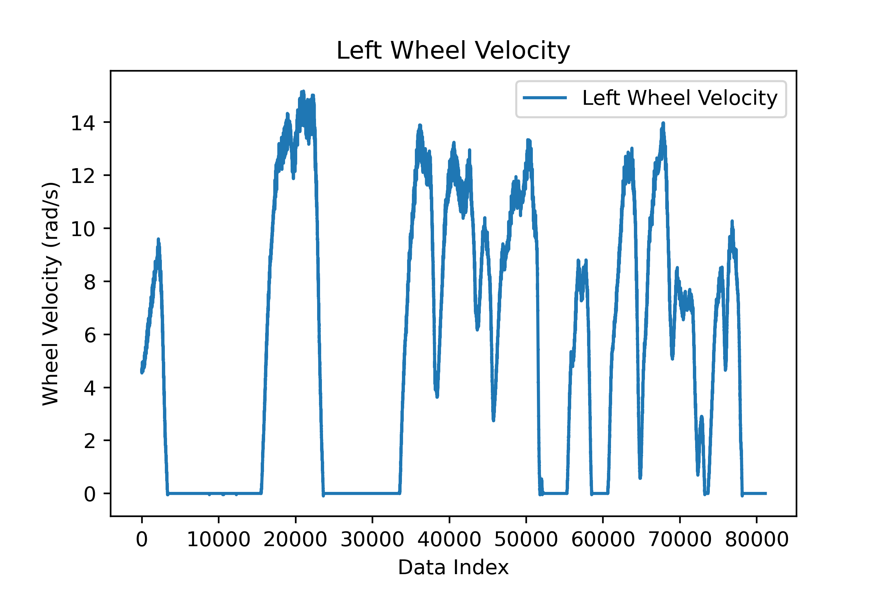
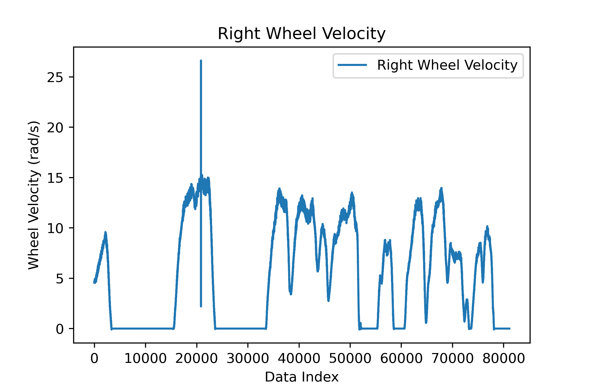
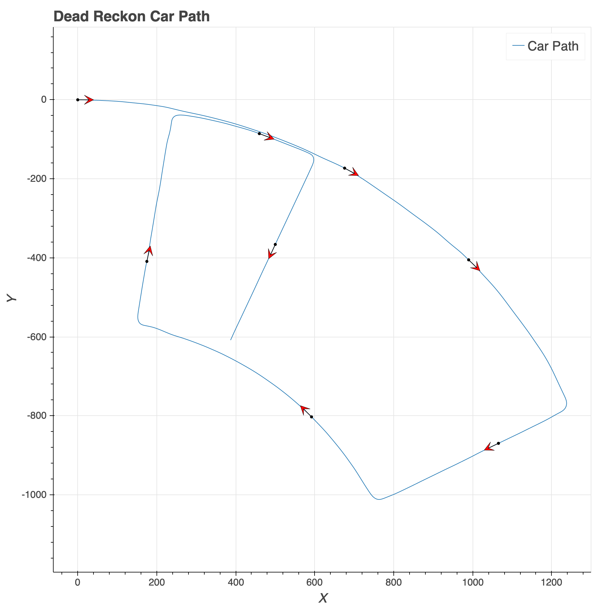

## Table of Contents

```toc

```

# Introduction

In this post we will discuss an approach to solving the simultaneous localization and mapping (SLAM) problem for a mobile vehicle and attempt to understand the shortcomings of the given implementation.

# Report

As this was part of my graduate studies I cannot publish the code but the below button will take you to the formal writeup associated with the project. Also the report has _much_ more detail than this post will so I highly advice you look through it for more information, here I will be focusing on high level principles and results.

<PostButton text={"Report Link"} target={"/reports/pf_slam.pdf"} />

# Technical Approach

Here I will discuss how I implemented a particle filter for solving the SLAM problem.

## Data Cleaning




## Dead Reckoning



## Particle Filter

# Results

import Video from "./images/MappingVideo.mp4"

<PostVideo video={Video} />
