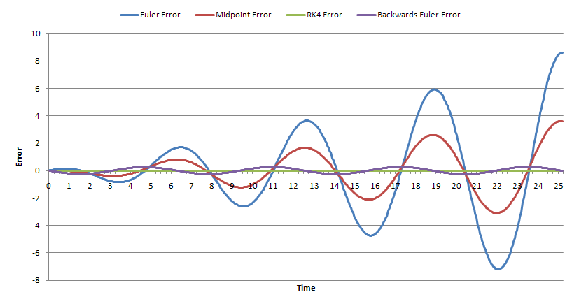

# When to use a numerical integrator?

For many useful ODEs in the world, the lack of explicit forms
introduces the need for numerical ways to solve. Numerical meaning running
over discrete time steps on a computer. As the name suggests, we can use one
of many types of numerical integrators to integrate these ODEs into the
desired solutions!



# What is an RK4?

One of the most common types of integrators is the Runge-Kutta 4th Order method.
This is oftentimes called advanced Euler integration as Euler integration can be
considered a 1st-order Runge-Kutta method! The idea is to take 4 Euler steps and
compute a weighted average of the results to account for changes in the derivative
projected forward in time.

As shown below, we can very quickly implement an RK4 step for a given function to be
in `evaulate` over a timestep with a vector of initial conditions X.

```python
def rk4(dt, X, evaluate):
    '''
    Given a vector X with [x,xdot], calculate the new X for step dt,
    using rk4 method
    '''

    k1 = dt * evaluate(X)
    k2 = dt * evaluate(X + 0.5*k1)
    k3 = dt * evaluate(X + 0.5*k2)
    k4 = dt * evaluate(X + k3)

    X_new = X + (1/6.)*(k1+ 2*k2 + 2*k3 + k4)
    return X_new
```

> A good reference for all of this is blah blah blah's textbook

- Testing bullet points

1. Number 1
2. Number 2

# Deeper Explanation On Sample Python Code

## Euler Steps

Highlighted below are the lines that compute the 4 euler steps in the 4-th
order approximation of the ODE solution.

```python{7-10}
def rk4(dt, X, evaluate):
    '''
    Given a vector X with [x,xdot], calculate the new X for step dt,
    using rk4 method
    '''

    k1 = dt * evaluate(X)
    k2 = dt * evaluate(X + 0.5*k1)
    k3 = dt * evaluate(X + 0.5*k2)
    k4 = dt * evaluate(X + k3)

    X_new = X + (1/6.)*(k1+ 2*k2 + 2*k3 + k4)
    return X_new
```

## Update Step

Highlighted below are the lines that compute the 4 euler steps in the 4-th
order approximation of the ODE solution.

```python{12}
def rk4(dt, X, evaluate):
    '''
    Given a vector X with [x,xdot], calculate the new X for step dt,
    using rk4 method
    '''

    k1 = dt * evaluate(X)
    k2 = dt * evaluate(X + 0.5*k1)
    k3 = dt * evaluate(X + 0.5*k2)
    k4 = dt * evaluate(X + k3)

    X_new = X + (1/6.)*(k1+ 2*k2 + 2*k3 + k4)
    return X_new
```
